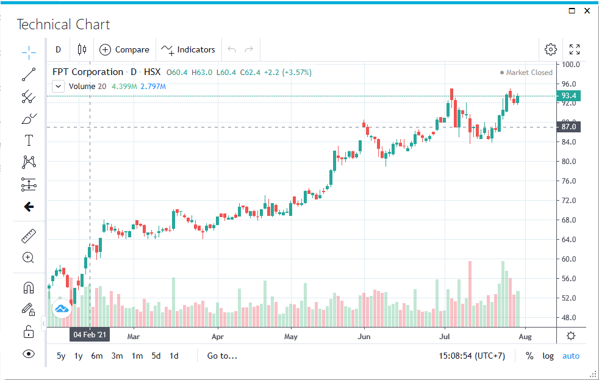

# FA.UI.TechnicalChart

Hàm FA.UI.TechnicalChart sẽ tạo ra một liên kết tới biểu đồ phân tích kỹ thuật của mã chứng khoán. Bạn sẽ cần có trình duyệt IE 11+ hoặc Edge (có sẵn trên Windows 10) để mở được biểu đồ.

## **Cú pháp**

```
=FA.UI.TechnicalChart("Mã CK", ["Tiêu đề"])
```

**Trong đó:**

* **Mã CK:** Mã chứng khoán bạn cần xem biểu đồ&#x20;
* **Tiêu đề**: Tiêu đề của liên kết dùng để mở biểu đồ. Tham số này không bắt buộc phải nhập. Nếu không truyền tham số này thì hàm sẽ dùng giá trị mặc định là "**Phân tích kỹ thuật"**.

Các tham số không nhất thiết phải nhập trực tiếp, bạn có thể tham chiếu đến các ô chứa thông tin tương ứng.

## Giá trị trả về

Giá trị trả về là một liên kết. Khi bấm vào liên kết này, biểu đồ phân tích kỹ thuật cho mã tương ứng sẽ được nạp vào một cửa sổ mới.

## **Ví dụ**

Giả sử bạn muốn sử dụng biểu đồ phân tích kỹ thuật cho mã FPT, bạn gõ công thức:

\=FA.UI.TechnicalChart("FPT")

Kết quả thu được là 1 liên kết như sau

**Phân tích kỹ thuật**

Khi  vào liên kết, biểu đồ phân tích kỹ thuật của mã FPT sẽ hiện ra như dưới đây.



Tháy vì nhập trực tiếp mã FPT, bạn có thể nhập FPT vào 1 ô ví dụ A1, và dùng công thức như sau:

\=FA.UI.TechnicalChart(A1)

Ưu điểm của phương pháp này là bạn chỉ cần thay đổi mã ở ô A1 là nạp được biểu đồ khác mà không cần thay đổi công thức.

Bạn cũng có thể tùy biến nhãn liên kết mà không cần dùng nhãn mặc định, ví dụ bạn muốn nhãn liên kết có chứa mã ở ô A1, bạn dùng công thức sau:

\=FA.UI.TechnicalChart(A1, "Biểu đồ PTKT mã "\&A1)

Kết quả thu được sẽ là nhãn

**Biểu đồ PTKT mã FPT**
