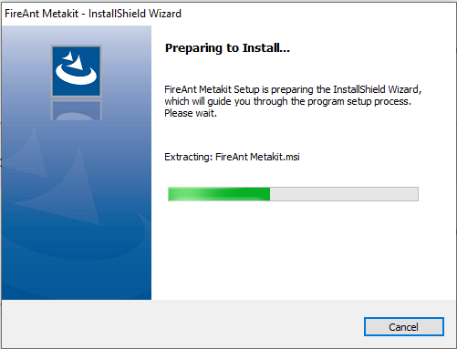
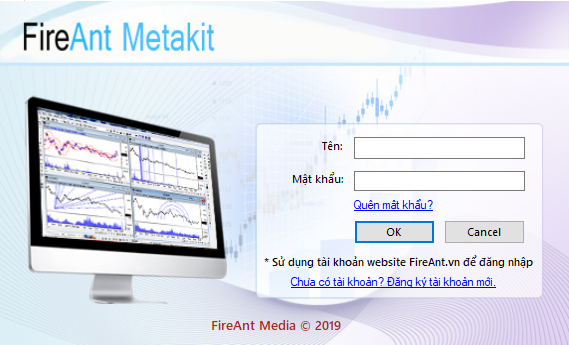

# Cài đặt FireAnt for Amibroker

Để cài đặt FireAnt for Amibroker, bạn vào trang <http://metakit.fireant.vn/Intro/>, hoặc bấm nút FireAnt for Amibroker trên trang chủ <https://www.fireant.vn>, tiếp theo bấm nút tải về để tải về bản cài (tệp setup.exe) cho FireAnt for Amibroker.

Bạn có thể lựa chọn một trong hai phiên bản 64 bit và 32 bit, tùy vào việc bạn sử dụng phiên bản Amibroker 64 bit hay 32 bit. Chúng tôi khuyến cáo sử dụng bản Amibroker 64 bit do hiệu năng vượt trội so với phiên bản 32 bit.&#x20;

Việc cài FireAnt for Amibroker khá đơn giản, chỉ cần vài thao tác nhắp chuột là bạn đã cài xong.

Sau khi cài xong, trên màn hình máy tính của bạn sẽ xuất hiện biểu tượng của **FireAnt for Amibroker** (Chữ F trắng trên nền xanh dương).

Để chạy **FireAnt for Amibroker**, bạn chỉ cần nhắp đúp chuột vào biểu tượng này. Tiếp đó bạn có thể đăng nhập **FireAnt for Amibroke** bằng tài khoản bạn đã đăng ký và thiết lập mật khẩu trên fireant.vn


**Lưu ý**: Bạn cần sử dụng mật khẩu thiết lập cho tài khoản đăng ký trên fireant.vn để đăng nhập thay vì sử dụng mật khẩu của google hay facebook (các mật khẩu này chỉ sử dụng được trên web và mobile)

