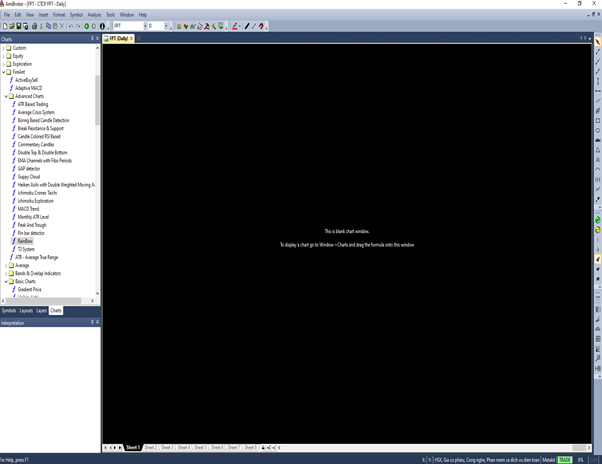
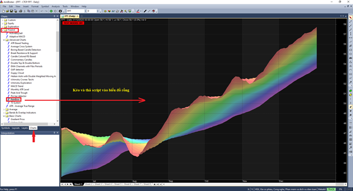
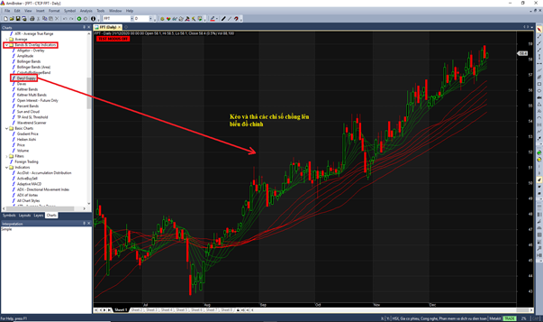
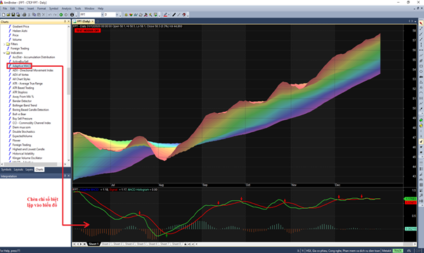
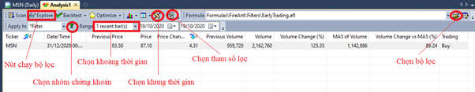
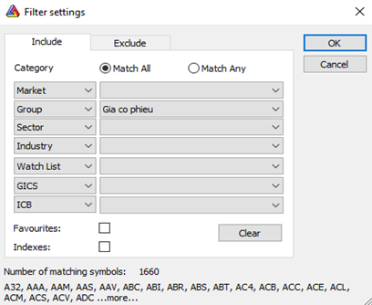
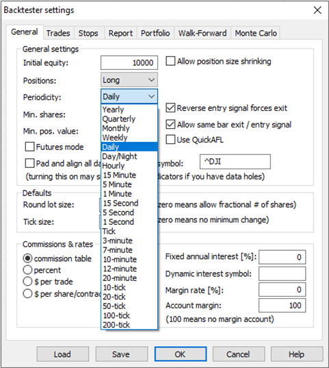
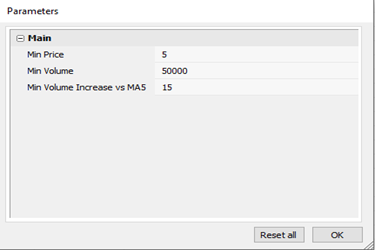
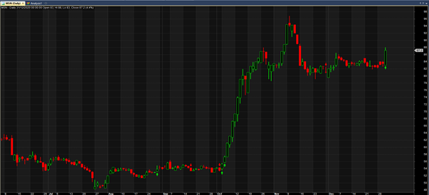

# Sử dụng Script của FireAnt

Bạn có thể sử dụng Scripts của FireAnt theo bốn cách, tùy theo loại scripts

* Sử dụng tạo biểu đồ chính (biểu đồ giá), bao gồm các biểu đồ đơn giản và nâng cao
* Chèn vào biểu đồ và sử dụng làm chỉ số
* Sử dụng để lọc cổ phiếu
* Sử dụng như công cụ (so sánh cổ phiếu, vẽ tự động Fibonacii thoái lui, hiển thị tự động trạng thái giao dịch), … trong tương lai chúng tôi có thể sẽ phát triển thêm các script hỗ trợ giao dịch.

## **Sử dụng script để tạo biểu đồ chính**

Để sử dụng scripts của FireAnt tạo các biểu đồ chính, bạn làm theo các bước sau

**Bước 1:** Tạo một biểu đồ rỗng (Blank chart). Chọn File > New > Blank chart

**Bước 2:** Kéo thả script lên biểu đồ. Vào mục Chart, thư mục **FireAnt > Advanced Chart** hoặc **FireAnt > Basic Chart**, chọn một trong các script, giữ chuột và kéo thả lên biểu đồ rỗng.

## **Chèn script vào biểu đồ và sử dụng làm chỉ số**

Có ba loại chỉ số có thể chèn vào biểu đồ:&#x20;

**Các chỉ số chồng**: Các chỉ số này được kéo thả trực tiếp lên biểu đồ chính. Bạn chọn một trong số các scripts trong thư mục **FireAnt > Bands & Overlap Indicators.**

**Các chỉ số biệt lập**: Các chỉ số này được hiển thị trong một ô riêng (pane) bên trên hoặc bên dưới biểu đồ chính. Bạn chèn các chỉ số này bằng cách vào thư mục **FireAnt > Indicators** và nhắp đúp chuột lên biểu đồ, bạn cũng có thể nhắp chuột phải lên script và chọn **Insert**. Chúng tôi khuyến cáo không sử dụng **Insert Linked,** vì khi sửa mã nguồn bạn sẽ sửa trực tiếp lên mã nguồn gốc thay vì sửa bản copy và có thể làm hỏng mã gốc.

**Các đường trung bình:** Các đường trung bình thuộc thư mục **FireAnt > Average** cũng có thể kéo thả lên biểu đồ chính, hoặc lên các ô chứa chỉ số biệt lập. Khi thả lên biểu đồ chính, dữ liệu để tính trung bình là giá chứng khoán. Khi thả lên các ô chứa chỉ số biệt lập, giá trị các chỉ số này được dùng để tính trung bình.


**Lưu ý:** Bạn cũng có thể kéo thả các chỉ số chồng lên các ô chứa chỉ số biệt lập, tuy nhiên bạn cần biết rằng khi đó dữ liệu để tính các chỉ số chồng sẽ là giá trị của chỉ số biệt lập thay vì giá, do đó bạn cần biết rõ mục đích sử dụng chỉ số chồng để sử dụng chúng một cách hợp lý. Ví dụ bạn có thể kéo Bollinger bands vào ô chứa RSI để vẽ Bollinger band cho RSI, nhưng nếu làm tương tự với MACD thì không có ý nghĩa gì cả.


## **Sử dụng script để lọc cổ phiếu**

Để sử dụng các scripts làm bộ lọc, bạn làm theo các bước sau.&#x20;

**Bước 1**: Tạo một tab Analysis. Bạn chọn **Analysis > New Analysis**

**Bước 2:** Thiết lập bộ lọc. Ở bước này bạn cần thực hiện các thao tác sau

* **Chọn bộ lọc**: Các bộ lọc mà FireAnt cung cấp được lưu trong thư mục Formulas\FireAnt\Filters nằm trong thư mục cài Amibroker của bạn. Bấm nút chọn bộ lọc như hình trên, và duyệt đến thư mục tương ứng, chọn một bộ lọc bạn muốn sử dụng.
* **Chọn nhóm chứng khoán**: Bạn có thể chọn lọc theo
  * **Tất cả các mã (All Symbols):** Không nên chọn cách này vì lẫn lộn đủ các loại dữ liệu khác nhau
  * **Mã hiện tại (Current Symbol):** Không nhiều ý nghĩa lắm, trừ khi điều kiện lọc của bạn đưa ra nhiều tiêu chí khác nhau và bạn muốn kiểm tra mã hiện tại thỏa mãn tiêu chí nào&#x20;
  * **Nhóm mã (Filter):** Đây là tiêu chí bạn cần chọn, tiếp theo bạn cần bấm vào nút hình phễu bên cạnh, và chọn Group là Gia co phieu (Giá cổ phiếu) để chọn lọc trong danh sách tất cả các mã cổ phiếu niêm yết trên thị trường chứng khoán Việt Nam. Chọn nhóm khác nếu bạn có nhu cầu lọc theo nhóm chứng khoán khác.

* **Chọn khung thời gian:** Bạn có thể chọn lọc theo khung thời gian khác nhau như ngày (Daily), tuần (Weekly), hay theo 1 phút (1 Minute), giờ (Hourly), … Lưu ý là nếu muốn lọc theo các khung thời gian trong ngày, bạn cần chuyển sang sử dụng dữ liệu Intraday thay vì Daily.

* **Chọn khoản thời gian:** Bạn có thể chọn lọc với các tiêu chí thời gian khác nhau
  * **Toàn thời gian (All Quotes)**: Trừ khi bộ lọc của bạn tính toán rất ít, bạn không nên chọn tiêu chí này vì nó sẽ lọc theo toàn bộ dữ liệu mà bạn có, và có thể chạy mất nhiều giờ.
  * **Nến hiện tại (recent bar):** Lọc các mã chỉ với nến hiện tại, tùy vào khung thời gian nến cuối có thể là giờ cuối, ngày cuối hay tuần cuối
  * **Ngày hiện tại (recent day):** Lọc các mã với dữ liệu ngày giao dịch hiện tại, nếu bạn chọn khung thời gian daily, thì tiêu chí này trùng với tiêu chí **Nến hiện tại**
  * **Khoảng thời gian xác định (From-to dates):** Nếu chọn tiêu chí này, bạn sẽ phải chọn thêm thời gian bắt đầu lọc và thời gian kết thúc lọc ở hai ô bên cạnh &#x20;
* **Chọn tham số lọc:** Trong trường hợp bộ lọc của bạn sử dụng tham số, bạn có thể chọn thay đổi tham số để tác động đến kết quả lọc

Sau khi thiết lập xong, bạn chỉ việc bấm nút Explorer để bắt đầu lọc, kết quả lọc sẽ được liệt kê bên dưới, cột đầu tiên bên trái luôn là danh sách mã chứng khoán thỏa mãn tiêu chí lọc.

Nếu trong bộ lọc có các điều kiện cho tín hiệu mua bán, thì bạn có thể nhắp đúp chuột vào mã chứng khoán trong danh sách kết quả, biểu đồ tương ứng với mã sẽ được nạp vào, và các tín hiệu mua bán cũng được vẽ lên biểu đồ.

