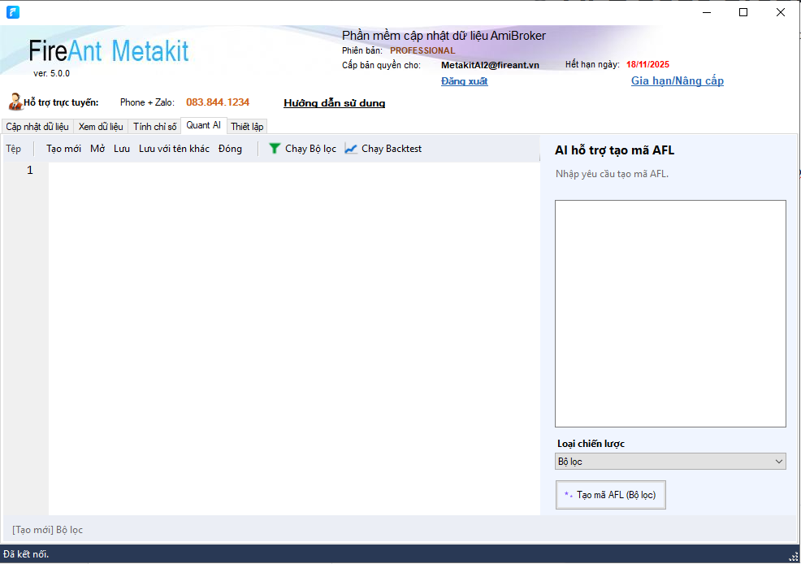
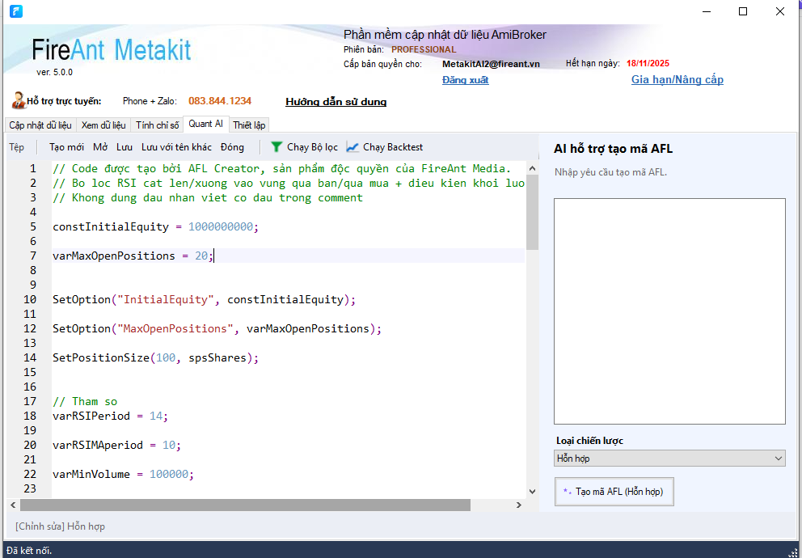
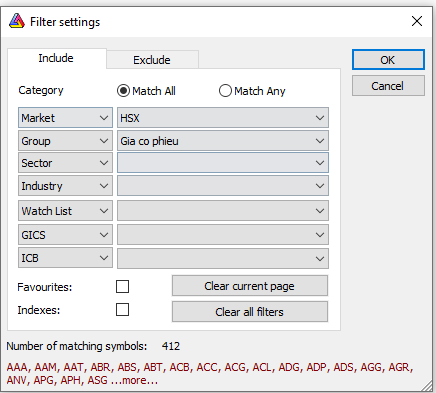

# Tạo mã AFL với AI Code Creator

Phiên bản hiện tại hỗ trợ tạo bốn loại code afl.

* Tạo bộ lọc
* Tạo code backtest
* Tạo chỉ báo
* Tạo code đa mục đích (vừa dùng để lọc, vừa dùng để backtest và vừa dùng làm chỉ báo)

Để sử dụng chức năng này, bạn cần là **hội viên chuyên nghiệp** và sử dụng ít nhất 1 gói **copilot web** của FireAnt.

<figure><figcaption></figcaption></figure>

<em>Chức năng tạo code AFL</em>

Để sử dụng chức năng này, trong Metakit, bạn chọn nút **Quant AI** để vào giao diện tạo code.

Hộp text bên phải là nơi bạn đưa yêu cầu tạo code. Yêu cầu có thể viết bằng tiếng việt và thể hiện mục đích tạo code của bạn. Ví dụ bạn có thể viết:

*Tạo bộ lọc cho các mã có RSI cắt lên đường trung bình (10) của chính nó trong vùng quá bán, hoặc cắt xuống đường trung bình (10) của chính nó trong vùng quá mua, với khối lượng tăng tối thiếu 15% so với trung bình 4 nến, tăng so với khối lượng nến trước, và tối thiểu bằng 100000.*

Trong **Dropbox** **Loại chiến lược** bên dưới, bạn hãy chọn mục đích tạo code của minh, sau đó bấm nút Tạo mã AFL. Đợi 1 lát code sẽ được sinh ra và hiển thị trong hộp text bên trái.

<figure><figcaption></figcaption></figure>

<em>Tạo code AFL</em>

Sau khi tạo xong code AFL bạn có thể:

* Tiếp tục bổ sung các yêu cầu mới, trong ví dụ trên, chẳng hạn bạn có thể đưa yêu cầu:&#x20;

<em>Thêm điều kiện giá tăng vượt giá cao nhất 20 nến.</em>

* Lưu vào file để tái sử dụng
* Tạo code mới
* Trường hợp code sinh ra là bộ lọc, có thể gửi vào amibroker để chạy bộ lọc bằng cách bấm nút **Chạy bộ lọc.**&#x20;
* Trường hợp code sinh ra cho mục đích backtest, có thể gửi vào amibroker để chạy backtest bằng cách bấm nút **Chạy backtest.**&#x20;
* Trường hợp code sinh là là code **hỗn hợp**, sử dụng cho nhiều mục đích thì bạn có thể chọn chạy bộ lọc hoặc chạy backtest đều được.


Lưu ý là bạn cần thiết lập 1 số thông số trước khi thực hiện lọc hoặc backtest. Mở Amibroker, chọn menu Analysis, chọn **New Analysis** hoặc **Old Analysis**, chọn Define Filter,  Chọn Group là **Giá cổ phiếu**, bạn cũng có thể chọn têm Market, ví dụ là HSX, để hạn chế bớt số mã lọc. Tiếp tục chọn các thông số khác như thời gian chạy analysis, ví dụ chọn từ ngày đến ngày, vào setting chọn chu kỳ daily, weekly, ... hoặc nếu dữ liệu đang dùng là intraday (phút hoặc ticks) bạn có thể chọn chu kỳ là phút, 15 phút, giờ, ...


<figure><figcaption></figcaption></figure>

<em>Chọn danh sách mã chưng khoán cho bộ lọc</em>


Bạn có thể sử dụng một số từ khóa như MCDX, "Cung cầu", "Nước ngoài", "Magic trend", để gọi ý cho Metakit lấy về code có trong thư viện, các thư viện sẽ được xây dựng tiếp theo nhu cầu của cộng đồng.

Ngoài việc tạo code mới, bạn cũng có thể nạp các file cũ vào để nâng cấp hoặc sửa code bị lỗi.&#x20;

