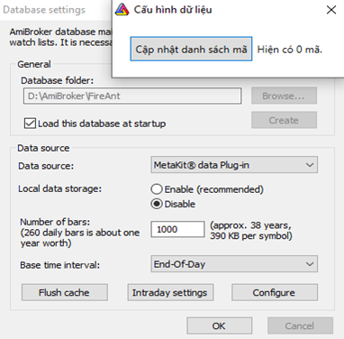

# Thiết lập dữ liệu cho Amibroker

Để có thể sử dụng dữ liệu cho các phân tích trên phần mềm Amibroker, trước tiên bạn cần tạo kết nối dữ liệu của FireAnt với phần mềm này.&#x20;

Với ứng dụng **FireAnt for Amibroker**, việc kết nối có thể thực hiện với vài thao tác đơn giản, sau đó bạn có thể sử dụng Amibroker để phân tích mà không cần quan tâm đến nguồn dữ liệu nữa, dữ liệu sẽ được tự động cập nhật vào Amibroker, và điều duy nhất bạn cần làm là bật **FireAnt for Amibroker** lên và để ứng dụng này chạy ngầm.&#x20;

## Thiết lập kết nối dữ liệu&#x20;

Để thiết lập kết nối dữ liệu, bạn cần thực hiện các thao tác sau:

* **Chọn Folder lưu dữ liệu**: **FireAnt for Amibroker**sẽ tải dữ liệu về và lưu tại đây. Bạn có thể chọn Folder lưu dữ liệu trong mục Thiết lập của **FireAnt for Amibroker**. Trong lần đầu sử dụng Metakit, bạn sẽ được yêu cầu chọn Folder này. Bạn có thể chọn bất kỳ Folder nào làm nơi lưu dữ liệu, tuy nhiên không nên chọn Folder ở ổ C:, trừ khi bạn chỉ có ổ C:
* **Cài đặt Plugin**: Plugin có nhiệm vụ lấy dữ liệu về và đẩy vào Amibroker. Bên cạnh dữ liệu giao dịch, chúng tôi cũng cung cấp một số dữ liệu tài chính của các mã cổ phiếu (từ gói hội viên chuyên nghiệp).&#x20;
* **Tạo cơ sở dữ liệu (database) cho Amibroker**: Cơ sở dữ liệu của Amibroker để lưu trữ danh sách mã chứng khoán và các thiết lập biểu đồ khác.

Để thiết lập Plugin, bạn vào phần mềm **FireAnt for Amibroker**, chọn mục Thiết lập và chọn Cài Amibroker Plugin, Chọn thu mục mà bạn đã cài Amibroker (thông thường **FireAnt for Amibroker** sẽ tự nhận biết vị trí cài Amibroke&#x72;**)**. Bấm OK, như vậy bạn đã cài xong Plugin.&#x20;

Để tải về các scripts của FireAnt, bạn chọn Tải thư viện script cho Amibroker.


Lưu ý: Các scripts cho Amibroker chỉ hoạt động đầy đủ với gói hội viên chuyên nghiệp trở lên.&#x20;


<figure><figcaption></figcaption></figure>

<em>Thiết lập thư mục lưu trữ dữ liệu</em>

Để tạo cơ sở dữ liệu cho Amibroker, bạn mở Amibroker, chọn **File > New > Database**. Ở giao diện tiếp theo (xem hình dưới), thực hiện các thao tác sau:&#x20;

* **Database Folder**: Đặt tên cho Database, tên mặc định là Mynewdata, tuy nhiên bạn nên sử dụng một tên dễ nhớ hơn là dùng tên mặc định. Bấm Create để tạo database
* Chọn **Load this database at startup** để dùng database này làm mặc định sử dụng vào khi bật amibroker&#x20;
* **Data Source**: Chọn Metakit Plugin&#x20;
* **Local data storage**: Chọn Disable, do dữ liệu lấy trực tiếp qua plugin nên bạn không cần lưu thêm một lần nữa.&#x20;
* **Number of bars**: Chọn số nến dữ liệu được nạp vào. Nếu sử dụng dữ liệu Daily, bạn chỉ cần chọn 10.000. Dữ liệu Intraday có thể chọn đến 1.000.000 với bản Amibroker 6.3 hoặc 500.000 với bản Amibroker 6.2, tuy nhiên trong đa phần các trường hợp con số 50.000 là đủ.&#x20;
* **Base time interval**: Chọn **End-Of-Day**, nếu bạn dùng biểu đồ Daily và **Tick** nếu bạn sử dụng biểu đồ Intraday.&#x20;

Bạn có thể thay đổi các thông số này, bằng cách vào **File > Database settings** và chọn lại thông số.&#x20;

Sau khi chọn xong các thông số, bấm nút **Configure**, sau đó bấm nút **Cập nhật danh sách mã**. Cuối cùng bấm **OK**. Như vậy bạn đã thiết lập xong dữ liệu cho Amibroker và có thể bắt đầu sử dụng phần mềm này.

