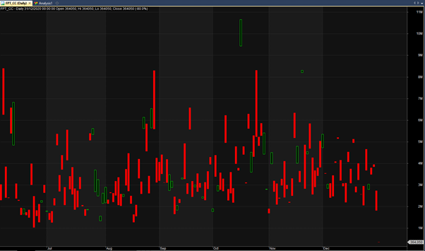
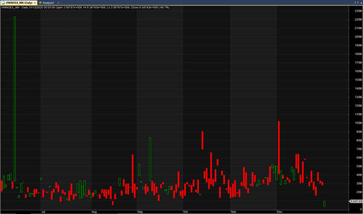
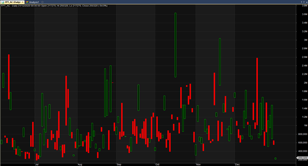
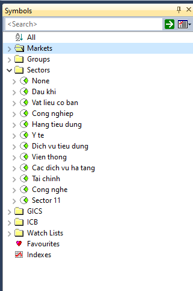
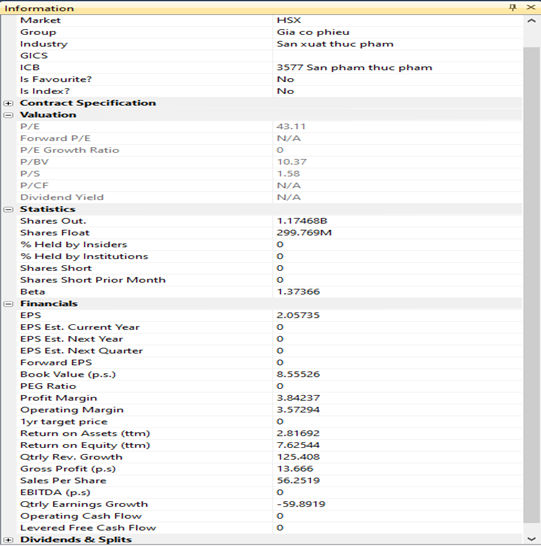

# Các loại dữ liệu cho Amibroker

FireAnt cung cấp các dữ liệu sau cho Amibroker:

* **Dữ liệu giao dịch**: Dữ liệu dùng để vẽ biểu đồ với các mức giá mở cửa, đóng cửa, cao nhất, thấp nhất và khối lượng
* **Dữ liệu tài chính**: Dữ liệu các chỉ số tài chính của doanh nghiệp

## **Dữ liệu giao dịch**

Dữ liệu giao dịch gồm năm loại:

* Dữ liệu giá chứng khoán
* Dữ liệu cung cầu
* Dữ liệu mua bán của nhà đầu tư nước ngoài
* Dữ liệu mua bán chủ động
* Dữ liệu tự doanh của các công ty chứng khoán

**Dữ liệu giá chứng khoán** được cung cấp cho:

* Các mã cổ phiếu niêm yết của Việt nam
* 5 index chứng khoán Việt Nam VNNDEX, HNXINDEX, UPCOMINDEX, VN30 và HNX30
* Các mã chứng khoán phái sinh Việt Nam (Hợp đồng tương lai chỉ số VN30 và chứng quyền)
* Các index ngành
* Các index chứng khoán thế giới
* Một số cặp tiền, hàng hóa, vàng, dầu, bitcoins

Với các mã cổ phiếu niêm yết và chứng khoán phái sinh của Việt Nam, dữ liệu được cung cấp dưới hai dạng gồm:

* **Dữ liệu Daily thời gian thực:** Nến giá là dữ liệu ngày, trong đó giá đóng cửa của nến cuối cùng được cập nhât theo thời gian thực
* **Dữ liệu Intraday dạng tick:** Dữ liệu trong phiên dạng tick, tương ứng với từng giao dịch, với dữ liệu này Amibroker có thể tự tổ hợp thành các nến giá với các khung thời gian khác nhau như phút, giờ, … loại dữ liệu này bị hạn chế số lượng ticks do khả năng của Amibroker chỉ cho phép hiển thị tối đa 500.000 ticks (hoặc 1.000.000 ticks với bản Amibroker 6.3 trở lên), tuy nhiên ngay cả với số lượng ticks lên đến 1 triệu, bạn cũng chỉ xem được chừng 1 tuần với dữ liệu các mã chứng khoán có tần suất giao dịch lớn, ví dụ như VN30F1M.
* **Dữ liệu Intraday dạng phút:** Dữ liệu nến giá theo phút, mỗi nến tương ứng với một phút giao dịch, giá đóng nến, và các giá cao nhất, thấp nhất trong 1 phút được cập nhật theo thời gian thực. Với dữ liệu này Amibroker có thể tự tổ hợp thành các nến giá với các khung thời gian khác nhau như 5 phút, 1 giờ, … loại dữ liệu này tuy vẫn bị hạn chế số lượng nhưng với 1 triệu nến phút, chúng ta có thể xem được dữ liệu tối đa đến 20 năm.

Các mã chứng khoán khác chỉ có dữ liệu Daily, và được cập nhật với tần suất 2 phút/lần

Dữ liệu giá giao dịch sử dụng các trường O,H,L,C, và V để lưu các giá mở cửa, cao nhất, thấp nhất, đóng cửa và khối lượng. Riêng trường OI được sử dụng lưu dữ liệu khác nhau cho các loại chứng khoán khác nhau.

**Với dữ liệu Daily:**

* **Các mã cổ phiếu Việt nam**: OI chứa số cổ phiếu lưu hành
* **Các mã Hợp đồng tương lai chỉ số VN30**: OI lưu số lượng hợp đồng mở đầu phiên
* **Các chỉ số chứng khoán Việt Nam:** OI lưu tổng giá trị giao dịch (không bao gồm thỏa thuận)
* **Các mã chứng khoán khác:** OI không được sử dụng

**Với dữ liệu Intraday:**

* **Các mã cổ phiếu và các mã phái sinh Việt Nam**: OI lưu loại giao dịch
  * OI=1: Bán chủ động
  * OI=2: Mua chủ động
  * OI=3: Mua và bán chủ động đồng thời
* **Các mã chứng khoán khác**: OI không được sử dụng

**Dữ liệu cung cầu** được cung cấp cho:

* Các mã cổ phiếu niêm yết của Việt nam
* 5 index chứng khoán Việt Nam VNNDEX, HNXINDEX, UPCOMINDEX, VN30 và HNX30

Dữ liệu cung cầu bao gồm khối lượng đặt mua và đặt bán của các mã cổ phiếu niêm yết và của cả thị trường hoặc nhóm mã cổ phiếu (tương ứng 5 index kể trên).

Dữ liệu cung cầu chỉ có cho khung thời gian Daily, và được lưu riêng vào các mã cùng tên với mã chứng khoán với đuôi \_CC, ví dụ với mã chứng khoán FPT, dữ liệu cung cầu sẽ được lưu ở mã FPT\_CC.

**Dữ liệu cung cầu sử dụng**

* Trường O để lưu khối lượng đặt bán (cung)
* Trường C để lưu khối lượng đặt mua (cầu)
* Trường H = Max(O,C)
* Trường L = Min (O,C)

Để sử dụng dữ liệu cung cầu, bạn có hai cách

* **Xem trực tiếp**: Chọn mã đuôi \_CC tương ứng với mã chứng khoán
* **Xem qua script**: FireAnt cung cấp Script **SupplyDemand,** trong thư mục **FireAnt >Indicators** (gói hội viên chuyên nghiệp trở lên)

Hình dưới minh họa dữ liệu cung cầu của mã FPT khi xem trực tiếp.

* **Các nến xanh có C>O:** Cầu lớn hơn cung, nhu cầu mua lớn hơn nhu cầu bán
* **Các nến đỏ có O>C:** Cung lớn hơn cầu, nhu cầu bán lớn hơn nhu cầu mua
* **Các nến thân dài:** Khoảng cách giữa cung và cầu cao
* **Các nến thân ngắn:** Chênh lệch giữa cung và cầu thấp
* **Các nến có tọa độ cao:** Cung và cầu đều ở mức cao
* **Các nến có tọa độ thấp:** Cung và cầu đều ở mức thấp

**Dữ liệu mua bán của nhà đầu tư nước ngoài** được cung cấp cho:

* Các mã cổ phiếu niêm yết của Việt nam
* 5 index chứng khoán Việt Nam VNNDEX, HNXINDEX, UPCOMINDEX, VN30 và HNX30
* Các mã hợp đồng tương lai chỉ số VN30

Dữ liệu mua bán của nhà đầu tư nước ngoài bao gồm khối lượng nhà đầu tư nước ngoài mua và khối lượng nhà đầu tư nước ngoài bán của các mã cổ phiếu niêm yết, các hợp đồng tương lai chỉ số VN30 và của cả thị trường hoặc nhóm mã cổ phiếu (tương ứng 5 index kể trên).

Dữ liệu mua bán của nhà đầu tư nước ngoài chỉ có cho khung thời gian Daily, và được lưu riêng vào các mã cùng tên với mã chứng khoán với đuôi \_NN, ví dụ với mã chứng khoán FPT, dữ liệu mua bán của nhà đầu tư nước ngoài sẽ được lưu ở mã FPT\_NN.

Dữ liệu mua bán của nhà đầu tư nước ngoài sử dụng

* Trường O để lưu khối lượng bán của nhà đầu tư nước ngoài
* Trường C để lưu khối lượng mua của nhà đầu tư nước ngoài
* Trường H = Max(O,C)
* Trường L = Min (O,C)
* Trường V để lưu giá trị bán của nhà đầu tư nước ngoài
* Trường OI để lưu giá trị mua của nhà đầu tư nước ngoài

Để sử dụng dữ liệu mua bán của nhà đầu tư nước ngoài, bạn có hai cách

* **Xem trực tiếp**: Chọn mã đuôi \_NN tương ứng với mã chứng khoán
* **Xem qua script**: FireAnt cung cấp Script **ForeignTrading,** trong thư mục **FireAnt >Indicators** (gói hội viên chuyên nghiệp trở lên)

Hình dưới minh họa dữ liệu mua bán của nhà đầu tư nước ngoài của mã VNINDEX khi xem trực tiếp.

* **Các nến xanh có C>O:** Nhà đầu tư nước ngoài mua ròng
* **Các nến đỏ có O>C:** Nhà đầu tư nước ngoài bán ròng
* **Các nến thân dài:** Nhà đầu tư nước ngoài mua ròng nhiều
* **Các nến thân ngắn:** Nhà đầu tư nước ngoài mua ít, khả năng bán trao tay cho nhau
* **Các nến có tọa độ cao:** Nhà đầu tư nước ngoài mua và bán với khối lượng lớn
* **Các nến có tọa độ thấp:** Nhà đầu tư nước ngoài mua và bán với khối lượng thấp

**Dữ liệu mua bán chủ động** được cung cấp cho:

* Các mã cổ phiếu niêm yết của Việt nam
* 5 index chứng khoán Việt Nam VNNDEX, HNXINDEX, UPCOMINDEX, VN30 và HNX30
* Các mã hợp đồng tương lai chỉ số VN30

Dữ liệu mua bán chủ động bao gồm khối lượng mua chủ động và bán chủ động của các mã cổ phiếu niêm yết, các hợp đồng tương lai chỉ số VN30 và của cả thị trường hoặc nhóm mã cổ phiếu (tương ứng 5 index kể trên).

Dữ liệu mua bán chủ động chỉ có cho khung thời gian Daily, và được lưu riêng vào các mã cùng tên với mã chứng khoán với đuôi \_AC, ví dụ với mã chứng khoán FPT, dữ liệu cung cầu sẽ được lưu ở mã FPT\_AC.

Dữ liệu cung cầu sử dụng

* Trường O để lưu khối lượng bán chủ động
* Trường C để lưu khối lượng mua chủ động
* Trường H = Max(O,C)
* Trường L = Min (O,C)

Để sử dụng dữ liệu mua bán chủ động, bạn có hai cách

* **Xem trực tiếp**: Chọn mã đuôi \_AC tương ứng với mã chứng khoán&#x20;
* **Xem qua script**: FireAnt cung cấp Script **ActiveBuySell,** trong thư mục **FireAnt >Indicators** (gói hội viên chuyên nghiệp trở lên)

Hình trên minh họa dữ liệu mua bán chủ động của mã FPT khi xem trực tiếp.

* **Các nến xanh có C>O:** Mua chủ động lớn hơn bán chủ động
* **Các nến đỏ có O>C:** Mua chủ động thấp hơn bán chủ động
* **Các nến thân dài:** Khoảng cách lớn giữa mua chủ động và bán chủ động
* **Các nến thân ngắn:** Chênh lệch giữa mua chủ động và bán chủ động thấp
* **Các nến có tọa độ cao:** Mua chủ động và bán chủ động đều ở mức cao
* **Các nến có tọa độ thấp:** Mua chủ động và bán chủ động đều ở mức thấp&#x20;

**Dữ liệu tự doanh** được cung cấp cho:

* Các mã cổ phiếu niêm yết của Việt nam
* 5 index chứng khoán Việt Nam VNNDEX, HNXINDEX, UPCOMINDEX, VN30 và HNX30
* Các mã hợp đồng tương lai chỉ số VN30

Dữ liệu tự doanh bao gồm khối lượng mua và bán của tự doanh các công ty chứng khoán đối với các mã cổ phiếu niêm yết, các hợp đồng tương lai chỉ số VN30 và của cả thị trường hoặc nhóm mã cổ phiếu (tương ứng 5 index kể trên).

Dữ liệu tự doanh chỉ có cho khung thời gian Daily, và được lưu riêng vào các mã cùng tên với mã chứng khoán với đuôi \_TD, ví dụ với mã chứng khoán FPT, dữ liệu cung cầu sẽ được lưu ở mã FPT\_TD.

Dữ liệu cung cầu sử dụng

* Trường O để lưu khối lượng tự doanh bán
* Trường C để lưu khối lượng tự doanh mua
* Trường H = Max(O,C)
* Trường L = Min (O,C)
* Trường OI để lưu giá trị tự doanh mua
* Trường V để lưu giá trị tự doanh bán

Để sử dụng dữ liệu tự doanh, bạn có hai cách

* **Xem trực tiếp**: Chọn mã đuôi \_TD tương ứng với mã chứng khoán&#x20;
* **Xem qua script**: FireAnt cung cấp Script **PropTrading,** trong thư mục **FireAnt >Indicators** (gói hội viên chuyên nghiệp trở lên)

Hình trên minh họa dữ liệu tự doanh của mã FPT khi xem trực tiếp.

* **Các nến xanh có C>O:** Tự doanh mua ròng
* **Các nến đỏ có O>C:** Tự doanh bán ròng
* **Các nến thân dài:** Khoảng cách lớn giữa mua và bán của tự doanh
* **Các nến thân ngắn:** Chênh lệch giữa mua và bán của tự doanh thấp
* **Các nến có tọa độ cao:** Mua và bán của tự doanh đều ở mức cao
* **Các nến có tọa độ thấp:** Mua và bán của tự doanh đều ở mức thấp&#x20;

Danh sách các mã chứng khoán khi đưa vào Amibroker được chia theo:

* **Thị trường (Markets)**:&#x20;
  * HSX
  * HNX
  * UPCOM&#x20;
  * World Indices
  * Currency Pairs
  * BitCoins&#x20;
  * Commodities
  * NYSE
  * NASDAQ
  * Bonds
  * Fuels
  * Metals
* **Nhóm (Groups)**:&#x20;
  * **Gia co phieu**: Các mã cổ phiếu&#x20;
  * **Hop dong tuong lai:** Các mã Hợp đồng tương lai
  * **Chi so chung khoan:** Các mã Chỉ số chứng khoán&#x20;
  * **Chung quyen co bao dam:** Các mã Chứng quyền có bảo đảm
  * **Nganh ICB**: Các mã Ngành ICB (theo 4 cấp)
  * **Mua ban chu dong**: Các mã chứa dữ liệu Mua bán chủ động (các mã có đuôi \_AC)&#x20;
  * **Nuoc ngoai**: Các mã chứa dữ liệu mua bán của nhà đầu tư nước ngoài (các mã có đuôi \_NN)&#x20;
  * **Cung cau**: Các mã cung cầu (các mã có đuôi \_CC)
  * **Thong ke thi truong:** Các mã chứa dữ liệu cung cầu, mua bán chủ động và giao dịch nhà đầu tư nước ngoài của toàn thị trường hoặc nhóm mã&#x20;
  * **Index tu tao**: Các mã chứa dữ liệu các index danh mục do người dùng tạo&#x20;
  * **Du lieu khac:** Các mã còn lại, gồm các mã index chứng khoán thế giới và dữ liệu forex
* **Lĩnh vực (Sectors)**:&#x20;
  * Các ngành cấp 1
* **Ngành ICB 4 cấp (ICB):** Cách ngành phân theo 4 cấp ICB (chỉ áp dụng cho Amibroker 6.2 về trước)

Ngoài ra bạn có thể tự nhóm các mã vào các Watchlist (chuột phải lên một Watchlist và chọn Type-in Symbols, gõ các mã cách nhau bởi dấu phẩy, hoặc import các mã từ một danh sách có sẵn)

## **Dữ liệu tài chính**

Dữ liệu tài chính được lưu trong hồ sơ thông tin mã cổ phiếu. Để xem dữ liệu tài chính của một mã, bạn chọn **Symbol > Information**. Ngoài ra bạn có thể dùng hàm **GetFnData** trong script để truy cập các dữ liệu này.

