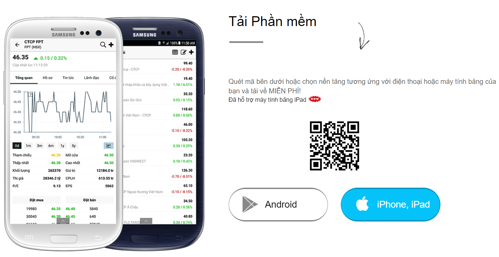
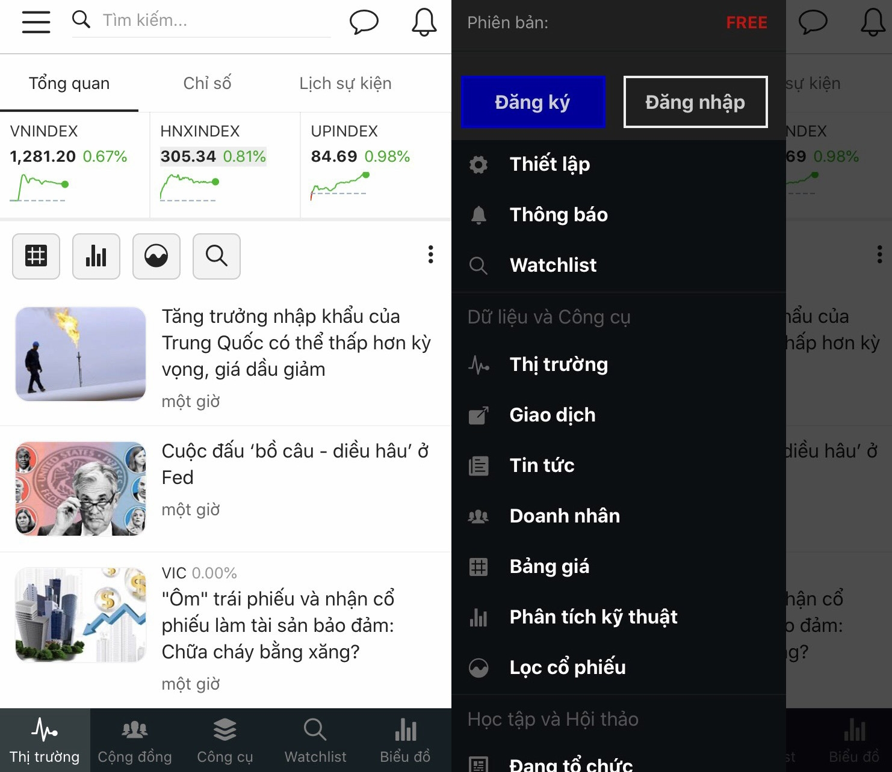
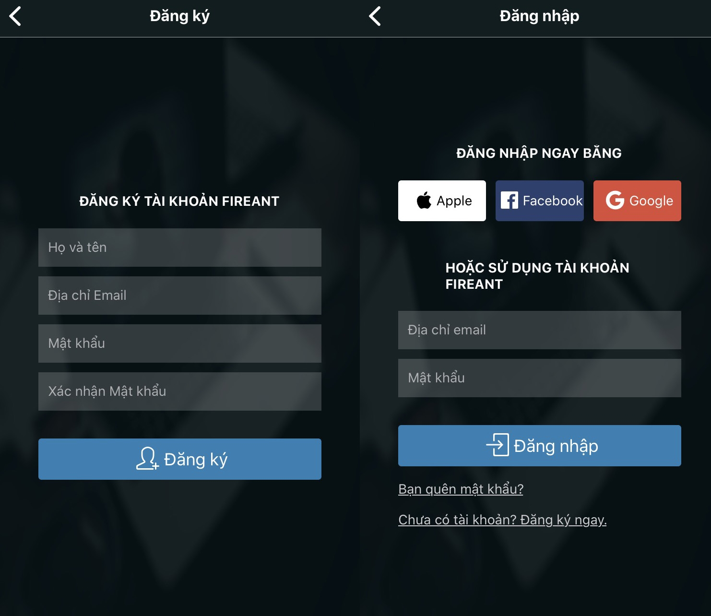

# Cài đặt và tạo tài khoản

## Bước 1: Cài đặt ứng dụng FireAnt Mobile

Tải ứng dụng FireAnt Mobile trên [Play Store](https://play.google.com/store/apps/details?id=vn.fireant.mobile\&hl=vi\&gl=US) (Android) hoặc [App Store](https://apps.apple.com/vn/app/fireant/id1060422890) (iOS) hoặc quét QR code dưới đây

## Bước 2: Đăng nhập/ Đăng ký tài khoản

Ở giao diện ban đầu của **FireAnt Mobile**, nhấn **☰**&#x20;

Sau đó chọn "**Đăng ký**" tài khoản mới hoặc "**Đăng nhập**"&#x20;

Bạn có thể đăng nhập bằng tài khoản **FireAnt** hoặc bằng tài khoản **Apple/Facebook/Google** có sẵn&#x20;

