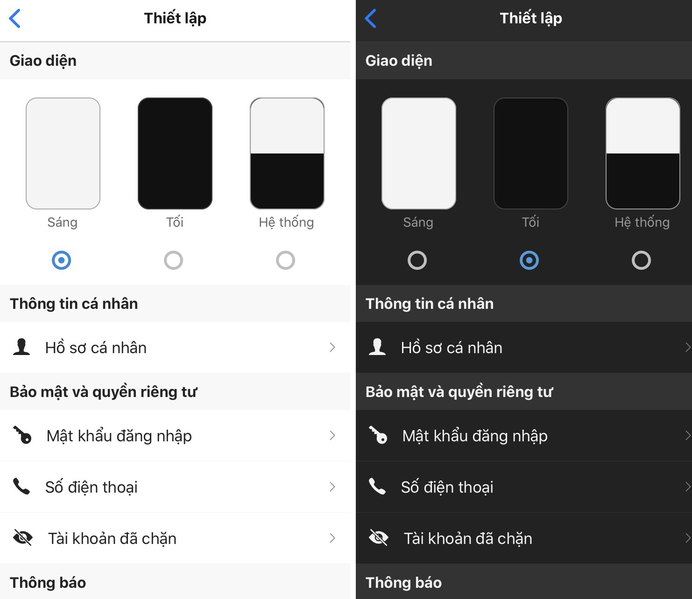
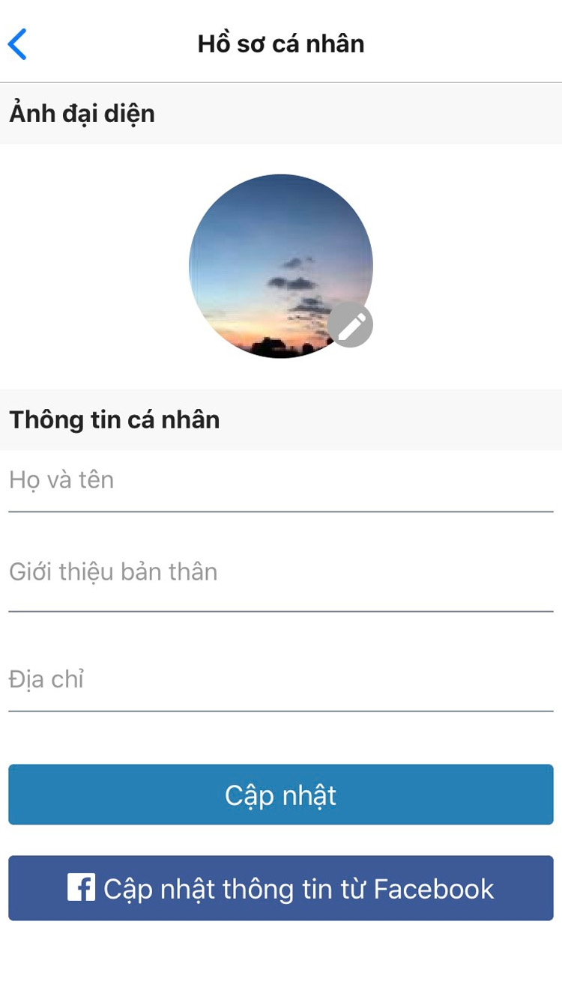
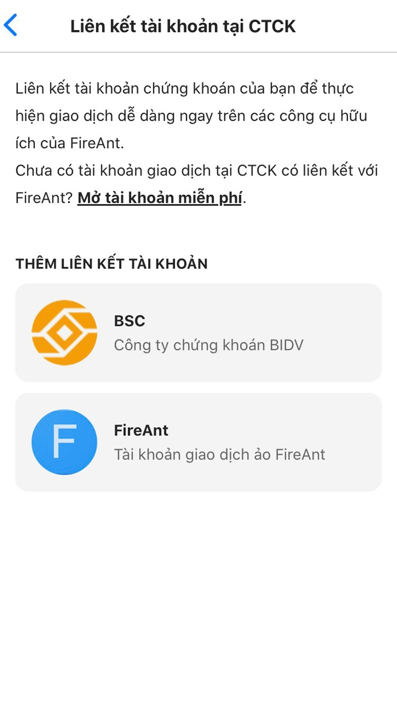

# Thiết lập

### Giao diện

FireAnt Mobile có các giao diện khác nhau phù hợp thị hiếu của các nhà đầu tư

### Thông tin cá nhân

Bạn có thể cập nhật thông tin Hồ sơ cá nhân của mình tại đây&#x20;

### Bảo mật và quyền riêng tư

* Đổi mật khẩu đăng nhập
* Thêm số điện thoại để khôi phục tài khoản/ đăng ký dịch vụ của FireAnt
* Xem danh sách tài khoản đã chặn

### Thông báo

* Bật/Tắt thông báo tin tức
* Bật/Tắt cảnh báo giá

### Giao dịch

Thêm tài khoản liên kết: Tài khoản giao dịch ảo FireAnt/ tài khoản tại công ty có liên kết với FireAnt

