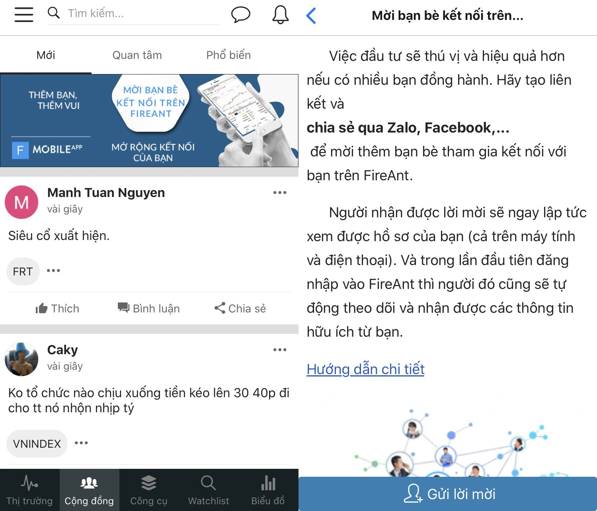
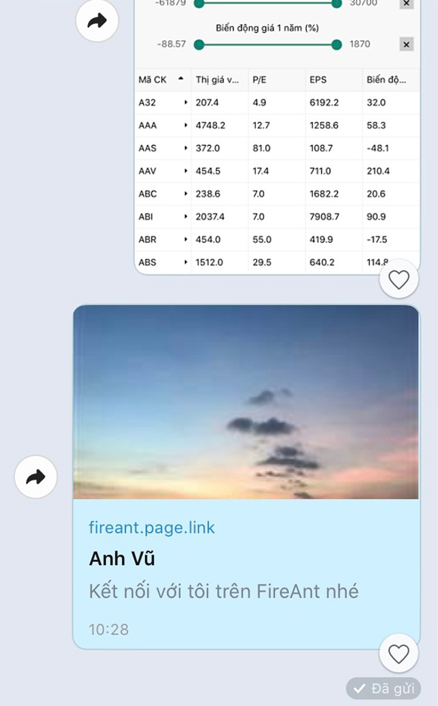
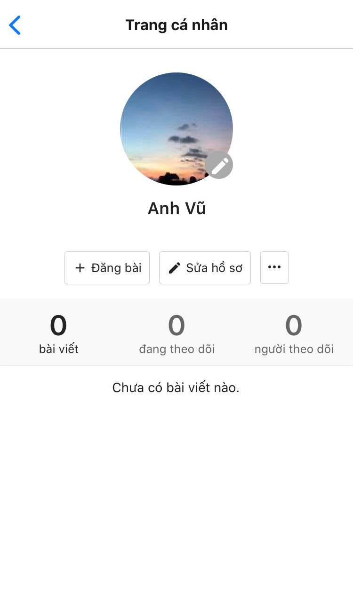

# Mời bạn bè kết nối

## Bước 1: Tạo liên kết mời kết nối

Người gửi tạo liên kết kết nối trên FireAnt bằng cách vào mục **Cộng đồng > Mời bạn bè kết nối trên FireAnt > Gửi lời mời**

## **Bước 2: Chia sẻ liên kết**

Chia sẻ liên kết lên các mạng xã hội Zalo, Facebook,...

## **Bước 3: Người nhận mở liên kết**

Người nhận mở liên kết bạn gửi sẽ tự động được chuyển đến trang **Hồ sơ cá nhân** của bạn.

## **Bước 4: Người nhận tự động theo dõi bạn**

Nhà đầu tư mới sau khi nhận lời mời của bạn, đăng nhập FireAnt lần đầu sẽ đều tự động "Theo dõi" bạn và cập nhật thông tin từ bạn
