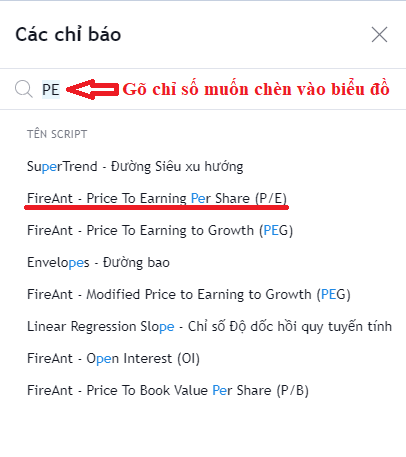
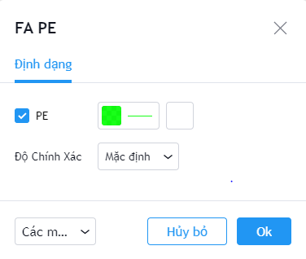

# Hướng dẫn chung

## 1. Thêm chỉ báo vào biểu đồ

Để thêm chỉ báo vào biểu đồ, bạn thực hiện các bước tương tự như thêm chỉ số kỹ thuật. Các chỉ số cơ bản cũng có chữ **FireAnt** ở đầu.

## 2. Thiết lập tham số cho chỉ báo

Cách thiết lập tham số cũng giống như với các chỉ số kỹ thuật. Bạn có thể thay đổi màu sắc cũng như độ đậm nhạt của đường biểu diễn chỉ báo.&#x20;

Bạn cũng có thể thay đổi độ chính xác của số liệu đến một số nhất định chữ số sau dấu phẩy.

Các thiết lập về màu sắc và độ đậm nhạt của đường biểu diễn chỉ số có thể lưu lại cho lần sử dụng tiếp theo.&#x20;


**Lưu ý:**&#x20;

Các chỉ số được xếp vào nhóm này bao gồm các chỉ số tài chính của doanh nghiệp, và một số chỉ số khác được dùng trong định giá như Beta, RS (Relative Strength) , Market Capitalization, hay chỉ số OI (Open Interest - chỉ có với các mã hợp đồng tương lai).&#x20;

Tất cả các chỉ số thuộc nhóm này đều được tính cho khung giờ daily, và không phải dữ liệu thời gian thực, do các chỉ số này nói chung chỉ thay đổi mỗi quý một làn khi có báo cáo tài chính mới.&#x20;

Các chỉ tiêu tài chính được tính cho quý gần nhất (Most Recent Quarter = MRQ)


## 3. Danh sách các chỉ số cơ bản có thể chèn vào biểu đồ

**Nhóm chỉ số định giá:**

* Beta (6 tháng)
* Market Capitalization
* Diluted EPS (MRQ)
* Price To Earning Per Share (P/E)
* Price To Book Value Per Share (P/B)
* Price To Earning to Growth (PEG)
* Modified Price to Earning to Growth (PEG)
* Relative Price Strength (RS)

**Nhóm chỉ số Khả năng sinh lợi:**

* Gross Margin (MRQ)
* Net Profit Margin (MRQ)
* EBIT Margin (MRQ)

**Nhóm chỉ số sức mạnh tài chính:**

* Debt To Equity (MRQ)
* Debt To Asset (MRQ)

**Nhóm chỉ số Hiệu quả quản lý:**

* ROA (MRQ)
* ROE (MRQ)

**Các chỉ tiêu về doanh thu và lợi nhuận:**

* Net Revenue (MRQ)
* Net Income (MRQ)
* Gross Profit (MRQ)

**Các chỉ tiêu về tài sản:**

* Current Assets (MRQ)
* Longterm Assets (MRQ)
* Total Assets (MRQ)
* Inventories (MRQ)
* Cash (MRQ)

**Các chỉ tiêu về vốn và nợ:**

* Equity (MRQ)
* Current Liabilities (MRQ)
* Longterm Liabilities (MRQ)
* Total Liabilities (MRQ)

**Các chỉ tiêu liên quan đến cổ tức:**

* DividendYield
* Payout Ratio
* Retention Ratio
* Total Stock Return (MRQ)
* Capital Gains Yield

**Chỉ tiêu sử dụng cho các hợp đồng tương lai chỉ số VN30:**

* Open Interest (OI)
