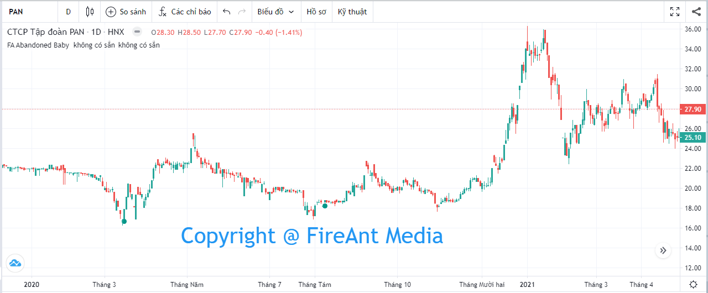
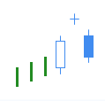
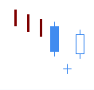
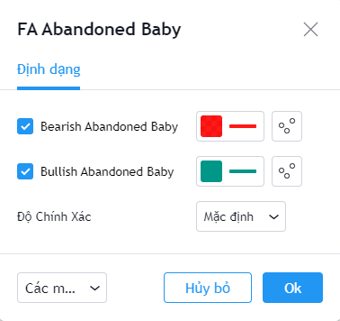

# Abandoned Baby

**Abandoned Baby Pattern** là một trong các mô hình nến Nhật có độ tin cậy cao, và cũng rất hiếm gặp. Mô hình này xuất hiện ở cuối 1 xu hướng, khi nến baby bị cô lập do tạo GAP với 2 nến trước và sau. Điều này thường xảy ra khi các tổ chức thay đổi quan điểm đột ngột khiến xu hướng giá bị bẻ gãy và đảo chiều. Có hai mẫu **Abandoned Baby** là **Bearish Abandoned Baby** và **Bullish Abandoned Baby**.

|  |  |
| ------------------------------------------------------------------- | ------------------------------------------------------------------- |
| **Bearish Abandoned Baby**                                          | **Bullish Abandoned Baby**                                          |

**Phiên bản Abandoned Baby Pattern của FireAnt** tìm kiếm cả hai mẫu hình nến **Bullish Abandoned Baby** và **Bearish Abandoned Baby**.

Mẫu **Bullish Abandoned Baby** sẽ được đánh dấu bằng chấm tròn màu xanh lá cây (và có thể coi là tín hiệu gợi ý mua). Ngược lại mẫu **Bearish Abandoned Baby** sẽ được đánh dấu bằng chấm tròn màu đỏ (và có thể coi là tín hiệu gợi ý bán).

Màu tín hiệu có thể thay đổi trong thiết lập:


**Gợi ý sử dụng**:&#x20;

**Abandoned Baby** là mẫu nến đảo chiều, do đó nó chỉ có giá trị khi xuất hiện trong một xu hướng (càng kéo dài càng tốt).&#x20;

Khi gặp mẫu nến này, bạn cần quan sát xem trước khi mẫu nến xuất hiện, giá có đi theo xu hướng không, xu hướng đó là tăng hay giảm, mạnh hay yếu.&#x20;

**Bullish Abandoned Baby** xuất hiện trong một xu hướng giảm là tín hiệu đảo chiều tăng đáng tin cậy, và việc mua vào thường là lựa chọn tốt. Nếu mua vào khi **Bullish Abandoned Baby** xuất hiện, bạn cần đặt điểm dừng lỗ tối đa tại điểm thấp nhất của nến baby.&#x20;

Tương tự **Bearish Abandoned Baby** xuất hiện trong xu hướng tăng sẽ là dấu hiệu đảo chiều giảm, và bạn nên bán ra.

