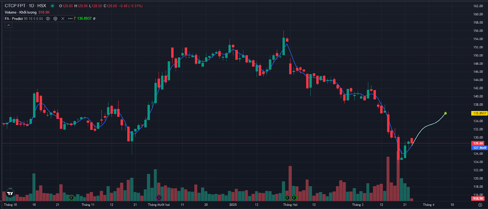
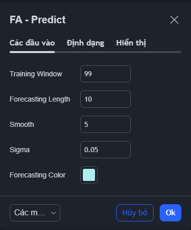
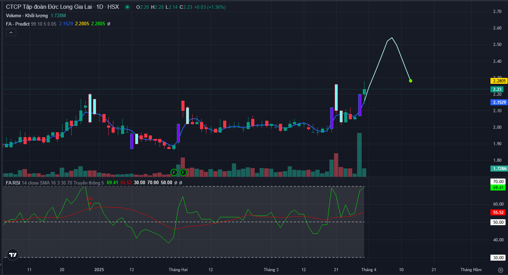
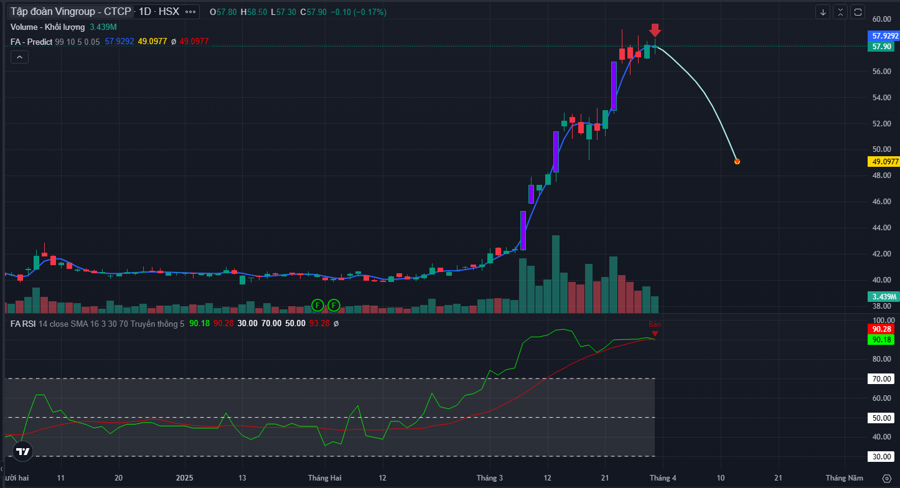

# AI Predition

Chỉ báo FireAnt – AI Prediction sử dụng Hồi quy của quá trình Gaussian (Gaussian Process Regression, một phương pháp học máy phổ biến có khả năng ước lượng các xu hướng cơ bản trong giá và dự báo giá trong tương lai.

Việc dự báo xu hướng thị trường là rất thách thức, đặc biệt là trong môi trường thời gian thực, vì vậy chúng tôi khuyến cáo không sử dụng chỉ báo này làm công cụ duy nhất để ra quyết định giao dịch.

<figure><figcaption></figcaption></figure>

🔶 HƯỚNG DẪN SỬ DỤNG

Mục tiêu chính của chỉ báo FireAnt – AI Prediction mà chúng tôi triển khai là dự báo xu hướng. Phương pháp này áp dụng trên một tập hợp các mức giá gần đây nhất, với Training Window (Cửa sổ huấn luyện) xác định kích thước của tập dữ liệu này, có giá trị mặc định là 99. Trong trường hợp bạn có số thanh giá trong quá khứ ít hơn giá trị Traing Window, bạn sẽ được yêu cầu chiều chỉnh tham số Traing Window thấp xuống. Theo kinh nghiệm của chung tôi giá trị Traing Window nên chọn trong khoảng 50-200.&#x20;

Người dùng có hai thiết lập chính để điều chỉnh kết quả ước lượng xu hướng, đó là Smooth (Độ mượt) và Sigma.

* Smooth quyết định mức độ mượt của đường dự báo. Giá trị cao hơn sẽ cho ra kết quả mượt mà hơn, phù hợp với việc dự báo xu hướng ở các khung dài hạn như weekly, monthly. Giá trị mặc định là 5, theo kinh nghiệm của chúng tôi, giá trị Smooth nên chọn trong khoảng từ 5-10
* Sigma kiểm soát biên độ (độ dao động) của đường dự báo. Giá trị càng gần 0 thì biên độ dao động càng lớn. Giá trị mặc định là 0.05.

FireAnt – AI Prediction bao gồm đường nhận định xu hướng trong quá khứ, qua đó cung cấp một khả năng kiểm thử quá khứ. Với từng mã chứng khoán, người dùng có thể điều chỉnh các tham số sao cho đường nhận định xu hướng trong quá khứ đi qua càng nhiều nến trong quá khứ càng tốt, khi đó giá trị của các tham số được coi là phù hợp nhất đối với mã chứng khoán đang xem.

🔶 CÁC THIẾT LẬP

* Training Window (Cửa sổ huấn luyện): Số lượng điểm dữ liệu giá gần nhất được dùng để xây dựng mô hình. Giá trị mặc định là 99.
* Forecasting Length (Chiều dài dự báo): Khoảng thời gian trong tương lai mà mô hình sẽ dự báo (được tính bằng số thanh giá). Độ dài dự báo càng lớn thì độ chính xác của các điểm ở xa trong tương lai càng giảm đi. Giá trị mặc định là 10.
* Smooth (Độ mượt): Kiểm soát mức độ mượt của đường dự báo. Giá trị mặc định là 5.
* Sigma (Phương sai nhiễu): Kiểm soát biên độ dao động của dự báo; giá trị thấp sẽ khiến mô hình nhạy hơn với những điểm bất thường. Giá trị mặc định là 0.05
* Forcasting Color: Chọn màu cho đường dự báo. Màu mặc định là xanh lơ.

<figure><figcaption></figcaption></figure>

🔶 HƯỚNG DẪN THỰC CHIẾN

<figure><figcaption>
Hỗ trợ duy trì vị thế
</figcaption></figure>

Xu hướng dự báo thường sẽ lập các đỉnh và đáy. Chừng nào các đỉnh và đáy dự báo vẫn cao hơn/thấp hơn giá hiện tại, thì bạn nên tiếp tục duy trì vị thế cũ. Trong ví dụ trên, đỉnh dự báo của DLG vẫn cao hơn giá hiện tại, nên dù giá có điều chỉnh, cũng chưa cần thoát khỏi vị thế mua.

<figure><figcaption>
Hỗ trợ xác định điểm vào lệnh
</figcaption></figure>

Khi giá đạt tới đỉnh/đáy dự báo, bạn có thể căn cứ vào dự báo sườn giá sau đỉnh/đáy để thực hiện giao dịch. Ví dụ trong hình cho thấy VIC đã đạt đỉnh, nên bán ra. Thông thường sườn giá sau khi đạt đỉnh/đáy cần đủ lớn, mới nên tham gia giao dịch.

 
