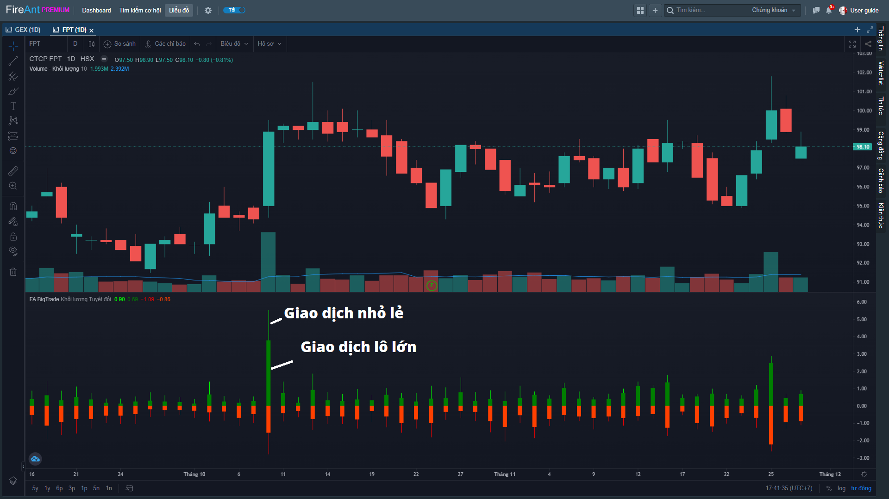
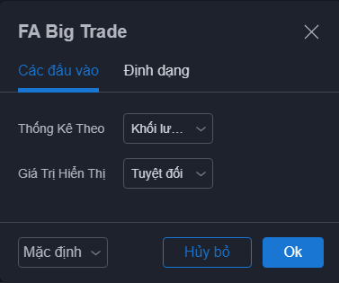
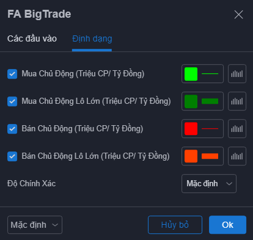

# Big Trade

**Chỉ báo Big Trade thống kê tổng các giao dịch chủ động được coi là giao dịch lớn (có giá trị giao dịch trên 500 triệu)**.&#x20;

Các giao dịch với giá trị lớn thường do các nhà đầu tư lớn tạo ra và có ảnh hưởng tới giá cổ phiếu nhiều hơn so với các giao dịch nhỏ lẻ.

Thống kê giao dịch lớn có thể xem theo giá trị tuyệt đối (theo khối lượng hoặc giá trị giao dịch), hoặc tương đối (theo tỷ lệ phần trăm trên tổng khối lượng hoặcgiá trị giao dịch chủ động).

Các giao dịch mua và bán được thể hiện bởi các cột màu xanh (mua chủ động) hoặc đỏ (bán chủ động) ngược chiều nhau, giao dịch bán có giá trị là số âm. Giao dịch lớn thể hiện bởi cột thân dày, còn giao dịch nhỏ lẻ được thể hiện bởi cột thân mảnh.


**Chỉ báo này chỉ áp dụng cho khung daily**


Các tham số mà chúng tôi sử dụng mặc định (người dùng có thể thay đổi):

* **Thống kê theo**: Mặc định giao dịch lô lớn được thống kê theo tổng khối lượng các giao dịch có giá trị trên 500 triệu đồng. Bạn có thể chọn thống kê theo tổng giá trị các giao dịch có giá trị trên 500 triệu đồng.
* **Giá trị hiển thị**: Mặc định là hiển thị tổng khối lượng/giá trị các giao dịch lớn (thân nến) và tổng khối lượng/giá trị giao dịch chủ động (thân nến và chân nến). Bạn có thể chọn hiển thị theo tỷ lệ phần trăm của tổng khối lượng giao dịch lớn so với tổng khối lượng giao dịch chủ động&#x20;

Bên cạnh các tham số, người dùng cũng có thể thay đổi màu sắc các cột hiển thị Khối lượng/giá trị tổng mua/bán chủ động và khối lượng/giá trị mua/bán chủ động lô lớn.


**Gợi ý sử dụng:**&#x20;

**Big Trade** có thể sử dụng để phát hiện sự đột biến trong giao dịch của các nhà đầu tư lớn, khi khối lượng giao dịch tăng đột biến đồng thời tỷ trọng giao dịch lô lớn ở mức cao..

