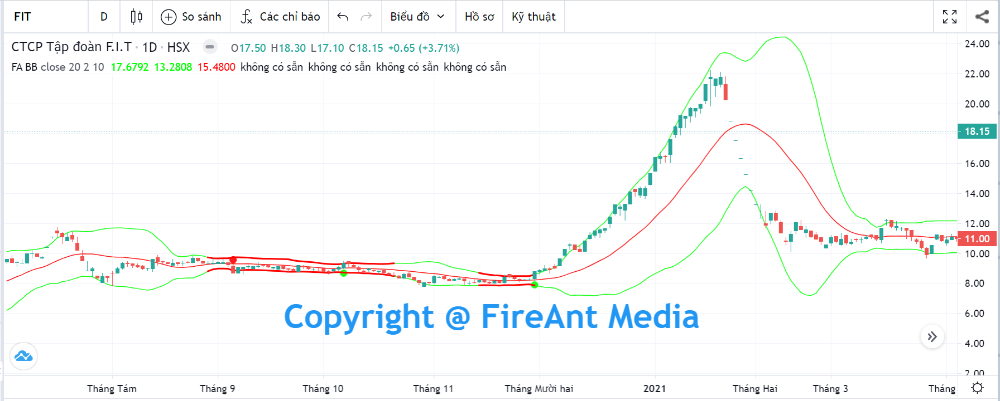
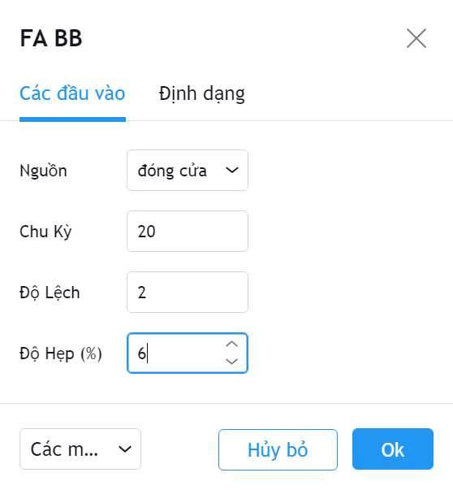
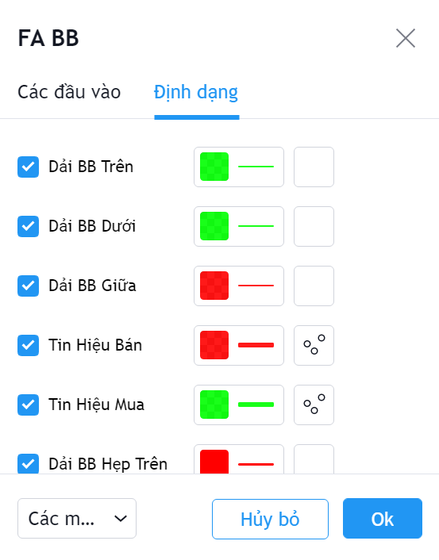

# Bollinger Bands

**Bollinger Bands** là 1 trong những indicator phổ biến và đa năng nhất. Đã có hàng trăm hàng trăm hệ thống giao dịch được phát triển từ chỉ chỉ số Bollinger Bands, mỗi hệ thống có lợi thế riêng.

**Phiên bản Bollinger Bands của FireAnt** là sự kết hợp giữa hai chỉ số **Bollinger Bands** và **Bollinger Bands Width**. Tín hiệu gợi ý mua/bán được tạo ra khi dải **Bollinger** co thắt đồng thời giá tăng vượt dải **Bollinger** (tín hiệu gợi ý mua) hoặc giảm xuống dưới dải **Bollinger** (tín hiệu gợi ý bán).

Các đoạn **Bollinger Bands** co thắt được tô đậm màu đỏ (màu có thể thay đổi trong thiết lập). Tín hiệu gợi ý mua được đánh dấu bơi một chấm tròn màu xanh, và tín hiệu gợi ý bán được gợi ý bởi một chấm tròn màu đỏ.

Các tham số mà chúng tôi sử dụng mặc định (người dùng có thể thay đổi):

* **Nguồn:** Giá đóng cửa được sử dụng để tính giá trị dải **Bollinger**
* **Chu kỳ:** Chu kỳ tính là 20 nến
* **Độ lệch**: Độ lệch được sử dụng là 2 lần độ lệch chuẩn (standard deviation)
* **Độ hẹp** (%): Khoảng cách giữa 2 dải **Bollinger** được cho là hẹp (co thắt) là dưới 6% so với dải MA 20 (dải **Bollinger** giữa).

Bên cạnh các tham số, người dùng cũng có thể thay đổi màu sắc các dải Bollinger trên dưới và giữa, màu tín hiệu mua/bán, cũng màu các đoạn co thắt.


**Gợi ý sử dụng**:&#x20;

Do các chứng khoán khác nhau có mức giá cũng như diễn biến giá khác nhau, sẽ rất khó để sử dụng các tham số với giá trị cố định cho tất cả các mã.&#x20;

Với các mã khác nhau, người dùng nên điều chỉnh các tham số sao cho tín hiệu xuất hiện càng chính xác trong quá khứ càng tốt. Không nên dùng cố định giá trị tham số cho mọi mã và mọi khung thời gian.&#x20;

Với từng giai đoạn khác nhau của thị trường, bạn cũng nên có những điều chỉnh thích hợp, ví dụ trong giai đoạn thị trường đang dao động trong biên hẹp, bạn có thể hạ bớt giá trị giới hạn co thắt của dải Bollinger xuống 4% (hoặc thấp hơn). Còn trong giai đoạn thị trường đang có xu hướng mạnh, bạn cần đẩy cao giá trị giới hạn co thắt của dải Bollinger.&#x20;

Cho đầu tư dài hạn hay ngắn hạn cũng cần sử dụng các tham số khác nhau, nếu bạn chỉ giao dịch ngắn hạn, bạn nên chọn chu kỳ tính giá trị giải Bollinger là 15.&#x20;

Độ lệch cũng ảnh hưởng đến số lượng tín hiệu. Độ lệch càng cao (3.5 có thể coi là rất cao và giá rất ít khi thoát ra khỏi dải Bollinger với độ lệch này), số lượng tín hiệu càng ít, nhưng độ tin cậy cũng càng cao. Ngược lại độ lệch thấp sẽ cho nhiều tín hiệu gơi ý mua bán với độ tin cậy thấp hơn.

