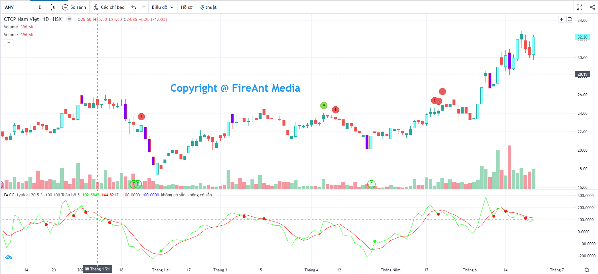
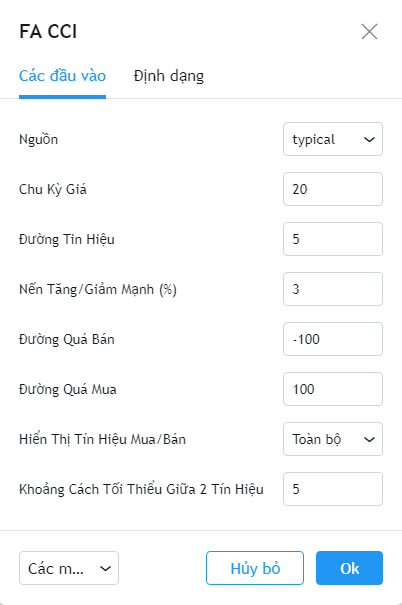
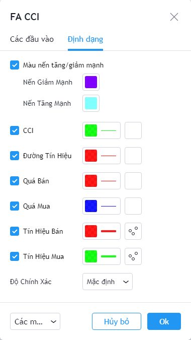

# Commodity Channel Index (CCI)

**Chỉ số kênh hàng hóa (CCI)** là một chỉ báo dao động được dùng để đo lường sức mạnh đằng sau hành động giá. Hiểu một cách đơn giản, chỉ báo CCI cho phép nhà đầu tư xác định xu hướng đang kiểm soát thị trường (xu hướng lên hoặc xu hướng xuống). CCI do Donald R Lambert tạo ra năm 1980.

**Phiên bản CCI của FireAnt** bổ sung thêm đường trung bình của CCI (còn gọi là đường tín hiệu) theo các chu kỳ khác nhau, và sử dụng giao cắt giữa CCI và đường tín hiệu để tạo ra các tín hiệu gợi ý mua/bán...

Có 3 cách sử dụng được chúng tôi đưa vào:

* **Toàn bộ tín hiệu**: Hiển thị các tín hiệu gợi ý mua bán, với ràng buộc là CCI trước khi cắt đường tín hiệu phải nằm trong vùng quá mua hoặc quá bán.
* **Xuất hiện lần lượt**: Cách sử dụng này có thêm một ràng buộc nữa là các tín hiệu gợi ý mua bán chỉ xuất hiện khi trước đó có xuất hiện tín hiệu trái chiều. Đây là cách sử dụng nhằm loại bỏ các tín hiệu cùng chiều xuất hiện liên tiếp (liên tiếp mua hoặc liên tiếp bán)
* **Loại bỏ tín hiệu sát nhau**: Tín hiệu chỉ xuất hiện khi cách tín hiệu trước đó 1 số nến. Cách dùng này nhằm loại bỏ các tín hiệu xuất hiện quá gần nhau (tín hiệu nhiễu)

Để chọn cách sử dụng, bạn vào thiết lập của chỉ báo vào chọn giá trị tương ứng cho tham số **Hiển thị tín hiệu mua/bán**

Các tham số mà chúng tôi sử dụng mặc định (người dùng có thể thay đổi):

* **Nguồn**: Giá điển hình (typical price, được tính bằng trung bình của 3 loại giá: đóng cửa, cao nhất và thấp nhất) được sử dụng để tính CCI
* **Chu kỳ tính**: Chu kỳ tính CCI là 20 nến
* **Chu kỳ đường tín hiệu**: Chu kỳ tính đường tín hiệu là 5 nến
* **Vùng quá mua**: Khi CCI>= 100
* **Vùng quá bán**: Khi CCI <= -100
* **Hiển thị các nến giá tăng giảm mạnh (%)**: Khi chênh lệch giá đóng và mở cửa vượt quá hoặc bằng 3% so với giá mở cửa.
* **Hiển thị tín hiệu mua/bán**: Hiển thị là toàn bộ tín hiệu mua/bán
* **Khoảng cách tối thiểu giữa 2 tín hiệu**: 5 nến (thông số này chỉ được dùng khi cách hiển thị tín hiệu được chọn là Loại bỏ tín hiệu sát nhau)

Bên cạnh các tham số, người dùng cũng có thể thay đổi màu sắc đường CCI, đường tính hiệu, màu tín hiệu mua/bán, màu ranh giới các vùng quá mua, quá bán, và màu các nến tăng/giảm mạnh.


**Gợi ý sử dụng**:&#x20;

Mặc dù được phát triển với mục đích ban đầu để phục vụ cho giao dịch hàng hóa, **CCI** cũng có thể sử dụng hiệu quả đối với các loại chứng khoán. **CCI** có thể được sử dụng độc lập hoặc dùng chung với các chỉ số khác.&#x20;

Với các mã khác nhau, người dùng nên điều chỉnh các tham số sao cho tín hiệu xuất hiện càng chính xác trong quá khứ càng tốt. Không nên dùng cố định giá trị tham số cho mọi mã và mọi khung thời gian.&#x20;

Mặc dù **CCI** sử dụng các ngưỡng -100 và 100 làm ngưỡng quá bán, quá mua, nhưng do **CCI** không bị ràng buộc theo một công thức nhất định như các cỉ báo động lượng nên các mức quá mua, quá bán này đôi khi sẽ mang tính chủ quan. Để thiết lập các ngưỡng quá mua, quá bán hiệu quả cho từng mã chứng khoán và các giai đoạn khác nhau, phụ thuộc nhiều vào kinh nghiệm thực chiến của nhà đầu tư.

