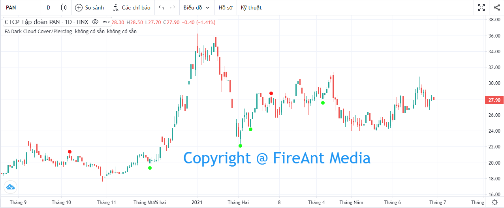
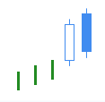
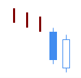
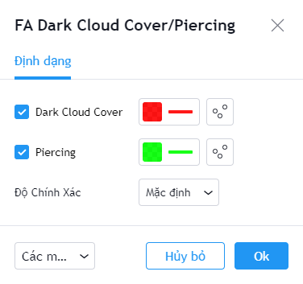

# Dark Cloud Cover / Piercing

**Dark Cloud Cover** là một trong các mô hình nến Nhật được sử dụng khá phố biến với độ tin cậy ở mức trung bình. **Dark Cloud Cover** được sử dụng để xác định sự đảo chiều giảm cuối một xu hướng tăng giá mạnh.&#x20;

Mô hình này xuất hiện khi ở mở cửa ở phiên đảo chiều cao hơn đóng cửa phiên trước, nhưng đóng cửa lại nằm ở nửa dưới của thân nến trước.&#x20;

Ngược lại với **Dark Cloud Cover, Piercing** được sử dụng để xác định sự đảo chiều tăng cuối một xu hướng giảm giá mạnh.&#x20;

Mô hình này xuất hiện khi ở mở cửa ở phiên đảo chiều thấp hơn đóng cửa phiên trước, nhưng đóng cửa lại nằm ở nửa trên của thân nến trước.

|  |  |
| ------------------------------------------------------------------- | ------------------------------------------------------------------- |
| **Dark Cloud Cover**                                                | **Piercing**                                                        |

**Phiên bản Dark Cloud Cover/Piercing của FireAnt** tìm kiếm cả hai mẫu hình nến **Dark Cloud Cove**r và **Piercing**.

Mẫu **Piercing** sẽ được đánh dấu bằng chấm tròn màu xanh lá cây (và có thể coi là tín hiệu gợi ý mua). Ngược lại mẫu **Dark Cloud Cover** sẽ được đánh dấu bằng chấm tròn màu đỏ (và có thể coi là tín hiệu gợi ý bán).&#x20;

Màu tín hiệu có thể thay đổi trong thiết lập:


**Gợi ý sử dụng**:&#x20;

**Dark Cloud Cover/Piercing** là các mẫu nến đảo chiều, do đó nó chỉ có giá trị khi xuất hiện trong một xu hướng (càng kéo dài càng tốt).&#x20;

Khi gặp mẫu nến này, bạn cần quan sát xem trước khi mẫu nến xuất hiện, giá có đi theo xu hướng không, xu hướng đó là tăng hay giảm, mạnh hay yếu.&#x20;

**Piercing** xuất hiện trong một xu hướng giảm là tín hiệu đảo chiều tăng có độ tin cậy ở mức trung bình, nên quyết định mua vào cần sử dụng thêm các tín hiệu khác để xác nhận. Nếu mua vào khi mẫu nến **Piercing** xuất hiện, bạn cần đặt điểm dừng lỗ tối đa tại điểm thấp nhất của nến đảo chiều (nến **Piercing** thứ 2).&#x20;

Tương tự **Dark Cloud Cover** xuất hiện trong xu hướng tăng sẽ là dấu hiệu đảo chiều giảm, và bạn có thể cân nhắc bán ra, nếu có thêm xác nhận từ các chỉ báo khác.

