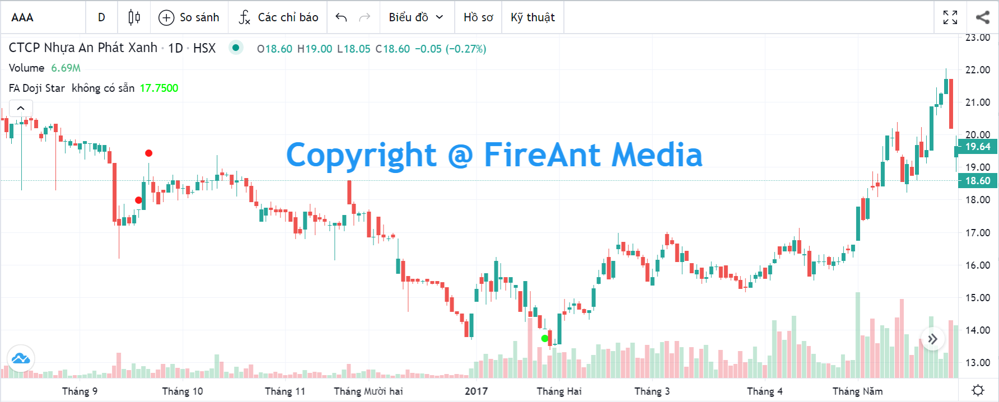
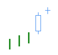
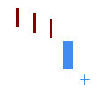
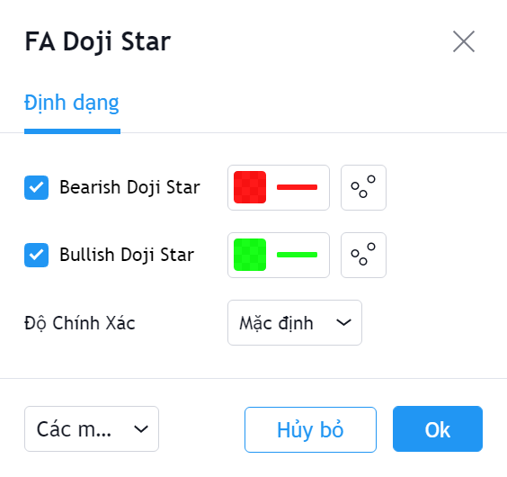

# Doji Star

**Doji Star Pattern** là một trong các mô hình nến Nhật thường gặp với độ tin cậy ở mức thấp đến trung bình.&#x20;

**Doji Star** được sử dụng để xác định sự đảo chiều cuối một xu hướng giá.&#x20;

Mô hình gồm hai nến này có giá trị khi xuất hiện trong một xu hướng, trong đó nến đầu là nến có thân dài cùng chiều xu hướng, tiếp đến là một nến doji có thân nến nằm bên trên (nếu xu hướng là tăng) hoặc bên dưới (nếu xu hướng là giảm) thân của nến thứ nhất. Nến thứ hai không được là nến doji bốn giá bằng nhau (O=H=L=C). Độ dài của bóng nến là bao nhiêu không quan trọng.

|   |  |
| --------------------------------------------------------------------------------------------------------------------------------------- | ------------------------------------------------------------------- |
|  **Bearish Doji Star**                                                   | **Bullish Doji Star**                                               |

**Phiên bản Doji Star của FireAnt** tìm kiếm cả hai mẫu hình nến **Bullish Doji Star** và **Bearish Doji Star**.&#x20;

Mẫu **Bullish Doji Star** sẽ được đánh dấu bằng chấm tròn màu xanh lá cây (và có thể coi là tín hiệu gợi ý mua). Ngược lại mẫu **Bearish Doji Star** sẽ được đánh dấu bằng chấm tròn màu đỏ (và có thể coi là tín hiệu gợi ý bán).&#x20;

Màu tín hiệu có thể thay đổi trong thiết lập:


**Gợi ý sử dụng:**&#x20;

**Doji Star** là mẫu nến đảo chiều, do đó nó chỉ có giá trị khi xuất hiện trong một xu hướng (càng kéo dài càng tốt).&#x20;

Khi gặp mẫu nến này, bạn cần quan sát xem trước khi mẫu nến xuất hiện, giá có đi theo xu hướng không, xu hướng đó là tăng hay giảm, mạnh hay yếu.&#x20;

Doji Star xuất hiện trong một xu hướng là tín hiệu đảo chiều với mức tin cậy thấp đến trung bình, nên quyết định mua vào/bán ra cần sử dụng thêm các tín hiệu khác để xác nhận. Nếu mua vào khi Bullish Doji Star xuất hiện, bạn cần đặt điểm dừng lỗ tối đa tại điểm thấp nhất của nến doji.

