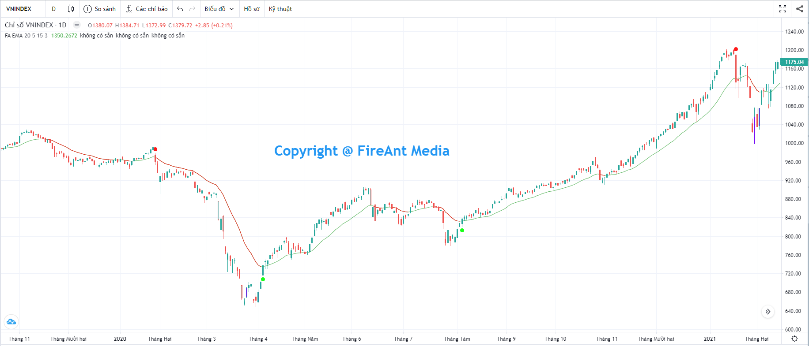
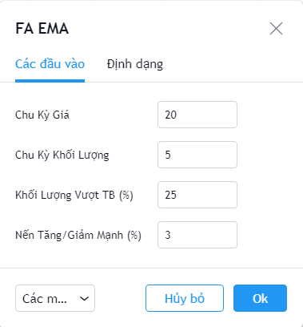
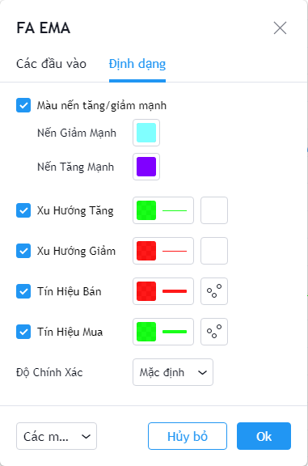

# EMA

**Đường trung bình hàm mũ (EMA)** là một trong 2 đường trung bình động được sử dụng phố biến nhất trong phân tích kĩ thuật.&#x20;

Đường **EMA** làm mượt đường giá hơn bằng cách loại bỏ các yếu tố ngẫu nhiên thông qua việc lấy trung bình theo trọng số của giá đóng cửa trong một khoảng thời gian nhất định. Đường EMA giúp chúng ta nhận biết được xu hướng của thị trường và xác định được các ngưỡng kháng cự và hỗ trợ.&#x20;

**Phiên bản EMA của FireAnt** cho phép nhà đầu tư lựa chọn thêm điều kiện về đột biến khối lượng, qua đó tăng độ chính xác của tín hiệu mua bán. Tín hiệu sẽ được tạo ra khi giá cắt lên đường **EMA** đồng thời khối lượng đạt mức tăng đột biến so với khối trung bình một số phiên tính đến phiên hiện tại.&#x20;

Đường **EMA** cũng sử dụng 2 màu khác nhau cho xu hướng tăng (màu xanh) và giảm (màu đỏ), giúp nhà đầu tư dễ theo dõi các giai đoạn biến động giá.&#x20;

Các tham số mà chúng tôi sử dụng mặc định (người dùng có thể thay đổi):

* **Chu kỳ Giá**: Chu kỳ tính EMA là 20 nến
* **Chu kỳ khối lượng**: Chu kỳ tính khối lượng bình quân là 5 nến
* **Khối lượng vượt trung bình (%):** Tín hiệu gợi ý mua/bán chỉ xuất hiệ nếu đồng thời khối lượng giao dịch vượt 25% so với khối lượng trung bình của 5 nến gần nhất (tính cả nến hiện tại)
* **Nến Tăng/Giảm mạnh (%)**: Hiển thị các nến tăng/giảm giá đóng cửa so với giá mở cửa trên 3%

Bên cạnh các tham số, người dùng cũng có thể thay đổi màu sắc các nến tăng/giảm mạnh, màu của đường EMA khi xu hướng là tăng/giảm, màu của tín hiệu gợi ý mua/bán.


**Gợi ý sử dụng**:&#x20;

Mục đích chính của **EMA** là để giúp nhà đầu tư phân biệt xu hướng giá ở các giai đoạn khác nhau của mã cổ phiếu. Khi xu hướng là tăng, nhà đầu tư nên giữ và không bán ra quá sớm khi có điều chỉnh nhẹ, mà chỉ cần bán khi xu hướng thay đổi thành giảm. Ngược lại, khi xu hướng là giảm, nhà đầu tư cũng không nên vội mua vào khi có điều chỉnh tăng nhẹ, mà chỉ nên mua vào khi xu hướng chuyển sang tăng.&#x20;

Đặc điểm của **EMA** là trọng số được đặt nặng vào các nến cuối, càng gần với nên hiện tại thì trọng số được tính càng lớn. Do đó **EMA** thường khá nhậy đối với diễn biến giá, Đây cũng là lý do **EMA** được ưa chuộng hơn chỉ số trung bình trượt đơn giản (**SMA**)

