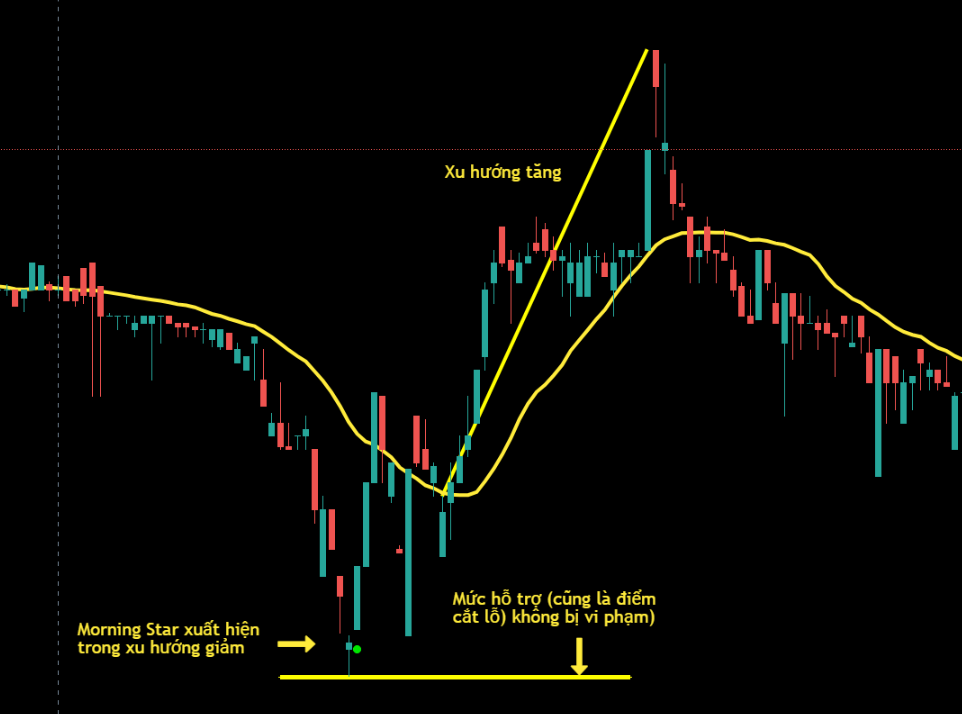
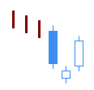
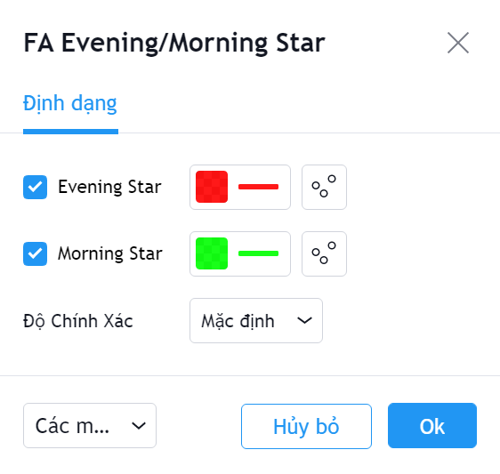

# Evening Star / Morning Star

**Evening Star/Morning Star Pattern** là một trong các mô hình nến Nhật được sử dụng khá rộng rãi với độ tin cậy trung bình.

**Evening Star** (*sankawa yoi no myojyo*) được sử dụng để xác định sự đảo chiều giảm cuối một xu hướng tăng giá.

Mô hình gồm ba nến này có giá trị khi xuất hiện trong một xu hướng tăng giá, trong đó nến đầu là nến tăng có thân dài, tiếp đến là một nến thân nhỏ giảm hoặc tăng nhưng có thân nến nằm bên trên thân của nến thứ nhất. Nến thứ hai có thể là một nến doji, nhưng không được là nến doji bốn giá bằng nhau (O=H=L=C). Nến thứ ba là 1 nến thân dài giảm với giá mở cửa nằm dưới thân nến thứ hai, và đóng cửa cao nhất ở nửa dưới thân nến thứ nhất.&#x20;

Ngược lại với mẫu nến **Evening Star**, mẫu nến **Morning Star (***sankawa ake no myojyo*) được sử dụng để xác định sự đảo chiều tăng cuối một xu hướng giảm giá.&#x20;

Mẫu **Morning Star** có giá trị khi hình thành trong một xu hướng giảm và gồm ba nến, trong đó nến đầu là nến giảm có thân dài, tiếp đến là một nến thân nhỏ giảm hoặc tăng nhưng có thân nến nằm bên dưới thân của nến thứ nhất. Nến thứ hai có thể là một nến doji, nhưng không được là lên doji bốn giá bằng nhau (O=H=L=C). Nến thứ ba là 1 nến thân dài tăng với giá mở cửa nằm trên thân nến thứ hai, và đóng cửa thấp nhất ở nửa trên thân nến thứ nhất.

|  |  |
| ------------------------------------------------------------------- | ------------------------------------------------------------------- |
| **Evening Star**                                                    | **Morning Star**                                                    |

**Phiên bản Evening Star/Morning Star của FireAnt** tìm kiếm cả hai mẫu hình nến **Evening Sta**r và **Morning Star**.

Mẫu **Evening Star** sẽ được đánh dấu bằng chấm tròn màu xanh lá cây (và có thể coi là tín hiệu gợi ý mua). Ngược lại mẫu **Morning Star** sẽ được đánh dấu bằng chấm tròn màu đỏ (và có thể coi là tín hiệu gợi ý bán).&#x20;

Màu tín hiệu có thể thay đổi trong thiết lập:


**Gợi ý sử dụng:**&#x20;

**Evening Star/Morning Star** là các mẫu nến đảo chiều, do đó nó chỉ có giá trị khi xuất hiện trong một xu hướng (càng kéo dài càng tốt). Khi gặp mẫu nến này, bạn cần quan sát xem trước khi mẫu nến xuất hiện, giá có đi theo xu hướng không, xu hướng đó là tăng hay giảm, mạnh hay yếu.&#x20;

**Morning Star** xuất hiện trong một xu hướng giảm là tín hiệu đảo chiều tăng với mức tin cậy trung bình, nên quyết định mua vào cần sử dụng thêm các tín hiệu khác để xác nhận. Nếu mua vào khi **Morning Star** xuất hiện, bạn cần đặt điểm dừng lỗ tối đa tại điểm thấp nhất của nến thứ hai, nếu bạn giao dịch ngắn hạn. Bạn có thể đặt điểm dừng lỗ là điểm thấp nhất của xu hướng giảm trước đó nếu bạn hướng tới nắm giữ dài hạn.&#x20;

Tương tự **Evening Star** xuất hiện trong xu hướng tăng sẽ là dấu hiệu đảo chiều giảm, và bạn có thể cân nhắc bán ra, nếu có thêm xác nhận từ các chỉ báo khác.

