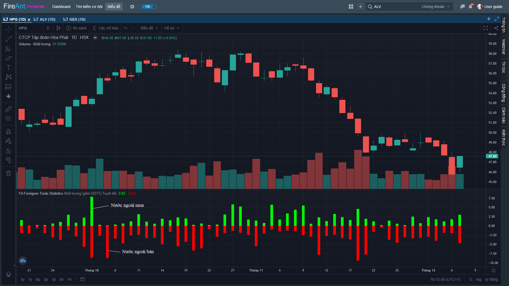
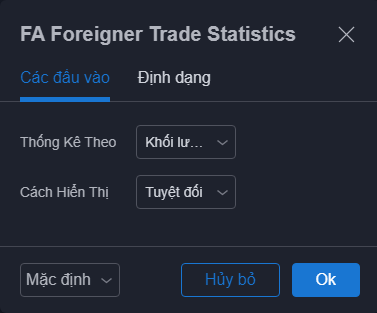
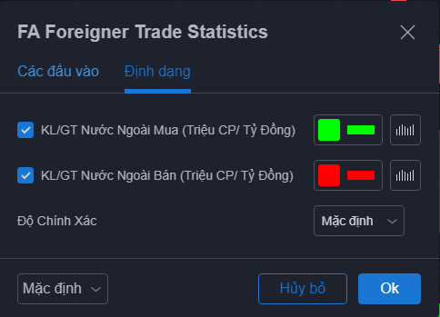

# Foreigner Trade Statistics

Chỉ báo **Foreigner Trade Statistics** thống kê giao dịch của khối ngoại. Mặc dù giao dịch của khối ngoại hiện tại chỉ chiếm tỷ trọng tương đối thấp (3%-5%) so với tổng giao dịch của thị trường, nhưng do giao dịch của khối này chủ yếu do các nhà đầu tư chuyên nghiệp của các quỹ hoặc tổ chức có tiếng của nước ngoài thực hiện, nên giao dịch của khối này vẫn nhận được sự quan tâm nhất định.

Thống kê khối ngoại có thể xem theo khối lượng, giá trị, cũng như theo tỷ trọng so với tổng giao dịch. Tổng khối lượng (giá trị) mua và bán của khối ngoại được thể hiện theo màu sắc khác nhau và với giá trị trái dấu.


**Chỉ báo này chỉ áp dụng cho khung daily**


Các tham số mà chúng tôi sử dụng mặc định (người dùng có thể thay đổi):

* **Thống kê theo**: Mặc định giao dịch của nhà đầu tư nước ngoài được thống kê theo tổng khối lượng mua (màu xanh) và tổng khối lượng bán (màu đỏ) của họ trong mỗi phiên. Bạn có thể chọn thống kê theo tổng giá trị mua và tổng giá trị bán của nhà đầu tư nước ngoài theo phiên.
* **Cách hiển thị**: Mặc định là hiển thị tổng khối lượng/giá trị các giao dịch mua/bán của nhà đầu tư nước ngoài. Bạn có thể chọn hiển thị theo tỷ lệ phần trăm tổng khối lượng/giá trị giao dịch của nhà đầu tư nước ngoài so với tổng khối lượng/giá trị giao dịch của mã chứng khoán tương ứng

Bên cạnh các tham số, người dùng cũng có thể thay đổi màu sắc các cột hiển thị tổng khối lượng/giá trị mua/bán của khối ngoại


**Gợi ý sử dụng:**&#x20;

**Foreigner Trade Statistics** có thể sử dụng để phát hiện sự đột biến trong giao dịch của khối ngoại, khi khối lượng giao dịch mua hoặc/và bán của khối ngoại tăng mạnh hoặc tỷ trọng giao dịch của khối ngoại trên tổng giao dịch tăng đột biến.

