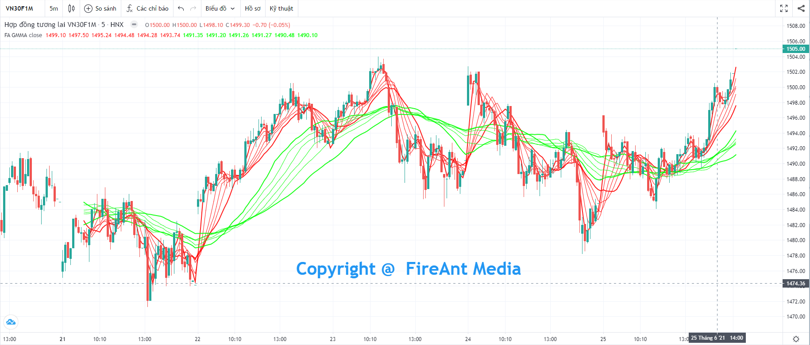
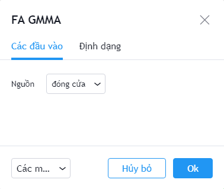
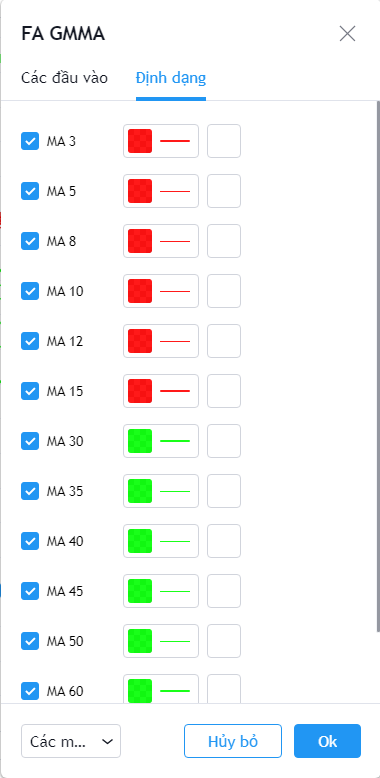

# Guppy Multiple Moving Average

dụng để xác định sự thay đổi của xu hướng giá, khả năng đột phá, cũng như các cơ hội giao dịch.&#x20;

Các đường trung bình được chia làm 2 nhóm **ngắn hạn** và **dài hạn**, mỗi nhóm gồm 6 đường. **GMMA** là chỉ số phủ (overlay) và được vẽ trên đồ thị giá.&#x20;


**GMMA** là phát minh của **Daryl Guppy**, người Úc năm 1996.


Phiên bản **GMMA** của FireAnt hiển thị 12 đường SMA cùng lúc như một chỉ số duy nhất, thay vì phải chèn lần lượt 12 đường SMA và thiết lập tham số cho từng đường. Chu kỳ sử dụng cho các đường SMA là các chu kỳ được Daryl Guppy khuyến cáo sử dụng: 3,5,8,10,12,15 cho nhóm SMA ngắn hạn và 30, 35, 40, 45, 50, 60 cho nhóm SMA dài hạn.

Các tham số mà chúng tôi sử dụng mặc định (người dùng có thể thay đổi):

* **Nguồn:** Giá đóng cửa được sử dụng làm đầu vào để tính các đường SMA

Bên cạnh các tham số, người dùng cũng có thể thay đổi màu sắc cũng như độ dày các đường SMA.


**Gợi ý sử dụng:**&#x20;

Các đường SMA được phân làm 2 nhóm gồm các SMA ngắn hạn và dài hạn. Nhóm SMA ngắn hạn có độ nhậy cáo, biến động nhanh, còn nhóm SMA dài hạn sẽ có sức ì lớn, biến động chậm.

Thông thường khi nhóm SMA ngắn hạn cắt lên nhóm dài hạn, thì chứng khoán sẽ bước vào xu hướng tăng giá, và ngược lại, khi nhóm SMA ngắn hạn cắt xuống nhóm SMA dài hạn, xu hướng sẽ là giảm giá. Khi xu hướng hình thành, nhóm SMA sẽ đóng vai trò hỗ trợ với xu hướng tăng giá, và kháng cự đối với xu hướng giảm giá. Xu hướng sẽ càng mạnh nếu 2 nhóm SMA có sự phân kỳ càng cao và các đường thuộc SMA dài hạn sẽ gần như tách biệt khỏi nhau.&#x20;

Khi các đường SMA xoắn vào nhau, xu hướng là không rõ ràng và bạn không nên tham gia giao dịch.

