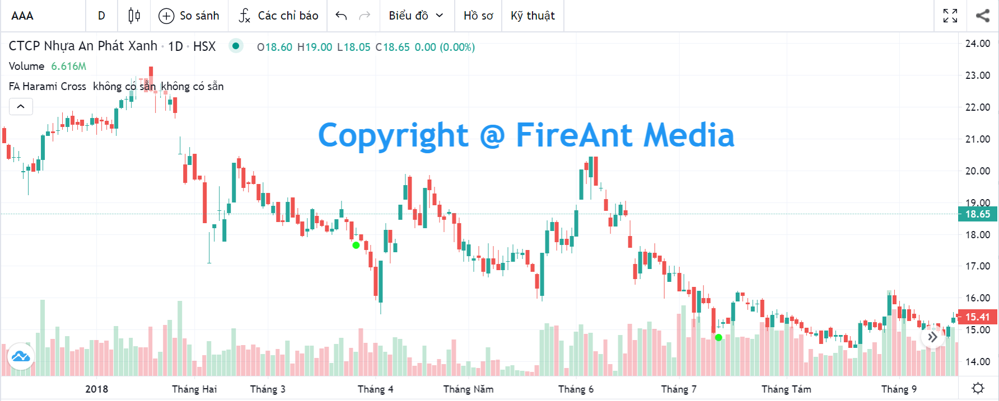
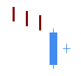
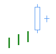
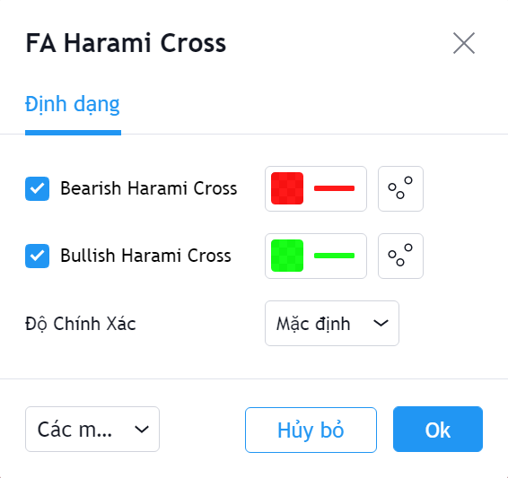

# Harami Cross

**Harami Cross Pattern** là một trong các mô hình nến Nhật được sử dụng khá phố biến và có độ tin cậy ở mức trung bình. **Harami Cross Pattern** được sử dụng cho việc xác định sự đảo chiều của xu hướng.&#x20;

Mô hình này hình thành trong 1 xu hướng, khi một nến doji xuất hiện sau 1 nến thân dài cùng chiều với xu hướng và bị bọc hoàn toàn (bao gồm cả bóng nến của nến doji) bởi thân nến này.&#x20;

Có hai mẫu **Harami Cross** là **Bearish Harami Cross** và **Bullish Harami Cross**.

|  |  |
| ------------------------------------------------------------------- | ------------------------------------------------------------------- |
| **Bullish Harami Cross**                                            | **Bearish Harami Cross**                                            |

**Phiên bản Harami Cross Pattern của FireAnt** tìm kiếm cả hai mẫu hình nến **Bullish Harami Cross** và **Bearish Harami Cross**.&#x20;

Mẫu **Bullish Harami Cross** sẽ được đánh dấu bằng chấm tròn màu xanh lá cây (và có thể coi là tín hiệu gợi ý mua). Ngược lại mẫu **Bearish Harami Cross** sẽ được đánh dấu bằng chấm tròn màu đỏ (và có thể coi là tín hiệu gợi ý bán).&#x20;

Màu tín hiệu có thể thay đổi trong thiết lập:


**Gợi ý sử dụng:**&#x20;

**Harami Cross** là mẫu nến được sử dụng để xác định sự đảo chiều xu hướng, do đó bạn cần quan sát mẫu nến này trong một xu hướng (càng kéo dài càng tốt).&#x20;

Khi gặp mẫu nến này, bạn cần quan sát xem trước khi mẫu nến xuất hiện, giá có đi theo xu hướng không, xu hướng đó là tăng hay giảm, mạnh hay yếu.&#x20;

**Bullish Harami Cross** xuất hiện trong một xu hướng giảm là tín hiệu đảo chiều tăng với mức tin cậy trung bình, nên khi quyết định mua vào cần sử dụng thêm các tín hiệu khác để xác nhận. Nếu mua vào khi **Bullish Harami Cross** xuất hiện, bạn cần đặt điểm dừng lỗ tối đa tại điểm thấp nhất của nến **Harami Cross** thứ nhất.&#x20;

Tương tự **Bearish Harami Cross** xuất hiện trong xu hướng tăng sẽ là dấu hiệu đảo chiều giảm, và bạn có thể cân nhắc bán ra, nếu có thêm xác nhận từ các chỉ báo khác.

