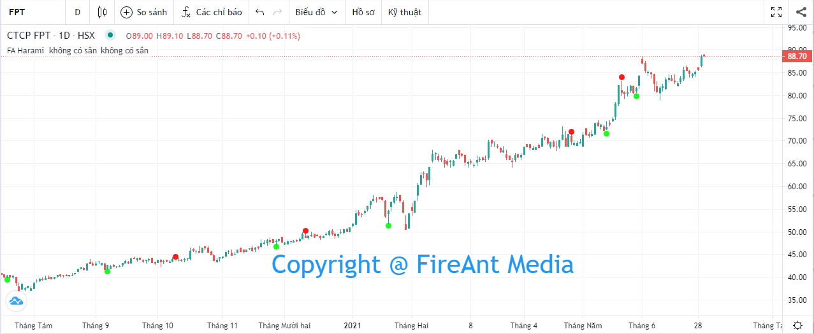
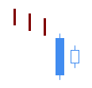
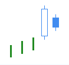
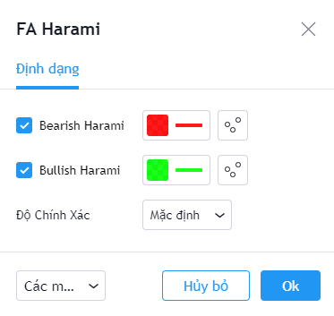

# Harami

**Harami Pattern** là một trong các mô hình nến Nhật được sử dụng khá phố biến và có độ tin cậy ở mức trung bình. **Harami Pattern** có thể được sử dụng cho việc xác định **sự đảo chiều của xu hướng** và cũng có thể sử dụng để xác định sự **tiếp diễn của xu hướng**.&#x20;

Mô hình này xuất hiện trong 1 xu hướng, khi một nến đổi màu và bị bọc hoàn toàn bởi thân nến trước đó. Nếu nến bị bọc cùng chiều với xu hướng mô hình này là đảo chiều, ngược lại đây là mô hình tiếp diễn xu hướng. Có hai mẫu **Harami** là **Bearish Harami** và **Bullish Harami**.

|  |  |
| ------------------------------------------------------------------- | ------------------------------------------------------------------- |
| **Bullish Harami**                                                  | **Bearish Harami**                                                  |

**Phiên bản Harami Pattern của FireAnt** tìm kiếm cả hai mẫu hình nến **Bullish Harami** và **Bearish Harami**.&#x20;

Mẫu **Bullish Harami** sẽ được đánh dấu bằng chấm tròn màu xanh lá cây (và có thể coi là tín hiệu gợi ý mua). Ngược lại mẫu **Bearish Harami** sẽ được đánh dấu bằng chấm tròn màu đỏ (và có thể coi là tín hiệu gợi ý bán).&#x20;

Màu tín hiệu có thể thay đổi trong thiết lập:


**Gợi ý sử dụng:**&#x20;

**Harami** là mẫu nến chủ yếu được sử dụng để xác định sự đảo chiều xu hướng, do đó bạn cần quan sát mẫu nến này trong một xu hướng (càng kéo dài càng tốt).&#x20;

Khi gặp mẫu nến này, bạn cần quan sát xem trước khi mẫu nến xuất hiện, giá có đi theo xu hướng không, xu hướng đó là tăng hay giảm, mạnh hay yếu.

**Bullish Harami** xuất hiện trong một xu hướng giảm là tín hiệu đảo chiều tăng với mức tin cậy trung bình, nên khi quyết định mua vào cần sử dụng thêm các tín hiệu khác để xác nhận. Nếu mua vào khi **Bullish Harami** xuất hiện, bạn cần đặt điểm dừng lỗ tối đa tại điểm thấp nhất của nến **Harami** thứ nhất.&#x20;

Tương tự **Bearish Harami** xuất hiện trong xu hướng tăng sẽ là dấu hiệu đảo chiều giảm, và bạn có thể cân nhắc bán ra, nếu có thêm xác nhận từ các chỉ báo khác.&#x20;

Bên cạnh việc sử dụng mẫu nến **Harami** cho việc xác định sự đảo chiều xu hướng, mẫu nến **Harami** cũng có thể sử dụng để xác nhận sự tiếp diễn của xu hướng nếu nến đầu của mẫu **Harami** ngược chiều với xu hướng (nến giảm trong xu hướng tăng, và tăng trong xu hướng giảm). Nến thứ hai khi đó cùng chiều với xu hướng sẽ xác định sự tiếp diễn của xu hướng.

