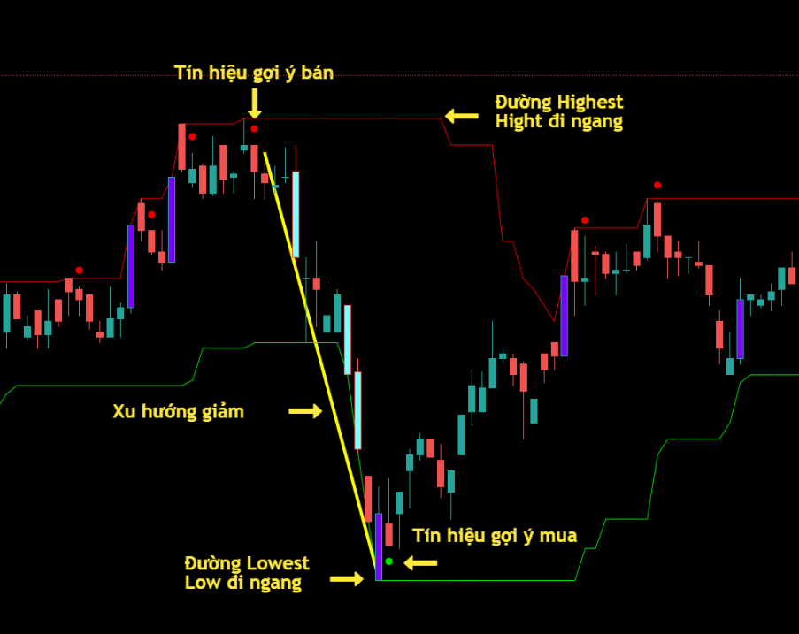
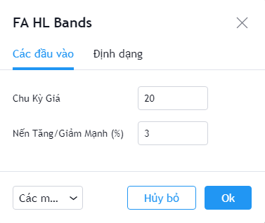
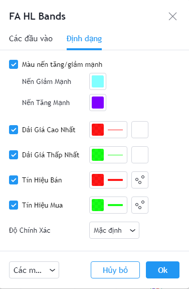

# Highest Lowest Bands

**Dải băng cao thấp (Highest Lowest Bands)** bao gồm 2 dải trên dưới được tạo bởi các điểm cao nhất, hoặc thấp nhất trong một chu kỳ giá. Giá chứng khoán sẽ dao động giữa 2 dải này và cho tín hiệu mua bán ở một điểm cận biên.

**Phiên bản Highest Lowest Bands của FireAnt** sử dụng các tham số mặc định được sử dụng rộng rãi trong cộng đồng các nhà đầu tư, là một bổ sung hữu hiệu vào thư viện các chỉ số.

**Highest Lowest Bands** sử dụng 2 màu khác nhau: Dải Highest được to màu đỏ và dải Lowest được tô màu xanh.&#x20;

Tín hiệu gợi ý mua/bán sẽ được tạo ra khi dải **Lowest/Highest** chuyển sang đi ngang sau khi giảm/tăng.&#x20;

Các tham số mà chúng tôi sử dụng mặc định (người dùng có thể thay đổi):

* **Chu kỳ Giá**: Chu kỳ tính mức giá cao nhất, thấp nhất là 20 nến
* **Nến Tăng/Giảm mạnh (%)**: Hiển thị các nến tăng/giảm giá đóng cửa so với giá mở cửa trên 3%

Bên cạnh các tham số, người dùng cũng có thể thay đổi màu sắc các nến tăng/giảm mạnh, màu của các dải **Highest / Lowest**, màu của tín hiệu gợi ý mua/bán.


**Gợi ý sử dụng:**&#x20;

Các dải **Highest / Lowest** khi đi ngang, song song với khoảng cách hẹp tạo ra các nền giá tin cậy. Khi chúng tách khỏi nhau, một đường đi ngang và 1 đường tăng hoặc giảm mạnh, chúng ta sẽ có 1 xu hướng giá rất mạnh.

