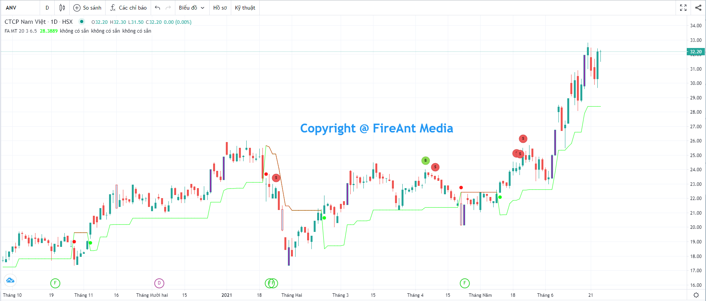
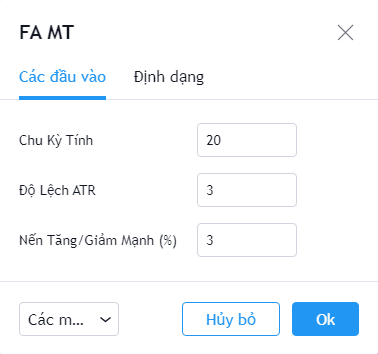
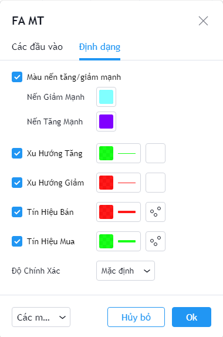

# Magic Trend

**Đường xu hướng ma thuật (Magic Trend)** được sử dụng rộng rãi trong cộng đồng các nhà đầu tư Forex, qua thử nghiệm cũng thích hợp để sử dụng cho các loại chứng khoán khác, đặc biệt thích hợp với các mã hợp đồng tương lai của Việt Nam.&#x20;

**Magic Trend** cung cấp cơ hội để phát hiện các đặc thù và mô hình khác nhau trong động lực giá mà mắt thường không nhìn thấy được. Dựa trên thông tin này, các nhà đầu tư có thể giả định biến động giá tiếp theo và điều chỉnh chiến lược của họ cho phù hợp.&#x20;

**Phiên bản Magic Trend của FireAnt** sử dụng các tham số mặc định được sử dụng phổ biến, nhưng cũng cho phép nhà đầu tư tự điều chỉnh tham số theo ý muốn. Tín hiệu gợi ý mua/bán xuất hiện khi đường giá cắt lên/xuống đường **Magic Trend**. Đường **Magic Trend** cũng sử dụng 2 màu khác nhau cho xu hướng tăng (màu xanh) và giảm (màu đỏ), giúp nhà đầu tư dễ theo dõi các giai đoạn biến động giá.&#x20;

Các tham số mà chúng tôi sử dụng mặc định (người dùng có thể thay đổi):

* **Chu kỳ tính**: Chu kỳ tính Magic Trend là 20 nến&#x20;
* **Độ lệch ATR**: 3 lần ATR, độ lệch càng cao thì đường Magic Trend cách tách xa khỏi đường giá. Theo kinh nghiệm của chúng tôi, độ lệch bằng 3 lần ATR là phù hợp cho đa số các trường hợp.&#x20;
* **Nến Tăng/Giảm mạnh (%)**: Hiển thị các nến tăng/giảm giá đóng cửa so với giá mở cửa trên 3%

Bên cạnh các tham số, người dùng cũng có thể thay đổi màu sắc các nến tăng/giảm mạnh, màu của đường Magic Trend khi xu hướng là tăng/giảm, màu của tín hiệu gợi ý mua/bán.


**Gợi ý sử dụng:**&#x20;

Mục đích chính của **Magic Trend** là để giúp nhà đầu tư phân biệt xu hướng giá ở các giai đoạn khác nhau của mã cổ phiếu. Khi xu hướng là tăng, nhà đầu tư nên giữ và không bán ra quá sớm khi có điều chỉnh nhẹ, mà chỉ cần bán khi xu hướng thay đổi thành giảm. Ngược lại, khi xu hướng là giảm, nhà đầu tư cũng không nên vội mua vào khi có điều chỉnh tăng nhẹ, mà chỉ nên mua vào khi xu hướng chuyển sang tăng.

