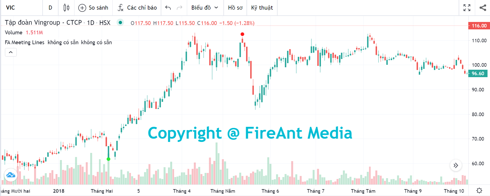
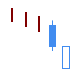
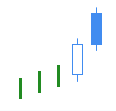
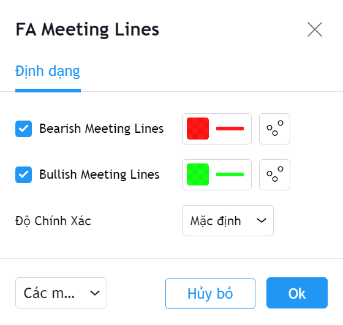

# Meeting Lines

**Meeting Lines Pattern** là một trong các mô hình nến Nhật hiếm gặp và có độ tin cậy tương đối cao. **Meeting Lines Pattern** được sử dụng để xác định **sự đảo chiều của xu hướng**.&#x20;

Mô hình này xuất hiện trong 1 xu hướng, khi xuất hiện một nến thân dài cùng chiều xu hướng, và tiếp theo là một nến thân dài ngược chiều xu hướng. Hai nến này có cùng mức giá đóng cửa . Có hai mẫu **Meeting Lines** là **Bearish Meeting Lines** và **Bullish Meeting Lines**.

|  |  |
| ------------------------------------------------------------------- | ------------------------------------------------------------------- |
| **Bullish Meeting Lines**                                           | **Bearrish Meeting Lines**                                          |

**Phiên bản Meeting Lines Pattern của FireAnt** tìm kiếm cả hai mẫu hình nến **Bullish Meeting Lines** và **Bearish Meeting Lines.**&#x20;

Mẫu **Bullish Meeting Lines** sẽ được đánh dấu bằng chấm tròn màu xanh lá cây (và có thể coi là tín hiệu gợi ý mua). Ngược lại mẫu **Bearish Meeting Lines** sẽ được đánh dấu bằng chấm tròn màu đỏ (và có thể coi là tín hiệu gợi ý bán).&#x20;

Màu tín hiệu có thể thay đổi trong thiết lập:


**Gợi ý sử dụng:**&#x20;

**Meeting Lines** là mẫu nến được sử dụng để xác định sự đảo chiều của xu hướng.&#x20;

Khi gặp mẫu nến này, bạn cần quan sát xem trước khi mẫu nến xuất hiện, giá có đi theo xu hướng không, xu hướng đó là tăng hay giảm, mạnh hay yếu. Nếu trong một xu hướng mạnh, xuất hiện một nến thân dài cùng chiều xu hướng, tiếp theo bởi một nến thân dài khác ngược chiều xu hướng, và có giá đóng cửa đúng bằng giá đóng cửa phiên trước đó, thì nhiều khả năng xu hướng sẽ đảo chiều. Bạn cần đặt stop loss tại điểm thấp nhất (trong xu hướng giảm trước đó), hoặc cao nhất (trong xu hướng tăng trước đó).&#x20;

Mẫu nến **Meeting Lines** là một trong những mẫu nến hiếm gặp, đổi lại mẫu nến này có độ tin cậy tương đối cao.

