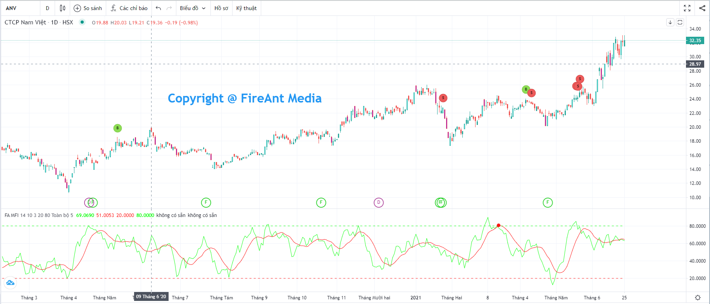
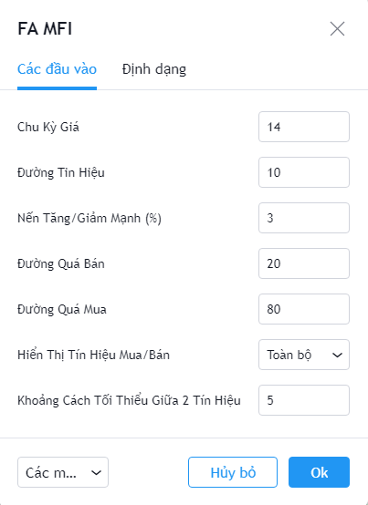
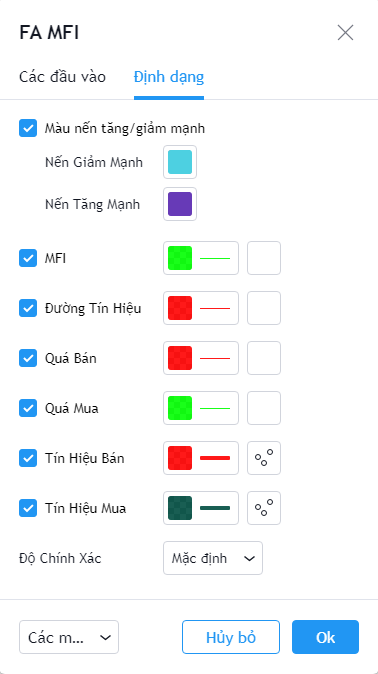

# Money Flow Index (MFI)

**Chỉ số dòng tiền (MFI)** được dùng để **đánh giá cường độ của dòng tiền** bằng cách so sánh giá tăng tích cực và tiêu cực trong một khoảng thời gian nhất định, có tính đến khối lượng giao dịch.

Chỉ báo MFI có thể được sử dụng để xác định tình trạng quá mua và quá bán của các mã cổ chứng khoán, đồng thời để xác định khả năng đảo chiều và là một trong các chỉ số kỹ thuật được sử dụng phổ biến. MFI do Gene Quong and Avrum Soudack phát minh năm 1989.

**Phiên bản MFI của FireAnt** bổ sung thêm đường trung bình của MFI (còn gọi là đường tín hiệu) theo các chu kỳ khác nhau, và sử dụng giao cắt giữa MFI và đường tín hiệu để tạo ra các tín hiệu gợi ý mua/bán.

Có 3 cách sử dụng được chúng tôi đưa vào:

* **Toàn bộ tín hiệu**: Hiển thị các tín hiệu gợi ý mua bán, với ràng buộc là MFI trước khi cắt đường tín hiệu phải nằm trong vùng quá mua hoặc quá bán.
* **Xuất hiện lần lượt**: Cách sử dụng này có thêm một ràng buộc nữa là các tín hiệu gọi ý mua bán chỉ xuất hiện khi trước đó có xuất hiện tín hiệu trái chiều. Đây là cách sử dụng nhằm loại bỏ các tín hiệu cùng chiều xuất hiện liên tiếp (liên tiếp mua hoặc liên tiếp bán)
* **Loại bỏ tín hiệu sát nhau**: Tín hiệu chỉ xuất hiện khi cách tín hiệu trước đó 1 số nến. Cách dùng này nhằm loại bỏ các tín hiệu xuất hiện quá gần nhau (tín hiệu nhiễu)

Để chọn cách sử dụng, bạn vào thiết lập của chỉ báo vào chọn giá trị tương ứng cho tham số **Hiển thị tín hiệu mua/bán.**

Các tham số mà chúng tôi sử dụng mặc định (người dùng có thể thay đổi):

* **Vùng quá mua**: Khi MFI >= 80
* **Vùng quá bán**: Khi MFI <= 20
* **Hiển thị các nến giá tăng giảm mạnh (%)**: Khi chênh lệch giá đóng và mở cửa vượt quá hoặc bằng 3% so với giá mở cửa.
* **Chu kỳ tính**: Chu kỳ tính MFI là 14 nến
* **Chu kỳ đường tín hiệu**: Chu kỳ tính đường tín hiệu là 10 nến
* **Hiển thị tín hiệu mua/bán**: Hiển thị là toàn bộ tín hiệu mua/bán
* **Khoảng cách tối thiểu giữa 2 tín hiệu**: 5 nến (thông số này chỉ được dùng khi cách hiển thị tín hiệu được chọn là **Loại bỏ tín hiệu sát nhau**)

Bên cạnh các tham số, người dùng cũng có thể thay đổi màu sắc đường MFI, đường tính hiệu, màu tín hiệu mua/bán, màu ranh giới các vùng quá mua, quá bán, và màu các nến tăng/giảm mạnh.


**Gợi ý sử dụng:**&#x20;

**MFI** là một chỉ số có mức thăng giáng mạnh, chúng tôi vì vậy khuyến cáo không dùng MFI độc lập để quyết định mua bán, mà sử dụng chung với các chỉ số khác như RSI, hay các đường xu hướng (như Magic Trend). Với các mã khác nhau, người dùng nên diều chỉnh các tham số sao cho tín hiệu xuất hiện càng chính xác trong quá khứ càng tốt. Không nên dùng cố định giá trị tham số cho mọi mã và mọi khung thời gian.

