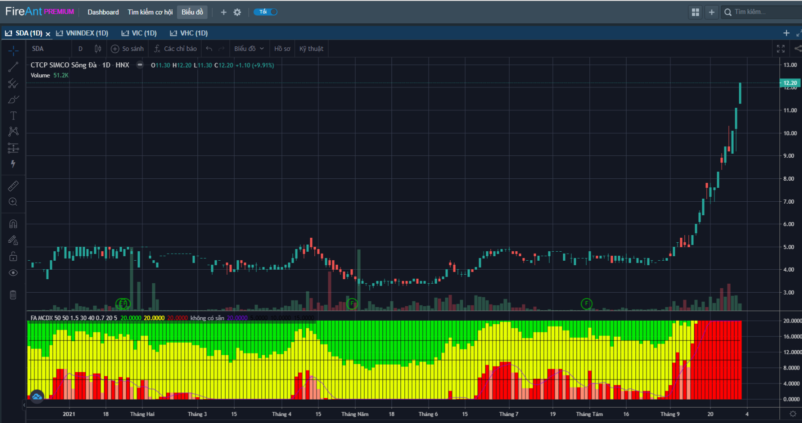
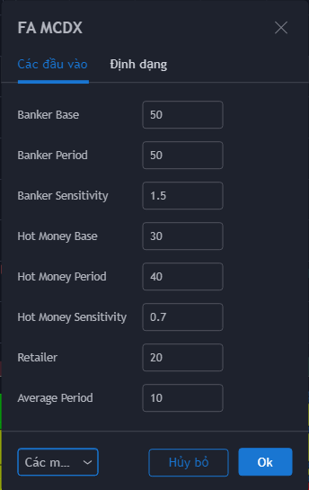
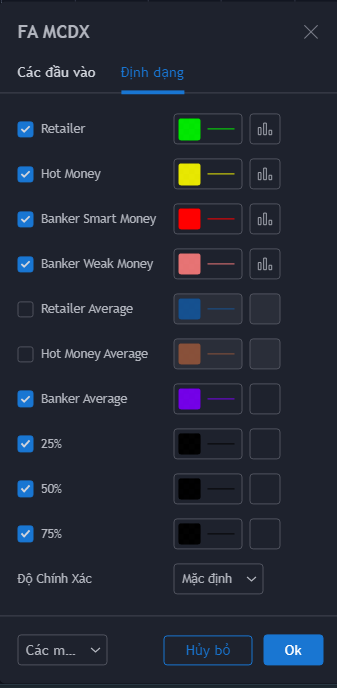

# Multi Color Dragon Extended (MCDX)

**Chỉ báo MCDX** được sử dụng để xác định xu hướng của thị trường. Chỉ số sử dụng ba nhóm màu đại diện cho ba nhóm tham gia thị trường:

* Màu đỏ đại diện cho nhà đầu tư lớn (Banker)
* Màu xanh đại diện cho nhà đầu tư nhỏ lẻ (Retailer)
* Màu vàng đại diện cho các nhà đầu cơ (Hot money)

Cách sử dụng MCDX khá đơn giản, khi màu màu đỏ vắng bóng, bạn nên đứng ngoài. Khi màu đỏ xuất hiện, bạn có thể tham gia thị trường. Thoát ra khi màu xanh xuất hiện trở lại.&#x20;

Xu hướng sẽ rất mạnh khi màu đỏ chạm ngưỡng 50% (vạch đen ở giữa), trước đó thường là giai đoạn thu gom.

**Phiên bản MCDX của FireAnt** là một biến thể của chỉ số MCD được sử dụng rất rộng rãi trong cộng đồng và là một trong những chỉ số có độ tin cậy cao. Nhà đầu tư có thể dùng chỉ số này kết hợp với các chỉ số khác để loại bỏ các tín hiệu mua bán khi chưa có xác nhận về khối lượng.

Các tham số mà chúng tôi sử dụng mặc định (người dùng có thể thay đổi, tuy nhiên chúng tôi khuyến cáo  bạn nên sử dụng các tham số mặc định):

* **Banker Period:** 5&#x30;**.** Chu kỳ cho đường RSI sử dụng để tính giá trị Banker.&#x20;
* **Banker Base:** 50. Đây là mức thấp nhất là RSI sử dụng cho Banker
* **Banker Sensibility**: 1.5. Độ nhạy dùng để tính Banker
* **Hot Money Period**: 40. Chu kỳ cho đường RSI sử dụng để tính giá trị Hot Money&#x20;
* **Hot Money Base:** 30. Đây là mức thấp nhất là RSI sử dụng cho Hot Money
* **Hot Money Sensibility**: 0.7. Độ nhạy dùng để tính Hot Money
* **Retailer:** 20. Giá trị cận trên cho Retailer
* **Average Period**: 10. Chu kỳ tính đường trung bình cho Banker, Hot money và Retailer.&#x20;

Bên cạnh các tham số, người dùng cũng có thể thay đổi màu sắc cho Banker, Hot money và Retailer.


**Gợi ý sử dụng:**&#x20;

Chúng tôi sử dụng thêm 3 giải 25%, 50%, 75% để người dùng dễ dàng so sánh các giai đoạn.

* **Nếu Banker vượt trên 25%**: Nhà đầu tư lớn  bắt đầu gom hàng&#x20;
* **Nếu Banker vượt 50%**: Nhà đầu tư lớn đã gom xong. Giá sẽ bắt đầu tăng tốc&#x20;
* **Nếu Banker vượt 75%:** Nhà đầu tư lớn đang nắm quyền kiểm soát. Giá sẽ phi mã
  
