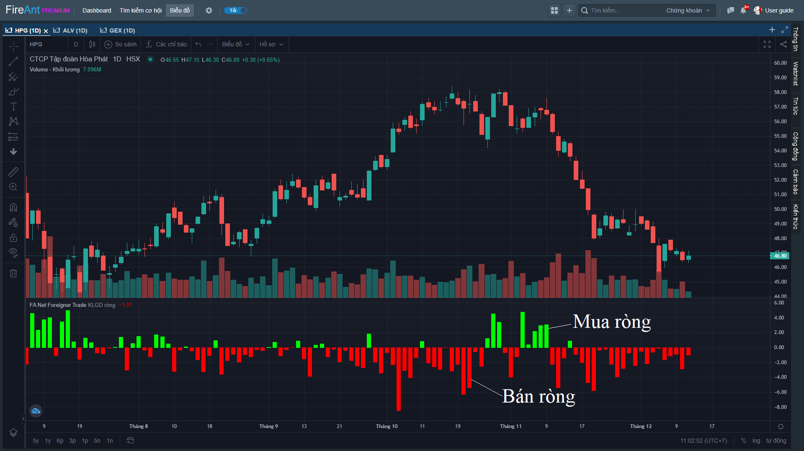
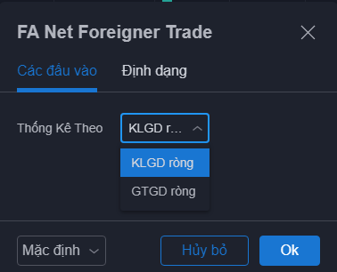
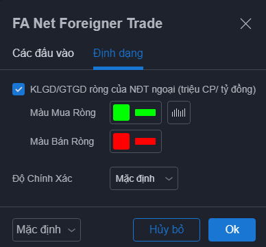

# Net Foreigner Trade

**Net Foreigner Trade** thể hiện khối lượng hoặc giá trị giao dịch ròng của khối ngoại. Mua ròng và bán ròng được thể hiện theo màu sắc khác nhau và với giá trị trái dấu.&#x20;

Theo dõi mua bán ròng của khối ngoại trong một thời gian nhất định có thể xác định được mục đích cũng như xu hướng giao dịch của khối ngoại đối với mã cổ phiếu.


**Chỉ báo này chỉ áp dụng cho khung daily**


Các tham số mà chúng tôi sử dụng mặc định (người dùng có thể thay đổi):

* **Thống kê theo**: Mặc định giao dịch mua/bán ròng của nhà đầu tư nước ngoài được thống kê theo tổng khối lượng mua ròng (màu xanh) hoặc tổng khối lượng bán ròng (màu đỏ) của họ trong mỗi phiên. Bạn có thể chọn thống kê theo tổng giá trị mua ròng và tổng giá trị bán ròng của nhà đầu tư nước ngoài theo phiên.

Bên cạnh các tham số, người dùng cũng có thể thay đổi màu sắc các cột hiển thị tổng khối lượng/giá trị mua/bán ròng của khối ngoại


**Gợi ý sử dụng:**&#x20;

**Net Foreigner Trade** có thể sử dụng trong một thời gian nhất định để phát hiện chuỗi mua ròng hoặc bán ròng của khối ngoại, giao dịch mua hoặc bán ròng của khối ngoại kéo dài qua nhiều phiên cho thấy chủ đích gom hàng hoặc xả hàng của họ.

