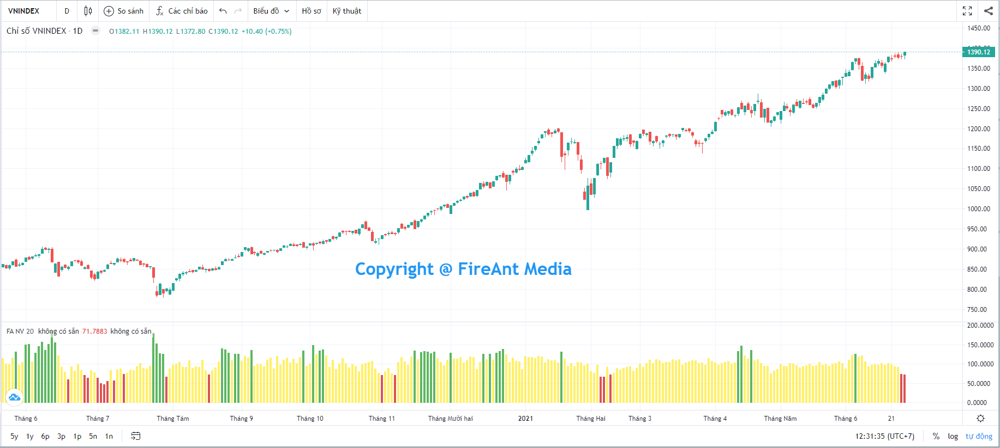
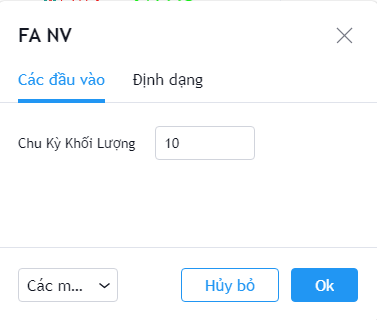
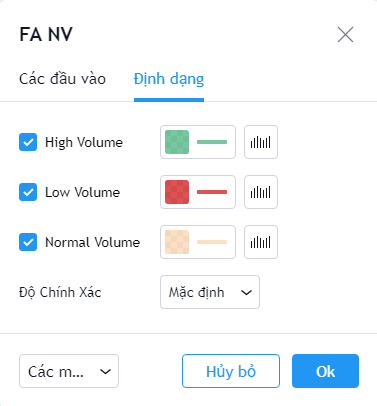

# Normalized Volume

**Khối lượng chuẩn hóa (Normalized Volume)** được sử dụng để nhanh chóng xác định khi nào khối lượng giao dịch vượt 25% hoặc nằm dưới 25% so với mức khối lượng trung bình của một số phiên gần nhất (bao gồm cả phiên hiện tại) .

Ưu điểm của **Normalized Volume** là giúp nhà đầu tư tách bạch giữa khối lượng giao dịch và sự đột biến khối lượng. Do các mã có tính thanh khoản khác nhau, nên sự đột biến không nhất thiết đồng nhất với khối lượng giao dịch lớn.

**Phiên bản Normalized Volume của FireAnt** sử dụng các tham số mặc định được sử dụng rộng rãi trong cộng đồng, là một bổ sung hữu hiệu vào thư viện các chỉ số. Nhà đầu tư có thể dùng chỉ số này kết hợp với các chỉ số khác để loại bỏ các tín hiệu mua bán khi chưa có xác nhận về khối lượng.

Các tham số mà chúng tôi sử dụng mặc định (người dùng có thể thay đổi):

* **Chu kỳ khối lượng:** Khối lượng trung bình được tính cho 10 phiên, gồm cả phiên hiện tại

Bên cạnh các tham số, người dùng cũng có thể thay đổi màu sắc cũng như độ dày các cột khối lượng cao, thấp và bình thường.


**Gợi ý sử dụng:**&#x20;

Các cột khối lượng màu xanh tương ứng với nến có khối lượng tăng đột biến (tăng hơn hoặc bằng 25%) so với trung bình 10 nến gần nhất. Ngược lại cột khối lượng màu đỏ ứng với nến có khối lượng sụt giảm mạnh (giảm hơn hoặc bằng 25%) so với trung bình 10 nến gần nhất, Normalized Volume vì vậy cho phép xác định nhanh dòng tiền bị đang vào hay rút ra khỏi mã cổ phiếu một cách gấp gáp.

