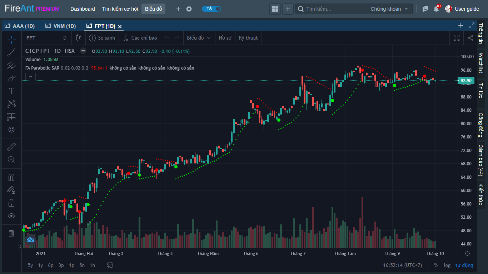
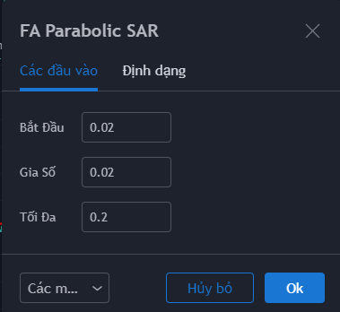
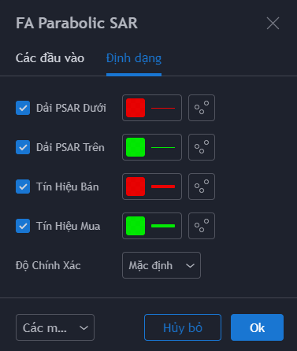

# Parabolic Stop And Reserve (PSAR)

**Parabolic SAR** là một công cụ mạnh trong phân tích xu hướng. **SAR** là viết tắt của cụm từ “Stop and Reverse” (Dừng và Đảo chiều). **Parabolic SAR** hỗ trợ xác định xu hướng và cung cấp tín hiệu đảo chiều. Chỉ báo được phát triển bởi J. Welles Wilder, tác giả của các chỉ báo nổi tiếng khác như ATR, ADX và RSI.

Chỉ báo **Parabolic SAR** rất đơn giản để sử dụng. Khi đường giá nằm phía trên **Parabolic SAR**, xu hướng là tăng, ngược lại nếu đường giá nằm bên dưới **Parabolic SAR,** xu hướng là giảm. Sự đảo chiều xảy ra khi **Parabolic SAR** thay đổi vị trí so với đường giá.

Phiên bản **Parabolic SAR** cung cấp thêm các tín hiệu gợi ý mua/bán, và sử dụng 2 màu khác nhau giúp người dùng dễ dàng xác định xu hướng đang là tăng (**Parabolic SAR** có màu xanh) hay giảm (**Parabolic SAR** có màu đỏ)

Các tham số mà chúng tôi sử dụng mặc định (người dùng có thể thay đổi):

* **Bắt đầu**: 0.02. Hệ số tăng tốc (acceleration factor) khởi điểm&#x20;
* **Gia số**: 0.02. Hệ số tăng tốc sẽ tăng thêm 0.02 mỗi khi giá đạt mức cao mới.&#x20;
* **Tối đa**: 0.2. Hệ số tăng tốc có thể đạt mức tối đa là 0,2, bất kể xu hướng tăng kéo dài bao lâu. Wilder khuyên người dùng không nên đặt mức tối đa trên 0.22

Bên cạnh các tham số, người dùng cũng có thể thay đổi màu sắc đường **Parabolic SAR**, màu của các tín hiệu gợi ý mua/bán.


**Gợi ý sử dụng:** **Parabolic SAR** hỗ trợ các nhà giao dịch rất nhiều trong việc xác định điểm kết thúc vị thế (exit point). Phương pháp này rất đơn giản: bạn phải đóng vị thế mua (bán ra cổ phiếu đang nắm giữ) khi **Parabolic SAR** vượt trên đường giá và đóng vị thế bán (mua vào) khi **Parabolic SAR** trở lại dưới đường giá.&#x20;

**Parabolic SAR** hoạt động tốt nhất trong các thị trường biến động tăng hoặc giảm. Khi thị trường đi ngang, nhiều khả năng chỉ báo này sẽ tạo ra các tín hiệu giả. **Parabolic SAR** hoạt động hiệu quả khi kết hợp với các chỉ báo kỹ thuật khác như ADX. Nếu chỉ báo ADX xác nhận xu hướng mạnh (ADX>40), bạn có thể tự tin sử dụng **Parabolic SAR**.

