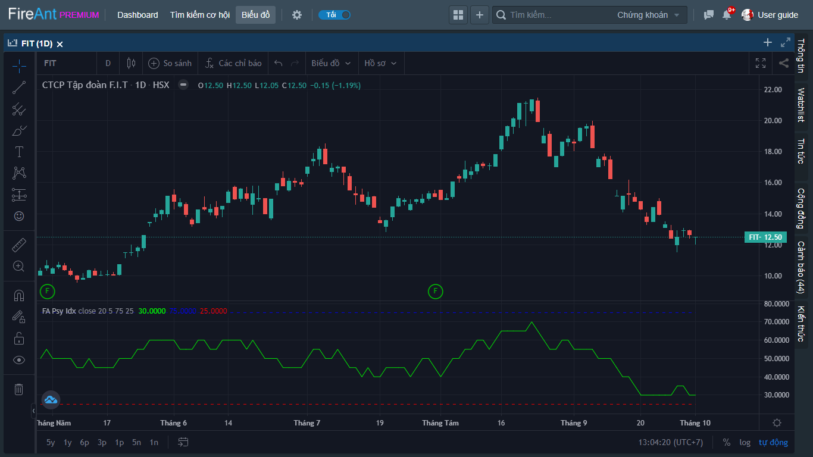
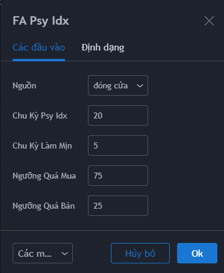
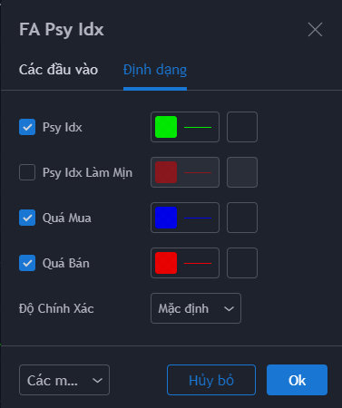

# Psychological Index

**Psychological Index** được công bố lần đầu tiên trên tạp chí Futures số ra tháng 6/2000. **Psychological Index là** chỉ báo tâm lý giúp xác định đáy và đỉnh giá chứng khoán cũng như các biến động ngắn hạn. Chỉ báo này được tính toán dựa trên tỷ lệ phần trăm số ngày tăng giá của mã chứng khoán trong một chu kỳ

**Phiên bản Psychological Index của FireAnt** sử dụng chu kỳ mặc định là 20 với hai đường quá mua 75 và quá bán 25..

Cách sử dụng **Psychological Index** khá đơn giản:

* Khi **Psychological Index** lập đỉnh trong vùng quá mua thì chuỗi tăng điểm cũng kết thúc và đây thường là đỉnh giá
* Khi **Psychological Index** lập đáy trong vùng quá bán thì chuỗi giảm điểm cũng kết thúc và đây thường là đáy giá
* **Psychological Index** có độ tin cậy cao hơn khi dùng với các index.

Các tham số mà chúng tôi sử dụng mặc định (người dùng có thể thay đổi):

* **Nguồn**: Giá đóng cửa được sử dụng để tính **Psychological Index**&#x20;
* **Chu kỳ Psy Idx**: Chu kỳ tính **Psychological Index** là 20 nến
* **Chu kỳ làm mịn**: Chu kỳ 5 được dùng để tính đường trung bình động làm mịn đường **Psychological Index**&#x20;
* **Ngưỡng quá mua**: Mặc định là 75
* **Ngưỡng quá bán**: mặc định là 25

Bên cạnh các tham số, người dùng cũng có thể thay đổi màu sắc và kiểu đường, kích thước đường **Psychological Index,** đường trung bình làm mịn, và các đường quá mua, quá bán.


**Gợi ý sử dụng:**&#x20;

Mục đích chính của **Psychological Index** là để xác định đáy và đỉnh giá. Khi **Psychological Index** tạo đỉnh trên ngưỡng quá mua, chứng khoán đã có một chuỗi tăng điểm liên tiếp (có thể đan xen 1 vài phiên giảm hoặc đi ngang nhưng số phiên tăng sẽ chiếm hơn 75% tổng số các phiên) cho thấy tâm lý của các nhà đầu tư đang cực kỳ hưng phấn, và cũng là lúc rủi ro xuất hiện. Ngược lại khi **Psychological Index** tạo đáy trong vùng quá bán, chứng khoán đã trải qua một giai đoạn giảm điểm trong đó số phiên giảm chiếm hơn 75%. Tâm lý nhà đầu tư lúc này đang chán nản, và thường giá sẽ lập đáy.

