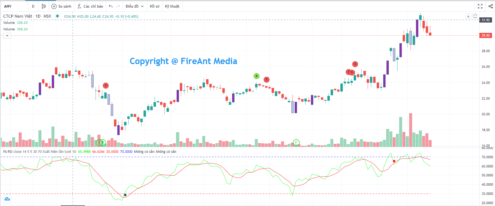
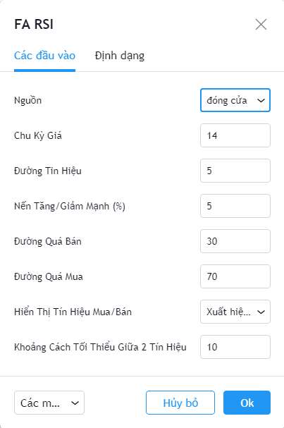
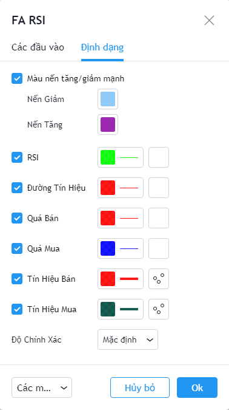

# Relative Strength Index (RSI)

**Chỉ số sức mạnh tương đối (RSI)** là chỉ báo động lượng đo lường mức độ thay đổi giá gần đây, nhằm đánh giá việc mua quá mức hoặc bán quá mức ở một mức giá của 1 cổ phiếu hoặc các tài sản tài chính khác. Chỉ số RSI là phát minh của J.Welles Wilder năm 1978 và là một trong các chỉ số được giới đầu tư ưa chuộng.

**Phiên bản RSI của FireAnt** bổ sung thêm đường trung bình của RSI (còn gọi là đường tín hiệu) theo các chu kỳ khác nhau, và sử dụng giao cắt giữa RSI và đường tín hiệu để tạo ra các tín hiệu gợi ý mua/bán.

Có 3 cách sử dụng được chúng tôi đưa vào:

* **Toàn bộ tín hiệu**: Hiển thị các tín hiệu gợi ý mua bán, với ràng buộc là RSI trước khi cắt đường tín hiệu phải nằm trong vùng quá mua hoặc quá bán.
* **Xuất hiện lần lượt**: Cách sử dụng này có thêm một ràng buộc nữa là các tín hiệu gợi ý mua bán chỉ xuất hiện khi trước đó có xuất hiện tín hiệu trái chiều. Đây là cách sử dụng nhằm loại bỏ các tín hiệu cùng chiều xuất hiện liên tiếp (liên tiếp mua hoặc liên tiếp bán)
* **Loại bỏ tín hiệu sát nhau**: Tín hiệu chỉ xuất hiện khi cách tín hiệu trước đó 1 số nến. Cách dùng này nhằm loại bỏ các tín hiệu xuất hiện quá gần nhau (tín hiệu nhiễu)

Để chọn cách sử dụng, bạn vào thiết lập của chỉ báo vào chọn giá trị tương ứng cho tham số **Hiển thị tín hiệu mua/bán**

Các tham số mà chúng tôi sử dụng mặc định (người dùng có thể thay đổi):

* **Nguồn**: Giá đóng cửa được sử dụng để tính RSI
* **Vùng quá mua**: Khi RSI>= 70
* **Vùng quá bán**: Khi RSI <= 30
* **Hiển thị các nến giá tăng giảm mạnh (%)**: Khi chênh lệch giá đóng và mở cửa vượt quá hoặc bằng 3% so với giá mở cửa.
* **Chu kỳ tính**: Chu kỳ tính RSI là 14 nến
* **Chu kỳ đường tín hiệu**: Chu kỳ tính đường tín hiệu là 5 nến
* **Hiển thị tín hiệu mua/bán**: Hiển thị là toàn bộ tín hiệu mua/bán
* **Khoảng cách tối thiểu giữa 2 tín hiệu**: 5 nến (thông số này chỉ được dùng khi cách hiển thị tín hiệu được chọn là **Loại bỏ tín hiệu sát nhau**)

Bên cạnh các tham số, người dùng cũng có thể thay đổi màu sắc đường RSI, đường tính hiệu, màu tín hiệu mua/bán, màu ranh giới các vùng quá mua, quá bán, và màu các nến tăng/giảm mạnh.


**Gợi ý sử dụng:**&#x20;

**RSI** là một chỉ số có độ tin cậy tương đối cao, do đó nó được các nhà đầu tư rất ưa chuộng sử dụng, RSI có thê sử dụng độc lập hoặc sử dụng chung với các chỉ số khác như MFI, hay các đường xu hướng (như Magic Trend) hoặc chỉ báo tâm lý Ulcer.&#x20;

Với các mã khác nhau, người dùng nên điều chỉnh các tham số sao cho tín hiệu xuất hiện càng chính xác trong quá khứ càng tốt. Không nên dùng cố định giá trị tham số cho mọi mã và mọi khung thời gian.

Với từng giai đoạn khác nhau của thị trường, bạn cũng nên có những điều chỉnh thích hợp, ví dụ trong giai đoạn thị trường đang dao động trong biên hẹp, bạn có thể hạ bớt giá trị ranh giới vùng quá mua, và tăng giá trị ranh giới vùng quá bán, còn trong giai đoạn thị trường đang có xu hướng mạnh, bạn cần đẩy cao giá trị ranh giới vùng quá mua và hạ thấp ranh giới vùng quá bán.

Cho đầu tư dài hạn hay ngắn hạn cũng cần sử dụng các tham số khác nhau, nếu bạn chỉ giao dịch ngắn hạn, bạn nên chọn chu kỳ tính đường tín hiệu ngắn, vì dụ 10, 5 hoặc thậm chí 3. Nhưng nếu bạn đầu tư dài hạn, chu kỳ tính đương tín hiệu nên đủ dài, ví dụ 20, 50 hoặc 65.

