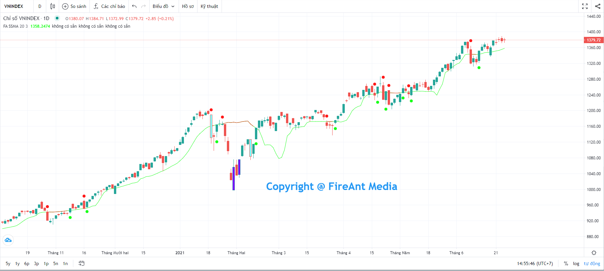
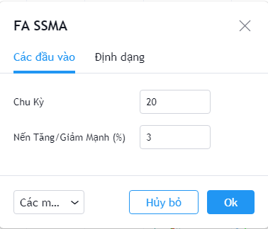
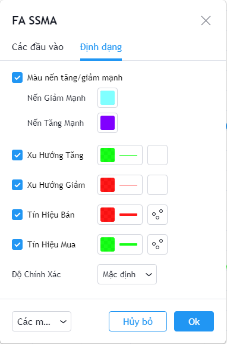

# Sensitive MA

**Đường trung bình nhạy cảm (SSMA)** là một biến thể của đường trung bình, đặc biệt nhạy với các biến động giá mạnh, và ít bị tác động bởi các biến động giá nhỏ.&#x20;

Được sử dụng nhằm xác định xu hướng giá giống như các đường trung bình khác, tuy nhiên **SSMA** có ưu thế nhờ khả năng loại bỏ nhiễu của các biến động nhỏ.&#x20;

**Phiên bản SSMA của FireAnt** sử dụng các tham số mặc định được sử dụng rộng rãi trong cộng đồng các nhà đầu tư quốc tế, là một bổ sung hữu hiệu vào thư viện các chỉ số.&#x20;

Tín hiệu gợi ý mua/bán xuất hiện khi đường giá cắt lên/xuống đường **SSMA**. Đường **SSMA** cũng sử dụng 2 màu khác nhau cho xu hướng tăng (màu xanh) và giảm (màu đỏ), giúp nhà đầu tư dễ theo dõi các giai đoạn biến động giá.&#x20;

Các tham số mà chúng tôi sử dụng mặc định (người dùng có thể thay đổi):

* **Chu kỳ**: Chu kỳ tính **SSMA** là 20 nến
* **Nến Tăng/Giảm mạnh (%)**: Hiển thị các nến tăng/giảm giá đóng cửa so với giá mở cửa trên 3%

Bên cạnh các tham số, người dùng cũng có thể thay đổi màu sắc các nến tăng/giảm mạnh, màu của đường **SSMA** khi xu hướng là tăng/giảm, màu của tín hiệu gợi ý mua/bán.


**Gợi ý sử dụng:**&#x20;

Mục đích chính của **SSMA** là để giúp nhà đầu tư phân biệt xu hướng giá ở các giai đoạn khác nhau của mã cổ phiếu. Khi xu hướng là tăng, nhà đầu tư nên giữ và không bán ra quá sớm khi có điều chỉnh nhẹ, mà chỉ cần bán khi xu hướng thay đổi thành giảm. Ngược lại, khi xu hướng là giảm, nhà đầu tư cũng không nên vội mua vào khi có điều chỉnh tăng nhẹ, mà chỉ nên mua vào khi xu hướng chuyển sang tăng.&#x20;

Khác với các đường trung bình khác, **SSMA** rất nhạy với các thay đổi mang tính đột biến. Khi có biến động giá mạnh, **SSMA** sẽ nhanh chóng tách xa khỏi đường giá, còn bình thường **SSMA** thường bám rất sát đường giá, do vậy các tín hiệu gợi ý mua bán sẽ có độ tin cậy cao hơn khi **SSMA** tách xa khỏi đường giá.

