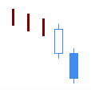
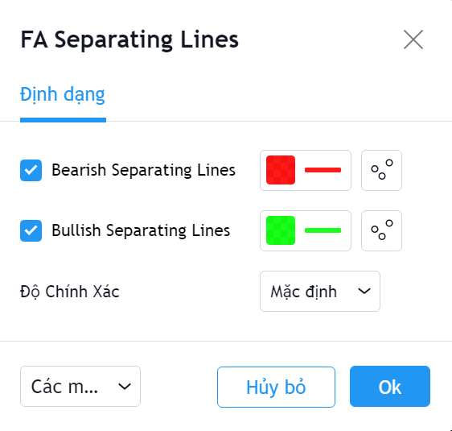

# Separating Lines

**Separating Lines Pattern** là một trong các mô hình nến Nhật hiếm gặp và có độ tin cậy tương đối cao. **Separating Lines Patter**n được sử dụng để xác định **sự tiếp diễn của xu hướng**.&#x20;

Mô hình này xuất hiện trong 1 xu hướng, khi một nến thân dài đi ngược chiều xu hướng, và tiếp theo là một nến thân dài cùng chiều xu hướng. Hai nến này có cùng mức giá mở cửa . Có hai mẫu **Separating Lines** là **Bearish Separating Lines** và **Bullish Separating Lines**.

|  |  |
| ------------------------------------------------------------------- | ------------------------------------------------------------------- |
| **Bullish Separating Lines**                                        | **Bearrish Separating Lines**                                       |

**Phiên bản Separating Lines Pattern của FireAnt** tìm kiếm cả hai mẫu hình nến **Bullish Separating Lines** và **Bearish Separating Lines**.&#x20;

Mẫu **Bullish Separating Lines** sẽ được đánh dấu bằng chấm tròn màu xanh lá cây (và có thể coi là tín hiệu gợi ý mua). Ngược lại mẫu **Bearish Separating Lines** sẽ được đánh dấu bằng chấm tròn màu đỏ (và có thể coi là tín hiệu gợi ý bán).&#x20;

Màu tín hiệu có thể thay đổi trong thiết lập:


**Gợi ý sử dụng:**&#x20;

**Separating Lines** là mẫu nến được sử dụng để xác định sự tiếp diễn của xu hướng.&#x20;

Khi gặp mẫu nến này, bạn cần quan sát xem trước khi mẫu nến xuất hiện, giá có đi theo xu hướng không, xu hướng đó là tăng hay giảm, mạnh hay yếu. Nếu trong một xu hướng mạnh, giá bất ngờ đảo chiều, và giá mở cửa phiên tiếp theo đúng bằng giá mở cửa phiên đảo chiều, thì nhiều khả năng đây là bẫy giá.&#x20;

Mẫu nến **Separating Lines** là một trong những mẫu nến hiếm gặp, đổi lại mẫu nến này có độ tin cậy tương đối cao.

