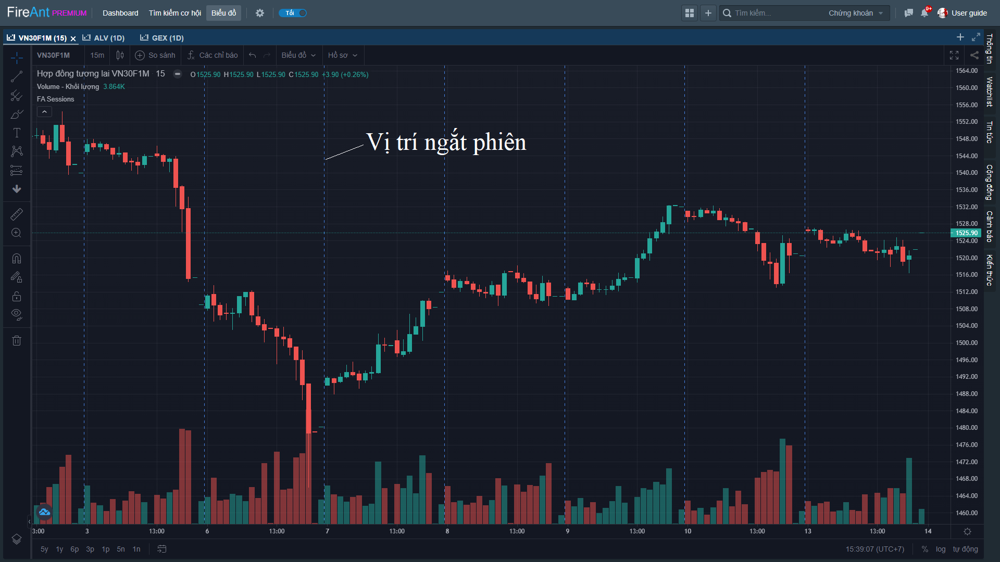

# Sessions

**Sessions** thực chất không phải chỉ báo kỹ thuật mà là công cụ thể hiện các vị trí ngắt phiên. Công cụ này chỉ áp dụng với các khung giờ trong phiên (các khung Intraday).

Các đường thẳng đứng sẽ hiện thị tại vị trí kết thúc của mỗi phiên giao dịch, cho phép người dùng nhanh chóng xác định được nến đầu tiên của ngày.
