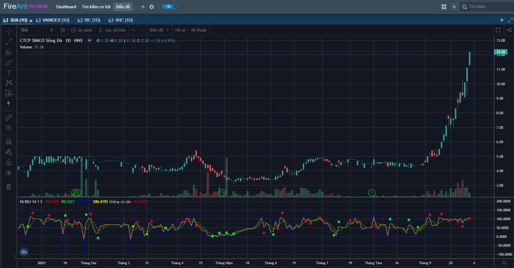
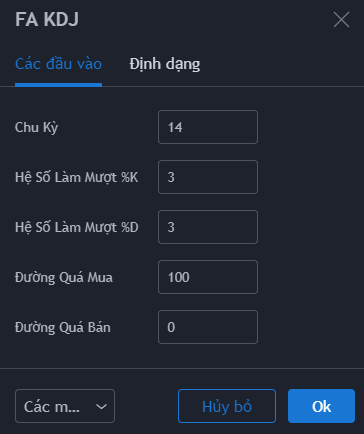
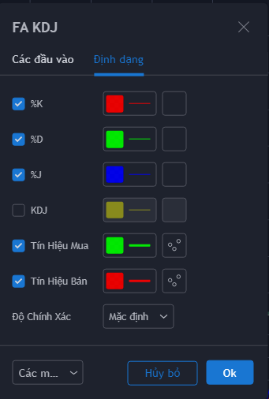

# Stochastic KDJ

**Chỉ báo Stochastic KDJ là một biến thể từ chỉ báo Stochastic vốn được sử dụng rất phổ biến trong giới đầu tư**. Stochastic được ưa chuộng do độ nhậy cao và là một trong các chỉ báo sớm.

Chỉ báo KDJ có thể được sử dụng để xác định tình trạng quá mua và quá bán của các mã cổ chứng khoán, đồng thời để xác định khả năng đảo chiều, tương tự như các chỉ số RSI, MFI, CCI hay Stochastic.

KDJ bổ sung thêm đường %J bên cạnh hai đường %K (đường Stochastic nhanh) và %D (đường Stochastic chậm).&#x20;

Nếu như ở phiên bản Stochastic truyền thống, các tín hiệu gợi ý mua bán xuất hiện khi đường %K cắt lên (tín hiệu gợi ý mua)/cắt xuống (tín hiệu gợi ý bán) đường %D, thì với KDJ đương nhiên bạn vẫn có thể sử dụng các tín hiệu này (thậm chí bạn sẽ dễ phát hiện ra tín hiệu hơn vì khi hai đường %K và %D cắt nhau thì cũng cắt luôn đường %J, tức là 3 đường chụm vào 1 chỗ).

Đường %J thể hiện sự phân kỳ giữa hai đường %K và %D, và cũng cho tín hiệu thậm chí sớm hơn, khi đường %J tạo đỉng và đáy ở vùng quá mua (trên 100) hoặc quá bán (dưới 0)

**Phiên bản KDJ của FireAnt** bổ sung thêm đường trung bình KDJ cộng của 3 đường %K, %D và %J. Bạn có thể chỉ sử dụng đường này và thực hiện mua vào khi KDJ thoát khỏi vùng quá bán và bán khi KDJ thoát khỏi vùng quá mua.

Các tham số mà chúng tôi sử dụng mặc định (người dùng có thể thay đổi):

* **Chu kỳ**: 14. Chu kỳ tính %K
* **Hệ số làm mượt %K**: 3. Đường trung bình với chu kỳ 3 được sử dụng thay cho %K
* **Hệ số làm mượt %D**: 3. Hệ số này là chu kỳ tính %D từ %K (%D là đường trung bình với chu kỳ là hệ số làm mượt %D của đường %K)

Bên cạnh các tham số, người dùng cũng có thể thay đổi màu sắc đường %K, %D, %J, KDJ, màu tín hiệu mua/bán.


**Gợi ý sử dụng:**&#x20;

**KDJ** cho tín hiệu mua bán sớm, do đó có độ nhậy khá cao. Bạn nên sử dụng Hệ số làm mượt tối thiểu bằng 3 cho %K. KDJ với hệ số làm mượt thấp phù hợp với các giai đoạn thị trường ít biến động dao động trong 1 phạm vi nhất định. Để sử dụng KDJ khi thị trường đang có xu hướng mạnh bạn cần tăng hệ số làm mượt tối thiểu bằng 5.

