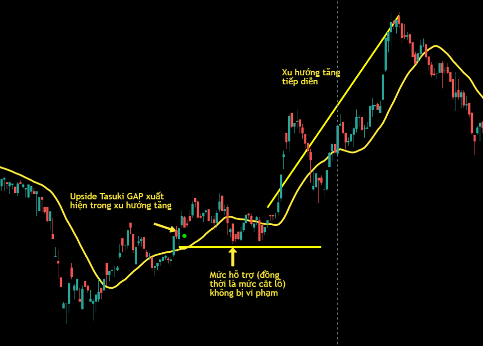
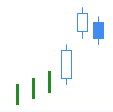
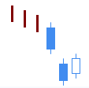
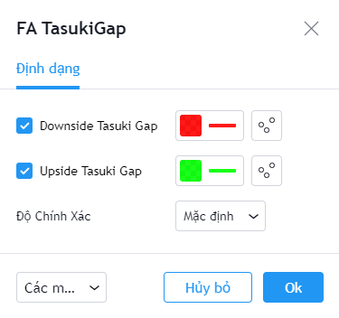

# Tasuki GAP

**Tasuki GAP Pattern** là các mô hình nến Nhật thuộc nhóm mô hình nến Tasuki có độ tin cậy tương đối cao và tần suất xuất hiện tương đối thấp. **Tasuki GAP Pattern** có thể được sử dụng cho việc xác định **sự tiếp diễn của xu hướng**.&#x20;

Mô hình gồm ba nến. Nến thứ nhất của mô hình là một nến dài cùng chiều với xu hướng trước đó. Nên thứ hai cũng có cùng màu với nến thứ nhất và tạo GAP với nến thứ nhất. Nến thứ ba cũng là nến xác định mô hình, có màu ngược với hai nến trước mở cửa ở giá trị nằm trong thân nến thứ hai và đóng cửa cao hơn đóng cửa của nến thứ nhất. Có hai mẫu **Tasuki GAP** là **Downside Tasuki GAP** (*shita banare tasuki*) và **Upside Tasuki GAP (***uwa banare tasuki*).

|  |  |
| -------------------------------------------------------------------------------------------------------------------------------------- | -------------------------------------------------------------------------------------------------------------------------------------- |
| **Upside Tasuki GAP**                                                                                                                  | **Downside Tasuki GAP**                                                                                                                |

**Phiên bản Tasuki GAP Pattern của FireAnt** tìm kiếm cả hai mẫu hình nến **Upside Tasuki GAP** và **Downside Tasuki GAP**.

Mẫu **Upside Tasuki GAP** sẽ được đánh dấu bằng chấm tròn màu xanh lá cây (và có thể coi là tín hiệu gợi ý mua). Ngược lại mẫu **Downside Tasuki GAP** sẽ được đánh dấu bằng chấm tròn màu đỏ (và có thể coi là tín hiệu gợi ý bán).

Màu tín hiệu có thể thay đổi trong thiết lập:


**Gợi ý sử dụng:**&#x20;

**Tasuki GAP** là mẫu nến được sử dụng để xác định sự tiếp diễn của xu hướng, do đó bạn cần quan sát mẫu nến này trong một xu hướng.&#x20;

Khi sử dụng **Tasuki GAP**, bạn cần đặc biệt chú ý là mẫu hình này cần có **GAP** giữa nến thứ hai và nến thứ nhất, còn nến thứ 3 không được lấp **GAP** này. Mẫu hình này rất dễ bị nhầm với mẫu **Tasuki Line**, là mẫu nến đảo chiều.

