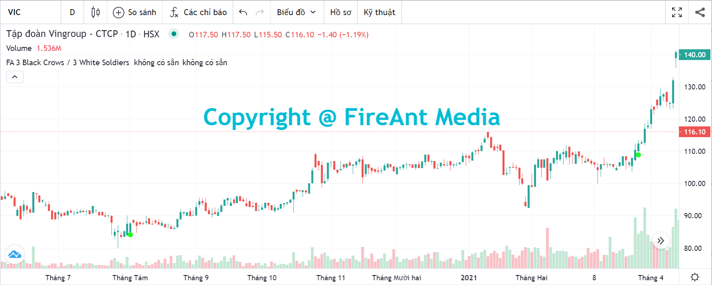
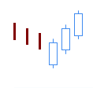
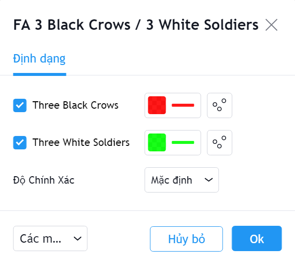

# Three Black Crows / Three White Soldier

**Three Black Crows Patter**n là một trong các mô hình nến Nhật được tương đối hiếm gặp nhưng có độ tin cậy tương đối cao. **Three Black Crows** được sử dụng để xác định sự đảo chiều giảm cuối một xu hướng tăng giá.&#x20;

Mô hình này hình thành khi xuất hiện ba nến giảm có thân dài liên tiếp. Nến thứ hai mở cửa ở mức giữa thân nến thứ nhất, và đóng cửa thấp hơn đóng cửa của nến thứ nhất. Nến thứ ba mở cửa ở giữa thân nến thứ hai và đóng cửa thấp hơn đóng cửa của nến thứ hai. Nến thứ ba cũng là nến xác định mẫu hình hoàn thành và xu hướng đảo chiều.&#x20;

Ngược lại với mẫu nến **Three Black Crows**, mẫu nến **Three White Soldier** được sử dụng để xác định sự đảo chiều tăng cuối một xu hướng giảm giá.&#x20;

Mẫu **Three White Soldier** hình thành khi xuất hiện ba nến tăng có thân dài liên tiếp. Nến thứ hai mở cửa ở mức giữa thân nến thứ nhất, và đóng cửa cao hơn đóng cửa của nến thứ nhất. Nến thứ ba mở cửa ở giữa thân nến thứ hai và đóng cửa cao hơn đóng cửa của nến thứ hai. Nến thứ ba cũng là nến xác định mẫu hình hoàn thành và xu hướng đảo chiều.

|  |  |
| ------------------------------------------------------------------- | ------------------------------------------------------------------- |
| **Three Black Crows**                                               | **Three White Soldier**                                             |

**Phiên bản Three Black Crows/Three White Soldier của FireAnt** tìm kiếm cả hai mẫu hình nến **Three Black Crows** và **Three White Soldier**.&#x20;

Mẫu **Three White Soldier** sẽ được đánh dấu bằng chấm tròn màu xanh lá cây (và có thể coi là tín hiệu gợi ý mua). Ngược lại mẫu **Three Black Crows** sẽ được đánh dấu bằng chấm tròn màu đỏ (và có thể coi là tín hiệu gợi ý bán).&#x20;

Màu tín hiệu có thể thay đổi trong thiết lập:


**Gợi ý sử dụng**:&#x20;

**Three Black Crows/Three White Soldier** là các mẫu nến đảo chiều, do đó nó chỉ có giá trị khi xuất hiện trong một xu hướng (càng kéo dài càng tốt).&#x20;

Khi gặp mẫu nến này, bạn cần quan sát xem trước khi mẫu nến xuất hiện, giá có đi theo xu hướng không, xu hướng đó là tăng hay giảm, mạnh hay yếu.&#x20;

**Three White Soldier** xuất hiện trong một xu hướng giảm là tín hiệu đảo chiều tăng đáng tin cậy, và việc mua vào thường là lựa chọn tốt. Nếu mua vào khi **Three White Soldier** xuất hiện, bạn cần đặt điểm dừng lỗ tối đa tại điểm thấp nhất của nến thứ nhất.&#x20;

Tương tự **Three Black Crows** xuất hiện trong xu hướng tăng sẽ là dấu hiệu đảo chiều giảm, và bạn nên bán ra.

