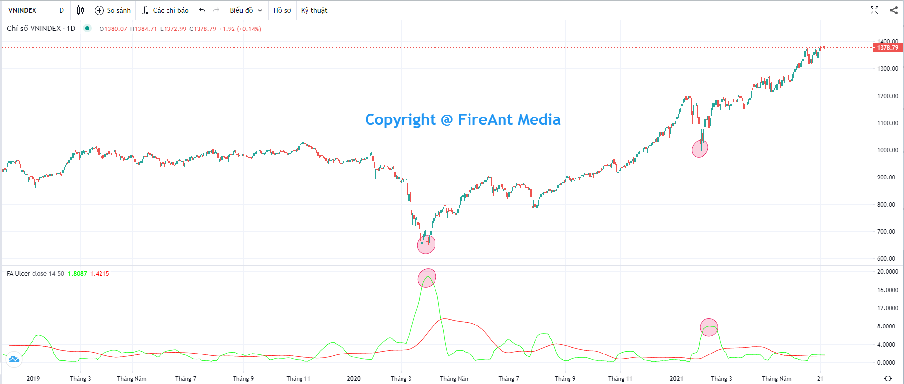
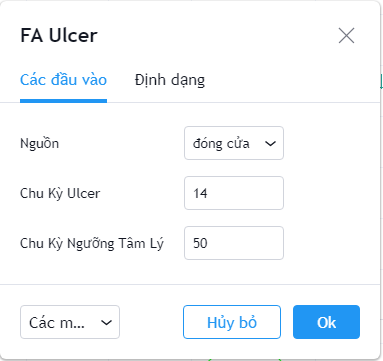
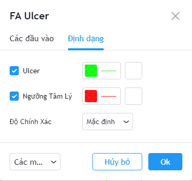

# Ulcer

**Chỉ số Ulcer** dùng để đánh giá **mức độ stress** của nhà đầu tư đang nắm giữ cổ phiếuthông qua việc đo lường mức độ tăng mãnh liệt khi thị trường tăng và mức độ giảm dữ dội khi thị trường giảm.

**Chỉ số Ulcer** chỉ ra rõ ràng rằng nhà đầu tư chỉ quan tâm tới rủi ro khi thị trường đi xuống chứ ko quan tâm tới rủi ro khi thị trường đi lên (mức độ rủi ro khi thị trường đi lên sẽ tương đương với lợi nhuận nhận được nếu đó là cổ phiếu đầu tư lâu dài). **Ulcer** vì vậy thường được các nhà đầu tư sử dụng chủ yếu để dò đáy. Chỉ số này có độ tin cậy cao đối với các index.

**Phiên bản Ulcer của FireAnt** thực hiện theo cách tính được mô tả bởi Ulcer Peter G. Martin và Byron B. McCann năm 1989 là sự bổ sung cần thiết cho các nhà đầu tư theo trường phái phân tích kỹ thuật.

Cách sử dụng **Ulcer** khá đơn giản:

* Xác định các đỉnh **Ulcer** càng cao càng tốt, thông thường với Ulcer lập đỉnh trên giá trị 15 và có giá trị trên gấp đôi đường trung bình Ulcer (còn gọi là ngưỡng tâm lý, ranh giới giữa tâm lý ổn định và lo sợ) chu kỳ 50 sẽ có độ tin cậy cao, đáy thường đâu đó quanh điểm này. Đây thường là thời điểm các nhà đầu tư bán ra bằng mọi giá và bán trong hoảng loạn.

Các tham số mà chúng tôi sử dụng mặc định (người dùng có thể thay đổi):

* **Nguồn**: Giá đóng cửa được sử dụng để tính Ulcer
* **Chu kỳ Ulcer**: Chu kỳ tính Ulcer là 14 nến
* **Chu kỳ Ngưỡng tâm lý**: Chu kỳ tính ngưỡng tâm lý là 50 nến

Bên cạnh các tham số, người dùng cũng có thể thay đổi màu sắc đường **Ulcer**, đường ngưỡng tâm lý.


**Gợi ý sử dụng:**&#x20;

Mục đích chính của **Ulcer** là để xác định đáy. Khi **Ulcer** tạo đỉnh trên ngưỡng tâm lý, cho thấy tâm lý lo sợ của các nhà đầu tư đã lên đến đỉnh điểm, và thường giá sẽ lập đáy ở gần đó. Theo kinh nghiệm của chúng tôi, bạn nên chọn các đỉnh có giá trị trên 15, và ít nhất gấp đôi ngưỡng tâm lý tạo bởi đường trung bình **Ulcer** 50.&#x20;

Mặc dù chủ yếu sử dụng để xác định đáy, **Ulcer** cũng có thể dùng để xác định thời điểm bán, khi giá trị Ulcer tăng vượt ngưỡng tâm lý sau khi đi ngang ở mức thấp.

