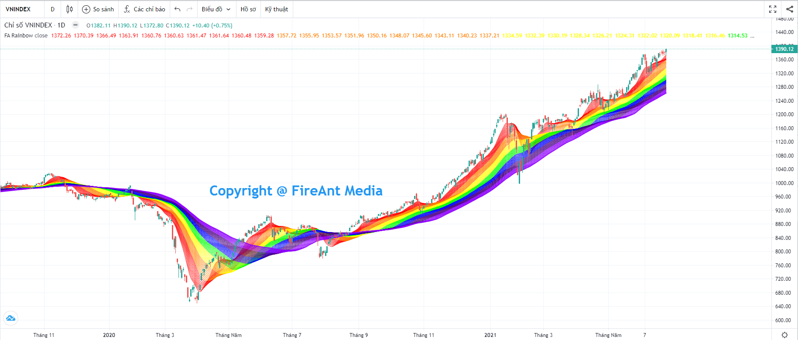
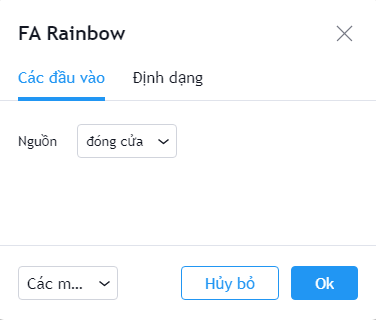
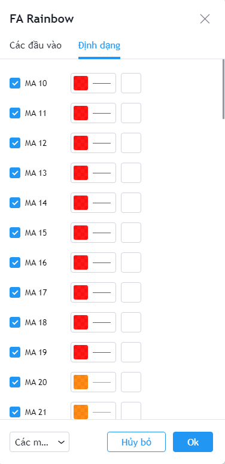

# Rainbow

**Rainbow (cầu vồng)** tên đầy đủ là Rainbow Moving Average là chỉ báo cho phép hiển thị nhiều đường trung bình động đơn giản (SMA) với các chu kỳ khác nhau cùng một lúc.

Chu kỳ của mỗi đường SMA được tính toán dựa trên SMA trước đó và được mã hóa màu theo 7 màu cầu vồng.

Có rất nhiều cách tính toán khác nhau cho chỉ báo này, từ đơn giản đến rất phức tạp, nhưng về cơ bản cách sử dụng chỉ số này lại tương đối giống nhau.

Khi giá vượt khỏi cầu vồng ở thời điểm các dải màu hội tụ, xu hướng giá mới được coi là bắt đầu, xu hướng càng mạnh nếu các dải màu tăng dần mức phân kỳ. Khi giá quay trở lại cầu vồng ở thời điểm các dải màu phân kỳ, xu hướng giá được coi là kết thúc.

**Phiên bản Rainbow của FireAnt** sử dụng 70 đường SMA với chu kỳ từ 10 đến 79 như một chỉ số duy nhất, với 7 màu cầu vồng, mỗi màu sử dụng cho 10 đường. Cả 70 đường SMA sẽ được vẽ cùng lúc thay vì phải kéo 70 đường SMA đơn lẻ vào biểu đồ.

Các tham số mà chúng tôi sử dụng mặc định (người dùng có thể thay đổi):

* **Nguồn**: Giá đóng cửa được sử dụng làm đầu vào để tính các đường SMA

Bên cạnh các tham số, người dùng cũng có thể thay đổi màu sắc cũng như độ dày các đường SMA trong dải màu cầu vồng


**Gợi ý sử dụng:**&#x20;

Do các đường SMA được chọn với chu kỳ sát nhau và màu được chọn theo gam 7 màu cầu vồng, chỉ số **Rainbow** sẽ có được hiệu ứng 3D khi các dải màu có chu kỳ ngắn hạn vượt lên hoặc cắt xuống các dải màu có chu kỳ dài hạn, giống như dải lụa lật mặt, thể hiện sự đảo chiều xu hướng khá chắc chắn.

Khi các dải màu xoắn vào nhau trong biên độ hẹp, không có xu hướng nào rõ ràng, giá đang xây nền.&#x20;

Khi giá vượt lên trên toàn bộ các dải màu hoặc ở bên dưới toàn bộ các dải màu, chúng ta có xu hướng tăng / giảm bền vững.

