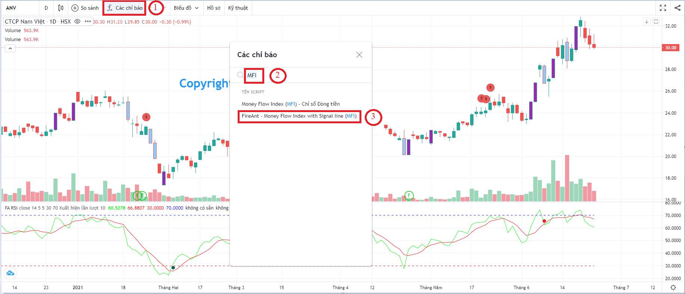
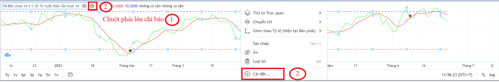
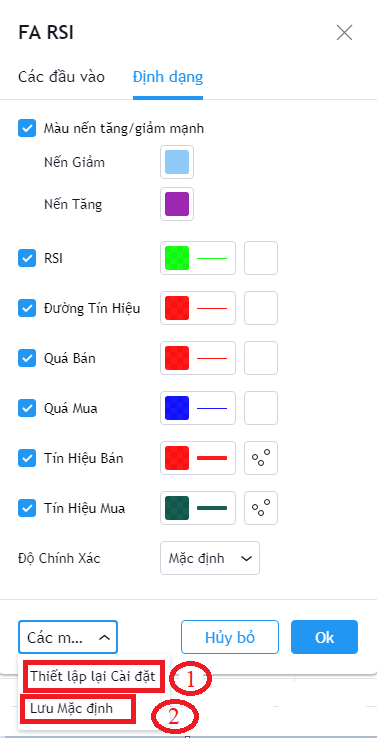

# Hướng dẫn chung

## 1. Thêm chỉ báo vào biểu đồ

Để thêm các chỉ số của FireAnt vào biểu đồ, bạn thực hiện các bước sau:&#x20;

1. Chọn nút   &#x20;
2. Ở danh sách các chỉ báo gõ từ khóa tương ứng với tên chỉ báo bạn muốn thêm vào biểu đồ, ví dụ MFI, RSI, ...&#x20;
3. Trong các chỉ báo tìm được, chọn chỉ báo có chữ **FireAnt** ở đầu.

## **2. Thiết lập tham số cho chỉ báo**

Để thiết lập tham số cho các chỉ báo, bạn thực hiện các bước sau:&#x20;

1. Nhắp chuột phải lên chỉ báo
2. Chọn Cài đặt, hoặc nút hình bánh xe có răng cưa bên cạnh tên chỉ báo

&#x20;Màn hình thiết lập tham số sẽ hiện ra, và bạn có thể thay đổi các tham số tùy ý

Về cơ bản sẽ có 2 nhóm tham số:

* *Các đầu vào:* Bạn có thể thay đổi giá trị cho các tham số dùng để tính toán chỉ số
* Định dạng: Bạn có thể thay đổi màu sắc hoặc hình dạng các đối tượng của chỉ báo

Sau khi thay đổi các tham số, bạn có 2 lựa chọn:

* Thiết lập lại cài đặt: Các tham số quay lại giá trị mặc định ban đầu
* Lưu mặc định: Lưu các tham số thiết lập thành tham số mặc định để sử dụng cho lần tiếp theo.

Lưu ý: Nếu bạn chọn Thiết lập lại cài đặt thì giá trị các tham số lại quay về thiết lập mặc định ban đầu của hệ thống, tuy nhiên ở lần sử dụng tiếp theo khi bạn chèn chỉ báo thì các thiết lập bạn lưu thành mặc định vẫn được sử dụng.
