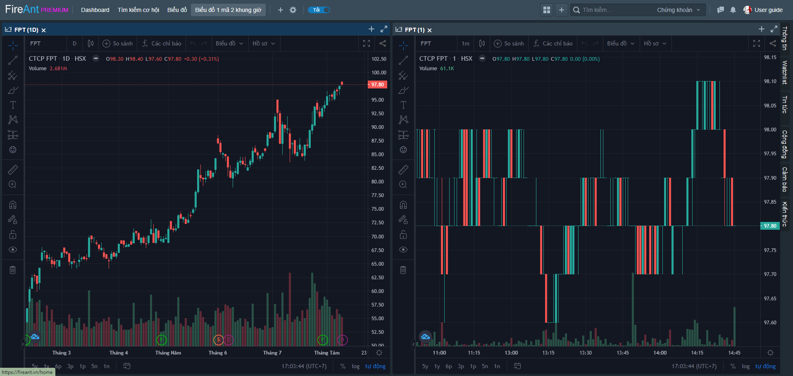

# Biểu đồ 1 mã 2 khung giờ

Trang thông tin với 2 cửa sổ chứa khối chức năng biểu đồ, mỗi cửa sổ chứa 1 biểu đồ của cùng một mã, ở 2 khung giờ khác nhau, hai biểu đồ này liên kết, do đó khi thay đổi mã ở một biểu đồ thì biểu đồ còn lại cũng chuyển sang thành của mã đó.

