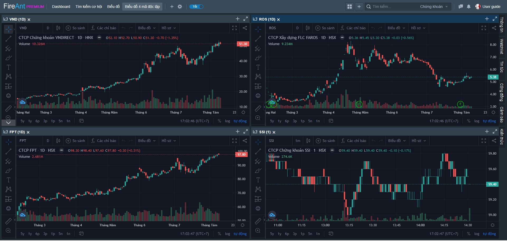

# Biểu đồ 4 mã độc lập

Trang thông tin với 4 cửa sổ chứa khối chức năng biểu đồ, mỗi cửa sổ chứa 1 biểu đồ của một mã khác nhau, các mã này không liên kết, do đó 4 biểu đồ hoàn toàn độc lập với nhau.&#x20;

