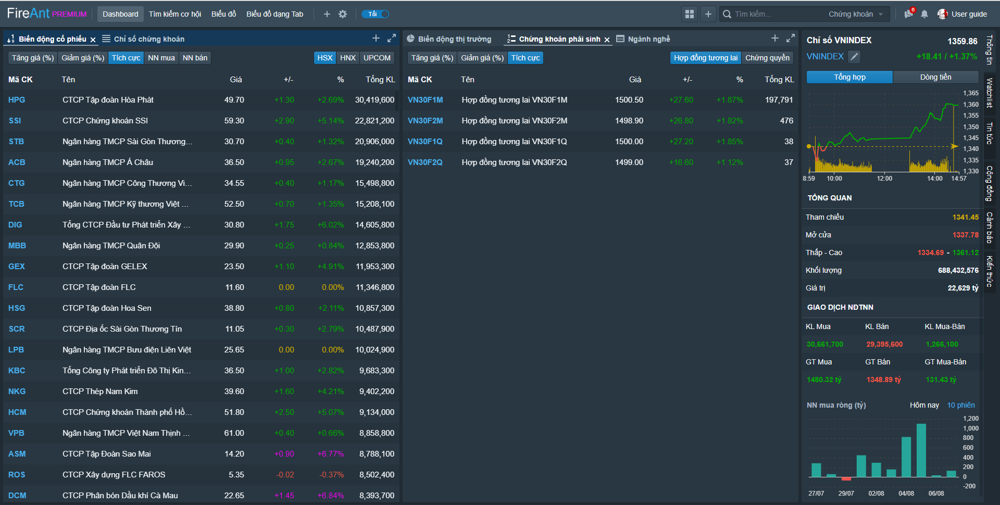

# Dashboard

Bố cục **Dashboard** là bố cục được dựng sẵn với hai cửa sổ chức năng sắp xếp cạnh nhau:

* Cửa số bên trái chứa các khối chức năng
  * Biến động cổ phiếu
  * Chỉ số chứng khoán
* Cửa sổ bên phải chứa các khối chức năng
  * Biến động thị trường
  * Chứng khoán phái sinh
  * Ngành nghề

Mục đích của trang thông tin này là đem lại cho người dùng một cái nhìn khái quát và toàn diện vào thị trường với các thống kê có chiều sâu khác nhau từ thị trường thế giới đến thị trường trong nước, từ biến động thị trường đến ngành nghề và cổ phiếu, từ chứng khoán cơ cở đến chứng khoán phái sinh, từ giao dịch của các nhà đầu tư nói chung đến giáo dịch của khối ngoại và tự doanh.

