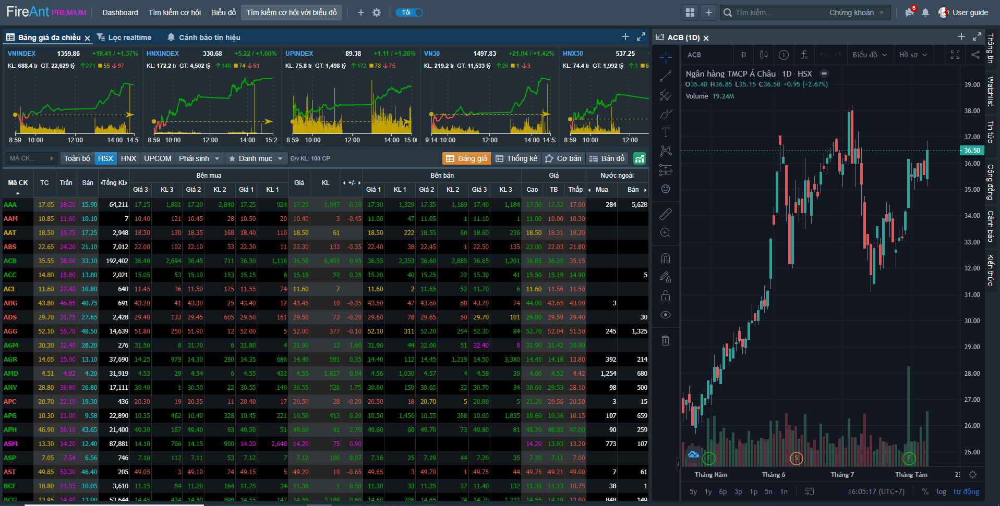

# Tìm kiếm cơ hội với biểu đồ

Trang thông tin dựng sẵn **Tìm kiếm cơ hội với biểu đồ** cũng tương tự như trang thông tin dựng sẵn[ **Tìm kiếm cơ hội**,](https://help.fireant.vn/fireant-for-web/bo-cuc-layout/cac-bo-cuc-mac-dinh/tim-kiem-co-hoi) nhưng có thêm 1 cửa sổ chứa sẵn biểu đồ. Khi bạn nhắp chuột vào dòng chứa mã cổ phiếu trong một danh sách ở cửa sổ tìm kiếm cơ hội (bất kể là ở bảng giá, kết quả tìm kiếm của bộ lọc thời gian thực hay kết quả của bộ lọc định nghĩa cảnh báo) biểu đồ của mã tương ứng sẽ được vẽ ở cửa sổ biểu đồ.

