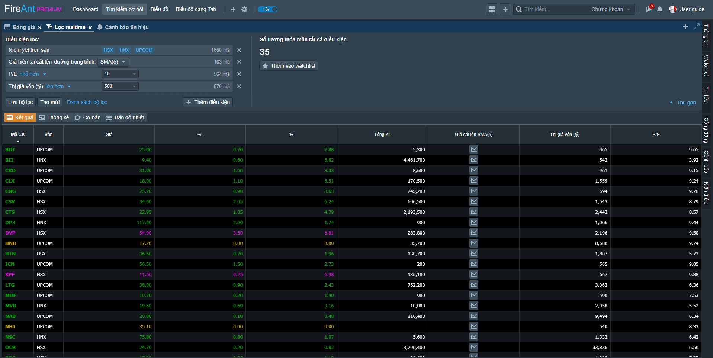

# Tìm kiếm cơ hội

Trang thông tin dựng sẵn **Tìm kiếm cơ hội** là bố cục được dựng sẵn với các khối chức năng sau:

* [Bảng giá chứng khoán](https://help.fireant.vn/fireant-for-web/tim-kiem-co-hoi/bang-gia): Cho phép theo dõi chứng khoán theo cách truyền thống qua bảng giá
* [Lọc Realtime](https://help.fireant.vn/fireant-for-web/tim-kiem-co-hoi/loc-co-phieu-thoi-gian-thuc): Cho phép tạo và lưu trữ các bộ lọc thời gian thực với các tiêu chí dựng sẵn (có thể thêm bớt các tiêu chí và thay đổi tham số cho từng tiêu chí), cũng như cho phép lưu kết quả lọc thành [Watchlist](https://help.fireant.vn/fireant-for-web/watchlists/vai-tro-cua-watchlist)
* [Cảnh báo tin hiệu](https://help.fireant.vn/fireant-for-web/tim-kiem-co-hoi/canh-bao): Cho phép thử nghiệm và tạo và quản lý các cảnh báo thời gian thực.

