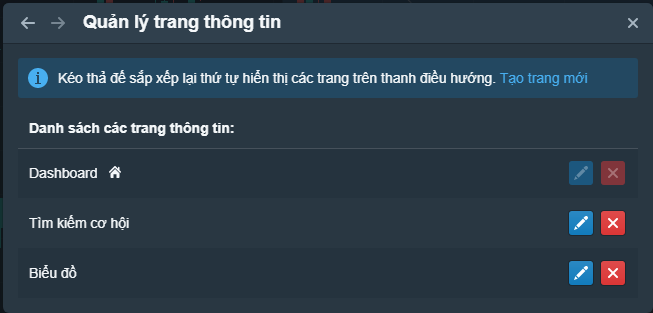
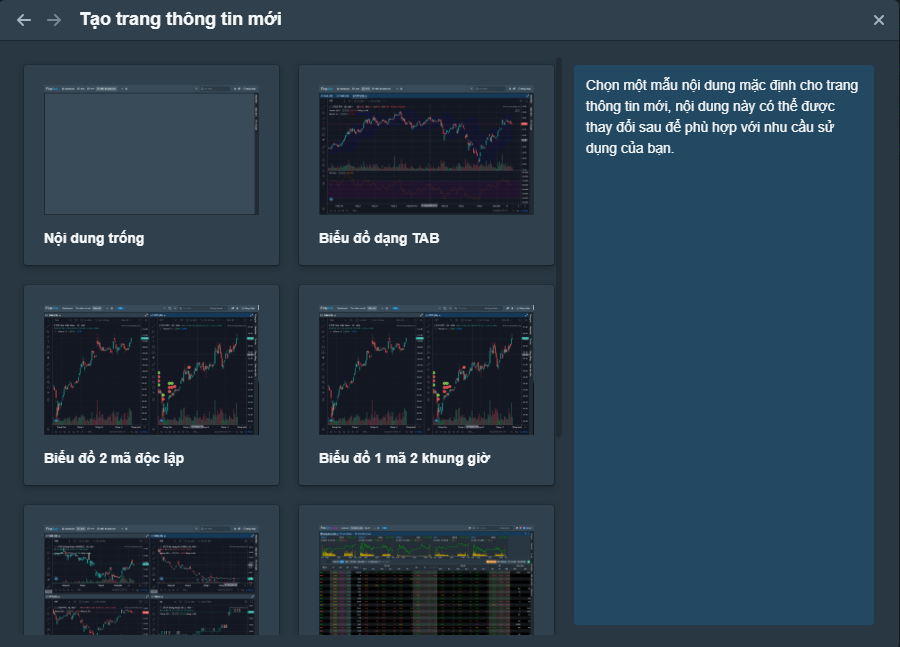

# Quản lý trang thông tin

## Trang thông tin là gì

Trang thông tin có thể hiểu là tập hợp nhiều khối chức năng được bố trí trên cùng một giao diện theo các cách khác nhau tùy theo nhu cầu và mục đích sử dụng.

Bạn có thể sử dụng các trang thông tin mà FireAnt dựng sẵn, hoặc tạo các trang thông tin của riêng mình. Bạn cũng có thể  thêm bớt các khối chức năng, điều chỉnh lại vị trí, kích thước các khối chức năng trên các trang thông tin có sẵn để tạo ra các trang thông tin mới.

Khi tạo ra một số lượng trang thông tin nhất định, bản sẽ thấy các trang thông tin được hiển thị thành 1 loạt các tab ở bên phải thanh công cụ phía trên.&#x20;

Bạn có thể:

* **Quản lý các trang thông tin**: Bấm vào nút hình răng cưa và chọn **Quản lý trang**
* **Thêm trang thông tin**: Bấm vào nút hình răng cưa và chọn **Thêm trang mới**

## Quản lý các trang thông tin

Các trang thông tin mà bạn đang sử dụng sẽ được liệt kê trong danh sách các bố cục. Bạn có thể:

* **Đổi tên trang thông tin**: Bấm vào nút hình cây bút màu xanh
* **Xóa trang thông tin**: Bấm vào nút hình chữ X màu đỏ

## Thêm trang thông tin

Bạn có thể chọn một trang thông tin trống, sau đó thêm lần lượt các khối chức năng vào bố cục, hoặc chọn một trong số các [trang thông tin dựng sẵn](https://app.gitbook.com/@fireant/s/fireant-for-web/~/drafts/-MgPwHOIOK4LXvIvF6sg/bo-cuc-layout/cac-bo-cuc-mac-dinh) của FireAnt.

