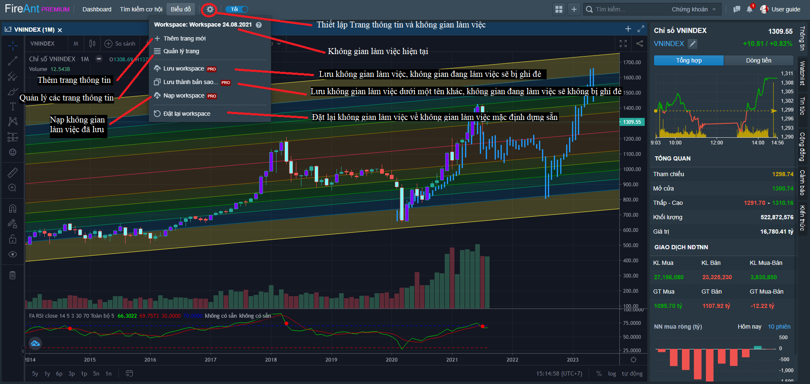

# Quản lý không gian làm việc

## Giới thiệu Workspace

Workspace là toàn bộ thiết lập về không gian làm việc hiện tại của bạn trên phần mềm. Bao gồm **các trang thông tin**, **sắp xếp bố cục (layout) trên từng trang thông tin**, **thiết lập các khối chức năng (biểu đồ, bảng giá...)**.

Bạn có thể thay đổi **workspace** và **lưu các thiết lập** của bạn thành **các workspace** khác nha&#x75;**. Các workspace** đã lưu có thể nạp ở thời điểm khác, thậm chí bạn có thể nạp **workspace** trên một máy tính khác để tiếp tục làm việc ngay lập tức mà không phải thiết lập **workspace** mới từ đầu.

