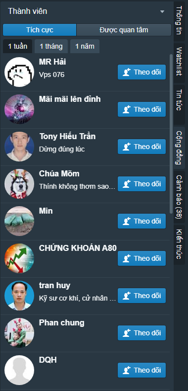
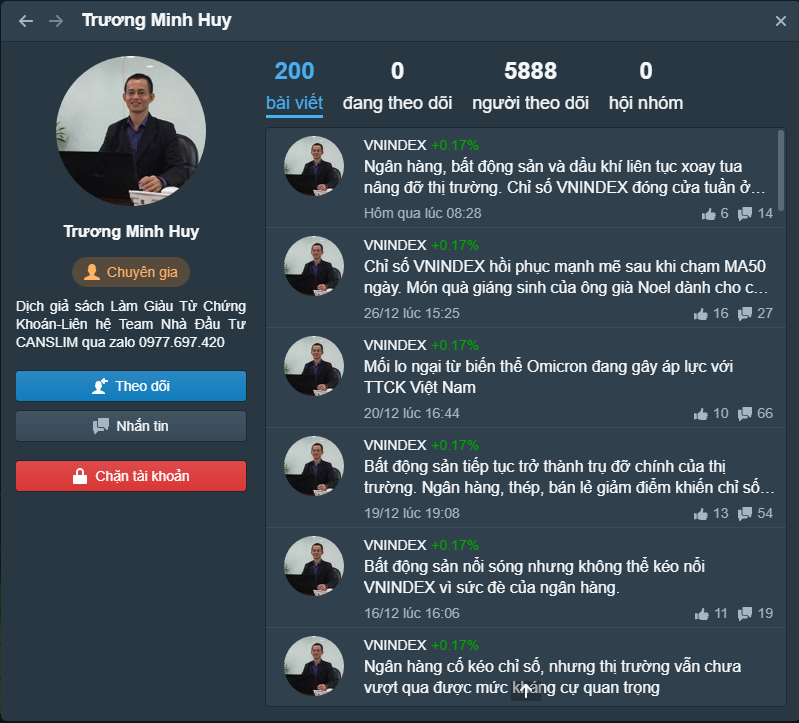

# Thành viên

Người dùng có thể tra cứu danh sách thành viên tích cực (TOP thành viên) theo các tiêu chí

* **Tích cực**: Mức độ tích cực, tính theo số bài viết theo tuần, tháng, năm
* **Quan tâm**: Các thành viên được nhiều hội viên khác theo dõi

Bạn có thể nhắp chuột lên các thành viên trong danh sách để xem hồ sơ của họ, hoặc chọn nút theo dõi thành viên để theo dõi họ. Khi theo dõi một thành viên, bạn sẽ nhận được thông báo mỗi khi thành viên đó có các hoạt động trên cộng đồng (chia sẻ bài viết mới, bình luận, like bài viết, ...)

Khi xem hồ sơ của thành viên, bạn có thể&#x20;

* Xem các bài viết của thành viên đó
* Xem, danh sách người dùng theo dõi thành viên đó
* Xem danh sách người dùng thành viên đó
* Xem danh sách các hội nhóm thành viên đó tham gia
* Theo dõi thành viên đó
* Nhắn tin cho thành viên đó (nếu thành viên đó online, bạn có thể chat với họ)
* Chặn tài khoản thành viên đó, bạn sẽ không nhận được thông báo khi thành viên đó đăng bài mới.
